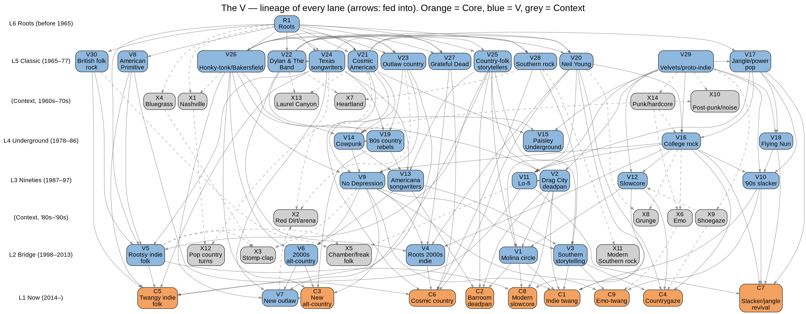
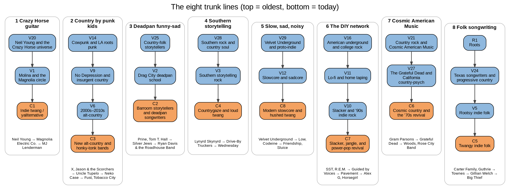

# The V

*A map of indie twang, slacker rock, and everything that fed them*

Companion to **V_Album_Atlas.xlsx** · 2,942 albums · 54 lanes

## Contents

- **1. How to read this** — layers, zones, how to use the map with the spreadsheet
- **2. The V diagram** — every lane, and the eight trunk lines
- **3. The bottom of the V** — the nine Core lanes, C1–C9
- **4. Climbing the V** — the V lanes, layer by layer, and the roots lane R1
- **5. Off the edges** — the fourteen Context lanes, X1–X14
- **6. Scenes and labels** — gazetteer
- **7. Listening paths** — routes from the anchors to the top of the V
- **8. Appendix** — the borderline decisions that shaped the map

# 1. How to read this

This document is the prose half of the V Album Atlas. The spreadsheet, V_Album_Atlas.xlsx, holds one row per album, with its lane, layer, descriptors, key tracks, lineage and sources. This map explains the shape those rows make: where each sound came from, what it fed, and which records to play first.

The atlas pictures the music as a V. The bottom point is the scene happening now: MJ Lenderman, Wednesday, Big Thief, villagerrr, Greg Freeman and the wave of bands people call indie twang, yallternative or slacker twang. Climbing the V goes back in time through the genres that fed it: '90s slacker and alt-country, the '80s college-rock underground, '70s outlaw and country rock, the Velvet Underground, and at the very top the Carter Family and Hank Williams. The V widens as it climbs because every era had more ancestors than the one below it.

Every album has two coordinates. Its **layer** is set purely by its original release year, from L1 (2014 to now) up to L6 (before 1965). Its **zone** is set by its primary lane: Core lanes (C1–C9) are the scenes happening now and are covered completely; V lanes (V1–V30 and the roots lane R1) are the direct ancestors and close siblings, covered deeply; Context lanes (X1–X14) are popular branches that split off from the V and lead somewhere else, covered with landmarks only.

A lane is a sound, not an artist. The same artist can appear in several lanes because each album is placed by its own sound: early Wilco sits in No Depression (V9), while their 2000s records sit in roots-inflected indie (V4). Each album has one primary lane and up to two secondary lanes.

Read the lane essays for the story, then use the album IDs in square brackets, such as `A0001`, to jump to a row in the spreadsheet. Each essay ends with a short list of essential albums. The listening paths in section 7 are the fastest way in: each starts from one of the anchor artists and climbs, one record at a time, toward the top of the V.

Two honesty rules run through the whole atlas. First, lineage is marked **Documented** only when an interview, cover, credit, shared member or reputable critic establishes it; otherwise it is **Inferred** and phrased as resemblance. Second, nothing is invented: every album was verified against at least one discography, label or Bandcamp source, and candidates that could not be verified sit on the Needs Verification sheet instead of in the atlas.

## Layers and zones

| Layer | Years | Core | V | Context |
|---|---|---:|---:|---:|
| L1 Now | 2014–2026 | 782 | 271 | 48 |
| L2 Bridge | 1998–2013 | 49 | 544 | 30 |
| L3 Nineties | 1987–1997 | 0 | 477 | 34 |
| L4 Underground | 1978–1986 | 0 | 234 | 20 |
| L5 Classic | 1965–1977 | 0 | 385 | 20 |
| L6 Roots | before 1965 | 0 | 48 | 0 |

| Zone | What it means | Depth |
|---|---|---|
| Core | The bottom of the V: the scenes happening now (C1–C9) | Completionist |
| V | Direct ancestors and close siblings of the Core (V1–V30, plus the roots lane R1) | Deep |
| Context | Popular branches whose main line leads outside the V (X1–X14) | Landmarks only |

Album IDs such as `A0001` refer to rows on the Albums sheet of V_Album_Atlas.xlsx; filter the sheet by ID, lane or artist for the full entry, descriptors, key tracks and sources.

# 2. The V diagram

The chart shows every lane as a box, placed in the layer where it is centred and coloured by zone (orange Core, blue V, grey Context). Arrows run from parent to child: from what fed a sound to what it fed. Dashed arrows touch a Context lane.

## The eight trunk lines

Each trunk line is one of the eight routes by which an older sound reaches the Core: (1) Neil Young & Crazy Horse guitar; (2) country played by punk and indie kids; (3) deadpan, funny-sad songwriting; (4) Southern storytelling rock; (5) slow, sad and noisy textures; (6) the DIY network; (7) Cosmic American Music; (8) folk songwriting.

# 3. The bottom of the V: the Core lanes

The Core is the bottom of the V: nine lanes of music made since roughly 2014 by bands and songwriters who grew up on indie rock, emo and DIY punk and then turned toward country, folk and the guitar sounds of the '70s. It is the part of the atlas that aims to be complete. Josh Terry's newsletter No Expectations was worked through post by post, the user's field guide was covered artist by artist, and label catalogs from Dear Life, Sophomore Lounge, Keeled Scales, Lame-O, Orindal and others were swept for anything that fit.

The lanes overlap, because the scene does. The same pedal-steel players, producers and studios turn up across several of them, and many artists move between lanes from one record to the next. The essays below take them one at a time: the loud indie twang of C1, the deadpan storytellers of C2, the honky-tonk bands of C3, the noise-walled countrygaze of C4, the folk of C5, the cosmic-country revival of C6, the slacker and jangle revival of C7, the hushed slowcore of C8, and the emo-twang crossovers of C9.

## C1 · Indie twang / yallternative

*Core zone · main era 2014– · 68 albums in the atlas · fed by V1, V3, V9, V20, V10, V2*

Indie twang is loud guitar rock that happens to know its way around a country song. The tempos lope rather than race, and the electric guitars are overdriven in the Crazy Horse manner: thick, slightly out of tune with each other, and allowed to wander into long solos. Pedal steel usually floats over the top, and the singers drawl or deadpan instead of belting. The lyrics are about specific small places and small failures, often funny right up until they aren't. On *Manning Fireworks* `A0029` MJ Lenderman sings about men who can't say what they mean ('She's Leaving You', 'Wristwatch', 'Rudolph') in a dry voice over a band that sounds like it could keep going for another ten minutes.

The sound took shape in the late 2010s and broke through in the early 2020s, and it is spread across small scenes rather than one city. Asheville, North Carolina is the center of gravity: Lenderman's hissy self-released tapes of 2019 (*MJ Lenderman* `A0006`) led to Dear Life Records and *Boat Songs* `A0015`, whose 'TLC Cage Match' and basketball jokes made him a name, and then to ANTI- and a live record with his band the Wind, *And the Wind (Live and Loose!)* `A0020`. Lenderman also played guitar in Wednesday, whose louder records sit next door in C4, and Karly Hartzman's writing for that band shares this lane's eye for Southern detail. Alex Farrar, who has recorded both, produced Squirrel Flower's *Tomorrow's Fire* `A0022` with Wednesday players in the room, a documented link. Burlington, Vermont is the second hub, around Greg Freeman: his self-released *I Looked Out* `A0014` spread by word of mouth before *Burnover* `A0036` landed on Transgressive, and Dari Bay's short, jangly *Longest Day Of The Year* `A0017` comes from the same small scene. Philadelphia gave the lane Florry, whose *The Holey Bible* `A0019` and *Sounds Like...* `A0035` on Dear Life are rowdy barroom records with fiddle and a half-broken pedal steel. Chicago's Ratboys moved from the quiet twang of *AOID* `A0002` to the fuller, Chris Walla-produced *The Window* `A0021`, whose 'Black Earth, WI' is one of the lane's best long songs.

The wave has spread well past those hubs. Austin's Good Looks, on Keeled Scales, write blue-collar songs with big desert-rock riffs on *Bummer Year* `A0013`; bandleader Tyler Jordan met his guitarist at Kerrville folk-festival song swaps where they also crossed paths with Buck Meek and Adrianne Lenker, a documented thread back to Big Thief. Thomas Dollbaum brings a rangy baritone and Florida gothic storytelling to *Wellswood* `A0016` and *Birds of Paradise* `A0048`. England has its own version in Norwich's Brown Horse, whose *All The Right Weaknesses* `A0033` pairs soaring guitars with pedal steel. Newer names such as i26connector, Oldstar and Spencer Radcliffe's *Ohio Vision* `A0039` show how many bands now start here.

The inheritance is easy to hear. The guitar sound comes straight from Neil Young and Crazy Horse (V20), and several rows here document that debt directly. The idea of country played by kids raised on punk and indie runs through the No Depression bands (V9) and the slacker rock of the '90s (V10), whose loose, conversational delivery the lane borrowed. The deadpan humor is the Drag City school (V2), especially David Berman's Silver Jews. The mix of slow-burning dread and loud, ragged catharsis recalls Jason Molina's Songs: Ohia and Magnolia Electric Co. (V1), a resemblance critics hear in Dollbaum, Brown Horse and The Clearwater Swimmers. The Southern storytelling rock of the Drive-By Truckers (V3) is the model for bands like Florry and Oldstar that write in character and want the room to sing along.

What this lane passed on is still unfolding, since it has no child lanes yet, but its reach is visible inside the Core. Lenderman's guitar is all over Waxahatchee's *Tigers Blood*, which sits in C3, and the supergroup *Snocaps* `A0038` ties his circle to the Crutchfield sisters through shared members. For a reader anchored in Lenderman, Wednesday, Hartzman and Greg Freeman, this is the home lane; Big Thief and Villagerrr fans will find the quieter corners of it, such as Dollbaum's *Drive All Night* `A0040`, the closest bridge back toward the folk of C5.

**Essential albums**

- MJ Lenderman – *Manning Fireworks* (2024) `A0029` — the lane's summary statement: Crazy Horse guitar, pedal steel and sad jokes
- MJ Lenderman – *Boat Songs* (2022) `A0015` — the Dear Life record that made Lenderman's deadpan a template
- Greg Freeman – *I Looked Out* (2022) `A0014` — Greg Freeman's word-of-mouth debut of overdriven guitar and pedal steel
- Greg Freeman – *Burnover* (2025) `A0036` — Freeman's wordier, more explosive label follow-up
- Florry – *The Holey Bible* (2023) `A0019` — Florry's rowdy barroom country-rock at full band strength
- Florry – *Sounds Like...* (2025) `A0035` — Florry widening the party with quieter songs
- Ratboys – *The Window* (2023) `A0021` — Ratboys' fullest mix of alt-rock, twang and long-form songwriting
- Ratboys – *Printer's Devil* (2020) `A0007` — where Ratboys first turned the guitars up
- Good Looks – *Bummer Year* (2022) `A0013` — Austin blue-collar storytelling with desert-rock riffs
- Brown Horse – *All The Right Weaknesses* (2025) `A0033` — the lane's strongest UK entry, loud but tender
- Thomas Dollbaum – *Birds of Paradise* (2026) `A0048` — Dollbaum's baritone Southern gothic at its most roaring

## C2 · Barroom storytellers and deadpan songwriters

*Core zone · main era 2014– · 42 albums in the atlas · fed by V2, V25, V13, V1*

This is the lane for people who come to songs for the words. The singers half-talk rather than sing, the verses run long, and the jokes arrive a beat before the grief does. The backing can be a loose bar band with pedal steel and fiddle, a home-studio drum machine, or a piano, but it always stays out of the way of the lyric. The tone is dry and unhurried; nobody here raises their voice to make a point. The benchmark is Ryan Davis & the Roadhouse Band's *New Threats from the Soul* `A0083`, a seven-song double LP of punning, conversational barfly rock where pedal steel and violin sit next to synths and programmed beats.

The lane runs from the mid-2010s to now, and its most important address is Louisville and Jeffersonville, Indiana, where Davis runs the Sophomore Lounge label. Before the Roadhouse Band he fronted State Champion, whose *Fantasy Error* `A0053` scrapes fiddle and banjo against fuzzy guitars and whose *Send Flowers* `A0056` is the fullest version of that band; *Dancing on the Edge* `A0071` then opened out into gentler, organ-swelled epics. Sophomore Lounge also released Nashville's Styrofoam Winos, three songwriters trading instruments and lead vocals on the easygoing *Real Time* `A0075`. On *New Threats from the Soul* the guest harmonies come from Will Oldham, Catherine Irwin and Lou Turner, a documented tie back to the Louisville generation of Palace.

The lane's elder statesman is David Berman. *Purple Mountains* `A0059`, made with members of Woods behind him on Drag City a decade after he retired Silver Jews, is his most bluntly autobiographical record; 'All My Happiness Is Gone' and 'Margaritas at the Mall' are jokes about depression and divorce that land as confessions. Berman died less than a month after its release, and the album now reads as a hinge between the Drag City generation and the one that followed.

Elsewhere the lane is a scatter of individual voices. Brooklyn's Dougie Poole went from bedroom drum-machine country on *Wideass Highway* `A0055` to a full honky-tonk band on *The Freelancer's Blues* `A0058` ('Vaping on the Job') and then to the synth-and-band mix of *The Rainbow Wheel of Death* `A0069`, named for the Mac loading icon; his baritone is golden and completely deadpan. Chicago's Orindal Records houses the quiet end: Owen Ashworth's Advance Base sets small, exact stories such as 'Christmas in Dearborn' to drum machine on *Nephew in the Wild* `A0051`, and Friendship's Dan Wriggins turns diary-plain lines into gutting jokes on *Mr. Chill* `A0062`. Asheville's Colin Miller works in tape hiss and front-porch textures on *Haw Creek* `A0068` and the sharper *Losin'* `A0076`. The most literal link to the Prine line is Tre Burt: *Caught It From the Rye* `A0061` was self-released before John Prine signed him to Oh Boy Records.

The inheritance is spelled out in the lane's name. Its lyrical voice descends from the country-folk storytellers of the '70s (V25), John Prine and Tom T. Hall above all, and from the Drag City deadpan school (V2) of Silver Jews, Smog and Palace, which several of these records document through labels, shared players and guest spots. The plainspoken, literary Americana songwriters of the late '80s and '90s (V13) sit in between, and Jason Molina's circle (V1) supplies the bleaker, more hushed side heard in Wriggins and Miller.

This lane has no child lanes yet, but its habits run through the whole Core. The deadpan that makes MJ Lenderman's songs so quotable in C1 is the same move these writers make, and Karly Hartzman's detailed, funny-sad Southern portraits for Wednesday and on her own sit close to this line. Readers who love the jokes on Lenderman's records should start with Davis and Poole; readers who come from Big Thief or Villagerrr will find the softer voices of Advance Base, Wriggins and Burt closer to home.

**Essential albums**

- Ryan Davis & the Roadhouse Band – *New Threats from the Soul* (2025) `A0083` — the modern high-water mark of wordy, tragicomic barfly rock
- Ryan Davis & the Roadhouse Band – *Dancing on the Edge* (2023) `A0071` — Davis's gentler, organ-and-steel first Roadhouse Band set
- Purple Mountains – *Purple Mountains* (2019) `A0059` — David Berman's final, most autobiographical statement
- State Champion – *Send Flowers* (2018) `A0056` — State Champion's fullest record and the missing link to Silver Jews
- Dougie Poole – *The Rainbow Wheel of Death* (2023) `A0069` — Dougie Poole's deadpan baritone over band and synths
- Dougie Poole – *The Freelancer's Blues* (2019) `A0058` — Poole's move from bedroom country to a real honky-tonk band
- Advance Base – *Nephew in the Wild* (2015) `A0051` — small, exact stories over drum machine
- Tre Burt – *Caught It From the Rye* (2020) `A0061` — the Prine line made literal on Oh Boy Records
- Dan Wriggins – *Mr. Chill* (2021) `A0062` — hushed, gutting diary lines from Friendship's frontman
- Colin Miller – *Losin'* (2025) `A0076` — Asheville front-porch storytelling from Lenderman's circle

## C3 · New alt-country and honky-tonk bands

*Core zone · main era 2014– · 43 albums in the atlas · fed by V9, V6, V26, V19, V7*

The records in this lane are recognizably country: shuffles and waltzes, honky-tonk duets, fiddle and pedal steel, even the '90s radio harmonies that indie kids once pretended to hate. What separates them from Nashville is where they come from. These are artists who came up through indie labels, DIY venues and folk festivals, and their records keep a plainness in the singing and a small-town specificity in the writing. The production is warm rather than glossy, and the vocals sound like people talking to someone in the room.

The lane's turning point is Waxahatchee's *Saint Cloud* `A0094` on Merge in 2020. Katie Crutchfield traded her indie-rock guitars for pedal steel and loping tempos on songs like 'Fire', 'Lilacs' and 'Can't Do Much', and the record is often cited as the moment indie musicians started leaning openly into country. The follow-ups made the scene: *I Walked with You a Ways* `A0098`, her duo album with Jess Williamson as Plains, plays like a tribute to Lucinda Williams and '90s country radio ('Problem With It'), and *Tigers Blood* `A0110` brought in MJ Lenderman on guitar and harmonies, documenting the tie between Waxahatchee's circle and Asheville.

From there the lane spreads across several cities. North Carolina's Fust started with Aaron Dowdy's lo-fi *Evil Joy* `A0096` and grew on Dear Life Records into *Genevieve* `A0103` and *Big Ugly* `A0112`, a character-driven record about Appalachian family history made with Alex Farrar and members of Sluice. Chicago has the thickest cluster: Tobacco City's two duet-voiced, pedal-steel records, *Tobacco City, USA* `A0105` and *Horses* `A0117`, sit near Gram Parsons and Emmylou Harris, while National Photo Committee, Red PK, Case Oats and Tommy Goodroad fill out a DIY scene that shares players. Louisville's Sophomore Lounge released Grace Rogers's jangly *Mad Dogs* `A0113`. The traditionalist wing includes Jesse Daniel, a punk kid turned honky-tonker on *Countin' the Miles* `A0107`, and Joshua Hedley's throwback Nashville Sound. The folk-leaning wing includes the bluegrass-trained Bella White on *Among Other Things* `A0100`, Ken Pomeroy's stripped-back *Cruel Joke* `A0115` from Tulsa, and S.G. Goodman's western-Kentucky records, beginning with the Jim James-produced *Old Time Feeling* `A0093`.

Buck Meek, Big Thief's guitarist, is the lane's clearest bridge to the folk side of the Core. His solo records are looser and more openly country than his band's, built on warm Telecaster lines and his reedy drawl, and *Haunted Mountain* `A0102`, his 4AD debut, is the most assured of them. Tommy Prine's *This Far South* `A0106` gives the lane a link to the '70s storytellers by blood: he is John Prine's son, working through grief in a quiet, fingerpicked voice.

The inheritance runs back through several V lanes. The model of indie-raised musicians playing straight country is the No Depression and insurgent country movement (V9), and JP Harris landing on Bloodshot for *JP Harris Is a Trash Fire* `A0108` continues that label's line directly. The 2000s alt-country of Neko Case and the Bloodshot songwriters (V6) sits in between. The hard-country singers (V26), Merle Haggard, George Jones and the Bakersfield sound, supply the shuffles and the steel; the 1980s rebels such as Dwight Yoakam (V19) showed how to revive them without irony; and the neo-traditional and new-outlaw artists of the 2010s (V7) share stages and audiences with Pomeroy, Daniel and Goodman.

No child lanes descend from this one yet. For the reader's anchors, the connections are direct: Lenderman plays on *Tigers Blood*, Fust and Big Thief share the North Carolina and folk-festival orbits of C1 and C5, and Meek's records are the obvious next step for a Big Thief listener who wants more twang. Wednesday fans will hear the same small-town detail here, just played quieter and closer to the honky-tonk.

**Essential albums**

- Waxahatchee – *Saint Cloud* (2020) `A0094` — the record that turned indie songwriters toward country
- Waxahatchee – *Tigers Blood* (2024) `A0110` — Waxahatchee with Lenderman on guitar and harmonies
- Plains – *I Walked with You a Ways* (2022) `A0098` — Crutchfield and Jess Williamson's '90s-country harmony album
- Fust – *Big Ugly* (2025) `A0112` — Fust's fullest, most detailed Appalachian storytelling
- Tobacco City – *Horses* (2025) `A0117` — Chicago honky-tonk duets in the Parsons and Harris mold
- Buck Meek – *Haunted Mountain* (2023) `A0102` — Buck Meek's most assured solo record, the bridge from Big Thief
- Bella White – *Among Other Things* (2023) `A0100` — bluegrass picking widened with country and indie textures
- Ken Pomeroy – *Cruel Joke* (2025) `A0115` — stripped-back, autobiographical Oklahoma folk-country
- Fust – *Genevieve* (2023) `A0103` — Fust's first full-band record on Dear Life
- Tobacco City – *Tobacco City, USA* (2023) `A0105` — Tobacco City's neon-lit, pedal-steel debut
- Grace Rogers – *Mad Dogs* (2025) `A0113` — the Sophomore Lounge scene's warm, jangly country entry

## C4 · Countrygaze and loud twang

*Core zone · main era 2018– · 29 albums in the atlas · fed by V12, V16, X9, V20, V3*

Countrygaze is the loudest corner of the Core. The songs underneath are country songs: verse-and-chorus structures, small-town stories, a drawled or flatly spoken lead vocal, pedal steel. What changes is the scale. The guitars pile up into shoegaze-sized walls of distortion and feedback, and the steel floats above the din instead of sitting in a honky-tonk shuffle. The lane's defining move is dynamic: a song drops to a near-whisper so that a line about a car crash or a church parking lot lands clearly, then the band buries it in a roar. The template is Wednesday.

The story starts in Asheville, North Carolina, in the late 2010s, as Karly Hartzman's project. The earliest releases, *yep definitely* `A0126`, the EP *How Do You Let Love Into the Heart That Isn't Split Wide Open* `A0125` and the EP *Wednesday* `A0127`, are hushed and lo-fi, built on rough or fingerpicked guitar, with the noise only beginning to creep in. The full band arrives on *I Was Trying to Describe You to Someone* `A0128`, their first for the Chicago label Orindal, where thick, shoegaze-leaning guitars and pedal steel wrap around 'Billboard' and 'Fate Is...'. *Twin Plagues* `A0133` is where the fuzz and the twang lock together; 'Cliff' swings between hush and blowout. MJ Lenderman played guitar in the band in these years, so two of the anchor acts grew up sharing players in the same Asheville circle.

After the covers set *Mowing the Leaves Instead of Piling 'em Up* `A0136`, which puts the band's country, indie and classic-rock sources in plain sight, Wednesday moved to Dead Oceans. *Rat Saw God* `A0141` is the lane's start-here record: Dinosaur Jr.-sized guitar theatrics under Hartzman's plain, unsparing Southern-gothic detail, with 'Bull Believer' as its most cathartic stretch of noise and 'Chosen to Deserve' as its most direct song. *Bleeds* `A0144` pushes further toward shoegaze and grunge while keeping country song shapes underneath; 'Elderberry Wine' shows the quieter, twangier side, 'Pick Up That Knife' the heavier one. Hartzman's unshowy, conversational voice is the constant, closer to the barroom storytellers of C2 than to any shoegaze singer.

Outside Asheville the lane is scattered, held together by Bandcamp and small labels. In Los Angeles, Dutch Interior went from the tape-hiss demos of *Kindergarten* `A0130` to the grunge-skewed *Blinded by Fame* `A0137` ('Be Intense', 'In Dodge') and then to Fat Possum for *Moneyball* `A0142`, whose 'Canada' and 'Sandcastle Molds' lay noise walls over warm country changes. Shallowater, from Houston with West Texas roots, call their version dirtgaze: *There Is A Well* `A0140` swallows string-bent guitar figures in overdrive on 'Birdshot' and 'Laredo', and *God's Gonna Give You A Million Dollars* `A0143` stretches the idea into long songs like 'Sadie' and '(Untitled) Cowboy'. Grave Saddles, from Hemet in the Inland Empire, put a plain country cadence under fuzz on *2022 Tour Tape* `A0135` and *There You Ain't* `A0138`, home of 'Willie Nelson Golfing Dream #3'. At the edges sit Hotline TNT's jangly *Nineteen in Love* `A0131`, Big Vic's *Girl, Buried* `A0129` and Squirrel Flower's *Say a Prayer to the Gods of Getting Going* `A0145`.

The rows document no direct line from older lanes into this one, so its ancestry is resemblance, but loud resemblance. The guitar volume and the feedback recall the college-rock underground of V16, especially Dinosaur Jr. and Sonic Youth, and the washes of classic shoegaze in X9, from My Bloody Valentine to Swirlies. The sustained, ragged lead tone points back to Neil Young and Crazy Horse (V20); the slow, near-silent passages recall the slowcore of V12; and the unglamorous, novelistic songs about the modern South sit closest to the Drive-By Truckers line of Southern storytelling rock (V3). The lane only dates from 2018, so its legacy shows in peers: the rows hear Dutch Interior, Shallowater and Grave Saddles working the Wednesday template. Nearby, Lily Seabird's albums, filed under twangy folk, carry a secondary countrygaze tag for their clanging full-band surges, and Greg Freeman's loud Burlington records sit close to this sound from the indie-twang side. Lenderman's own records live in C1, where his crunchier songs meet Wednesday's quieter ones.

**Essential albums**

- Wednesday – *Rat Saw God* (2023) `A0141` — the start-here: Southern-gothic storytelling inside Dinosaur Jr.-scale noise
- Wednesday – *Twin Plagues* (2021) `A0133` — where Wednesday's shoegaze fuzz and pedal-steel twang first lock together
- Wednesday – *Bleeds* (2025) `A0144` — the biggest, most grunge-leaning version of the template, with 'Elderberry Wine' as its twangy exhale
- Wednesday – *I Was Trying to Describe You to Someone* (2020) `A0128` — the first full-band Wednesday album and the lane's rough blueprint
- Dutch Interior – *Moneyball* (2025) `A0142` — Dutch Interior's fullest statement of noise walls over country changes
- Shallowater – *God's Gonna Give You A Million Dollars* (2025) `A0143` — Shallowater's long-form dirtgaze, country bones in noise-rock scale
- Shallowater – *There Is A Well* (2023) `A0140` — the dirtgaze debut, rougher and more shoegaze-heavy
- Dutch Interior – *Blinded by Fame* (2023) `A0137` — Dutch Interior's grunge-skewed middle step
- Grave Saddles – *There You Ain't* (2023) `A0138` — Grave Saddles' fuzz plus funny-sad country detail
- Hotline TNT – *Nineteen in Love* (2021) `A0131` — the noise-pop edge of the lane, jangle buried in fuzz

## C5 · Twangy indie folk

*Core zone · main era 2014– · 186 albums in the atlas · fed by V5, V8, V24, V25, V30, V11*

Twangy indie folk is the quietest of the Core lanes and the one closest to the ground. The records are acoustic-led: fingerpicked steel-string guitar, often in open tunings, with fiddle, banjo, mandolin or pedal steel used as color rather than as a genre badge. Vocals run from hushed and close-miked to cracked and yelping, and the best singers here move between the two inside a single verse. The songs are about family, landscape, grief and domestic detail, recorded so the room stays audible. The twang is seasoning; intimacy defines the lane.

Its center is Big Thief and Adrianne Lenker. Lenker and Buck Meek's duo records *a-sides* `A0148` and *b-sides* `A0149` came out on Saddle Creek in 2014 alongside her solo *Hours Were the Birds* `A0147`, before the Brooklyn band's debut *Masterpiece* `A0158` set her cracked, intimate voice against a band that could surge from whisper to electric roar. *Capacity* `A0162` turned inward, with 'Mythological Beauty' sung nearly under the breath. In 2019, on 4AD, came a pair: the drifting, almost ambient *U.F.O.F.* `A0176` ('Cattails') and *Two Hands* `A0175`, recorded largely live in Texas, with the jagged 'Not' at its center. *Dragon New Warm Mountain I Believe in You* `A0210`, twenty tracks of folk, country and loose jamming with fiddle and jaw harp, is the lane's start-here record. Lenker's solo shelf runs alongside: the spare *abysskiss* `A0169`, *songs* `A0188`, recorded alone in a cabin at the start of the pandemic, and the warm, live-take *Bright Future* `A0250`, with 'Vampire Empire' and 'Sadness as a Gift'.

Beyond them the lane is a map of small labels and regional circles. Louisville's No Quarter holds Joan Shelley, from *Electric Ursa* `A0151` onward, and Jana Horn's spare *The Window Is The Dream* `A0241`. Austin's Keeled Scales issued Katy Kirby's *Cool Dry Place* `A0199`, Renée Reed `A0206` and Tenci's *A Swollen River, A Well Overflowing* `A0222`. Chicago contributes Kara Jackson's *Why Does the Earth Give Us People to Love?* `A0242`, whose low, deadpan voice makes 'therapy' funny and devastating at once, and Hannah Frances, whose *Keeper of the Shepherd* `A0257` and *Nested in Tangles* `A0287` push fingerpicked folk into long, knotty forms. Philadelphia's DIY circuit gave Greg Mendez's bleak *Greg Mendez* `A0238` and Sadurn's *Radiator* `A0220`. From Portland, Oregon, Haley Heynderickx's *I Need to Start a Garden* `A0171` ('The Bug Collector') finds grace in housework and gardening. Abroad, Julia Jacklin's *Crushing* `A0182` and The Weather Station's *Ignorance* `A0208` share the plainspoken instinct.

Two strands connect directly to the anchors. The first is villagerrr in Columbus, Ohio, whose bedroom Bandcamp run, *Come Down* `A0207`, *OHIOAN* `A0226` and *Like Leaves* `A0225` with its 'Honky Tonk Romance', built toward *Tear Your Heart Out* `A0272` on Darling Recordings: soft guitar, quiet harmonies and understated twang. *Carousel* `A0321` widens that into slowcore and shoegaze haze. The rows place villagerrr beside Greg Freeman and Lily Seabird, and Seabird's *Alas* `A0264`, on Lame-O out of Burlington's loud twang scene, swings from whisper to shriek over clanging guitars. The second strand runs through the Wednesday and Lenderman circle's Asheville label Dear Life, home to Natalie Jane Hill, whose patient fingerstyle debut *Azalea* `A0192` grew into the pedal steel and flute of *Hopeful Woman* `A0313`.

The inheritance is mostly resemblance. Big Thief's storytelling is repeatedly heard as descending from Gillian Welch and the rootsy indie folk of V5, as is Sadurn's. The fingerpicking of Natalie Jane Hill and Heynderickx, who titles a song 'Sorry Fahey' on *Seed of a Seed* `A0256`, leans on the American Primitive guitar of V8. Kassi Valazza's *From Newman Street* `A0290` is heard in a Karen Dalton and Sandy Denny line, touching the country-folk storytellers of V25 and the British folk rock of V30, while the lane's folk line reaches back to Townes Van Zandt (V24). One link is documented: the trio Bonny Light Horseman's *Bonny Light Horseman* `A0190` reworks Child ballads and Appalachian revival material directly. The lo-fi home taping of V11 survives in villagerrr's bedroom records and Field Medic's four-track-rooted *grow your hair long if you're wanting to see something that you can change* `A0213`. Within the Core, the rows hear Heynderickx's patient observation echoing in Lily Seabird, and its hushed register reaches into the slowcore of C8.

**Essential albums**

- Big Thief – *Dragon New Warm Mountain I Believe in You* (2022) `A0210` — the start-here: Big Thief's sprawling folk-country double album
- Big Thief – *Capacity* (2017) `A0162` — the close-miked, whispered intimacy that became the band's signature
- Big Thief – *U.F.O.F.* (2019) `A0176` — folk songwriting pulled toward haze and space
- Big Thief – *Two Hands* (2019) `A0175` — the live-in-the-room, rockier twin, with 'Not' as its centerpiece
- Adrianne Lenker – *songs* (2020) `A0188` — Lenker alone in a cabin, the lane at its most stripped-down
- Adrianne Lenker – *Bright Future* (2024) `A0250` — Lenker's warm live-take solo record with a small circle of friends
- villagerrr – *Tear Your Heart Out* (2024) `A0272` — villagerrr's bedroom twang reaching a label and a wider audience
- Lily Seabird – *Alas* (2024) `A0264` — Lily Seabird's whisper-to-shriek folk that erupts into full-band rock
- Natalie Jane Hill – *Hopeful Woman* (2026) `A0313` — Natalie Jane Hill's fingerstyle folk opened up with pedal steel and flute
- Kara Jackson – *Why Does the Earth Give Us People to Love?* (2023) `A0242` — Kara Jackson's deadpan, grief-steeped Chicago folk
- Haley Heynderickx – *I Need to Start a Garden* (2018) `A0171` — Heynderickx's conversational fingerpicking that finds grace in chores
- Hannah Frances – *Nested in Tangles* (2025) `A0287` — Hannah Frances stretching folk into long, knotty structures

## C6 · Cosmic country and the '70s revival

*Core zone · main era 2005– · 174 albums in the atlas · fed by V21, V27, V20, V28, V8, V4*

Cosmic country is the Core lane that looks most openly at the 1970s. Its records run on buttery, sustained lead guitar, harmonized twin guitars, pedal steel, stacked vocal harmonies and easy mid-tempos that leave room for long instrumental passages. Where the other Core lanes lean on confession, this one leans on tone and groove: the Grateful Dead's interplay, Gram Parsons' steel-soaked country, Laurel Canyon's harmonies and Crazy Horse's fuzz, rebuilt by players from indie, psych and DIY scenes.

It is the oldest Core lane, starting in the mid-2000s. In Oakland, Ethan Miller's *Howlin Rain* `A0322` stretched Crazy Horse and Allman Brothers riffing out at length. In Brooklyn, Jeremy Earl's Woods and his Woodsist label went from tape-hiss folk on *At Rear House* `A0323` to *Songs of Shame* `A0328`, where Earl's falsetto floats over fuzzy guitar runs and G. Lucas Crane's cassette collages, and on to the cleaner, harmonized anthems of *Bend Beyond* `A0337`. In Philadelphia, The War on Drugs, co-founded by Adam Granduciel and Kurt Vile, opened with the harmonica-and-drawl sprawl of *Wagonwheel Blues* `A0325` and broke through with *Lost in the Dream* `A0348`, whose 'Red Eyes' and 'Under the Pressure' roll on motorik drums and layered guitar for seven or eight minutes. In Los Angeles, Jonathan Wilson made *Gentle Spirit* `A0331` in his own Laurel Canyon studio, an hour of pedal steel and patient guitar, and Beachwood Sparks returned with *The Tarnished Gold* `A0334`.

A second current came from solo guitar. Steve Gunn started singing over his raga-like fingerpicking on *Time Off* `A0342`, then added a rhythm section for *Way Out Weather* `A0347`, whose interlocking guitars recall both Television and the Dead. Chris Forsyth's four-part *Solar Motel* `A0339` made the same crossing into full-band jamming. Gunn and Forsyth both recorded for Paradise of Bachelors in Chapel Hill, the label that Hiss Golden Messenger's *Poor Moon* launched; M.C. Taylor's band then moved to Merge for *Lateness of Dancers* `A0345`, warm pedal steel and organ under his rasp on 'Lord, Help the Poor and Needy', and the country-soul *Heart Like a Levee* `A0357`. The Carolina thread runs on to Asheville, where twain's *Rare Feeling* `A0370` and The Dead Tongues' *Unsung Passage* `A0376` share a city with Wednesday and MJ Lenderman.

From the mid-2010s the lane widened. Kevin Morby moved from Woodsist to Dead Oceans with the strings and pedal steel of *Singing Saw* `A0359` and later the Memphis-tinged *This Is a Photograph* `A0426`; his Mare Records imprint released Liam Kazar's *Due North* `A0413`. Ripley Johnson of Wooden Shjips and Moon Duo turned to breezy steel-guitar country rock on Rose City Band's *Rose City Band* `A0392` for Thrill Jockey, darkening it on *Sol Y Sombra* `A0473`. Rosali and David Nance's Mowed Sound band built Neil Young-sized guitar songs on *No Medium* `A0415` and *Bite Down* `A0457`. Jess Williamson, who also records with Waxahatchee's Katie Crutchfield as Plains, went fully country on *Time Ain't Accidental* `A0439`. Nashville session players built their own corner, led by pedal-steel player Spencer Cullum's *Spencer Cullum's Coin Collection* `A0407`; Garcia Peoples' *Cosmic Cash* `A0386` kept twin-guitar Dead jamming alive, and Wild Pink's *A Billion Little Lights* `A0421` scaled pedal steel up to heartland size.

The parents are easy to hear, though most rows phrase them as resemblance. The harmonies and steel recall the Byrds, Parsons and Gene Clark of V21, heard in Cory Hanson's *Pale Horse Rider* `A0410`; the long-form interplay, the Grateful Dead (V27); the fuzz, Neil Young and Crazy Horse (V20); the riffing and country-soul swing, the Allman Brothers and their V28 kin. The documented links run through V8: Gunn and Forsyth's crossings out of American Primitive guitar. The roots-inflected 2000s indie of V4 is the bridge generation. Going forward, the rows hear *Lost in the Dream* `A0348` echoing in Wild Pink and Hovvdy, and Wild Pink as a crossover toward the C1 twang scene. For the anchors, this lane is less a parent than an older sibling: Meg Duffy, whose Hand Habits records sit beside Big Thief in C5, played guitar for Morby and The War on Drugs, and the unhurried Telecaster leads of Rosali and Steve Gunn sit close to the guitar-first side of Lenderman's records.

**Essential albums**

- Woods – *Songs of Shame* (2009) `A0328` — Woods' defining Woodsist record: falsetto, fuzz and tape collage
- Woods – *Bend Beyond* (2012) `A0337` — Woods' harmonized, Crazy Horse-inflected high point
- The War on Drugs – *Lost in the Dream* (2014) `A0348` — the start-here: widescreen, motorik cosmic heartland rock
- Jonathan Wilson – *Gentle Spirit* (2011) `A0331` — a patient Laurel Canyon revival made in Laurel Canyon
- Hiss Golden Messenger – *Lateness of Dancers* (2014) `A0345` — the start-here for Hiss Golden Messenger's pedal-steel country soul
- Steve Gunn – *Way Out Weather* (2014) `A0347` — American Primitive guitar turned into rolling full-band songs
- Kevin Morby – *Singing Saw* (2016) `A0359` — Morby's turn to strings, steel and Laurel Canyon breadth
- Rose City Band – *Rose City Band* (2019) `A0392` — Ripley Johnson trading drone for breezy steel-guitar country rock
- Rosali – *No Medium* (2021) `A0415` — Rosali's plainspoken drawl over Neil Young-sized guitars
- Jess Williamson – *Time Ain't Accidental* (2023) `A0439` — an indie-bred songwriter's most fully country record
- Cass McCombs – *Tip of the Sphere* (2019) `A0384` — McCombs' deadpan songs stretched into Dead-like jams
- Wild Pink – *A Billion Little Lights* (2021) `A0421` — pedal steel scaled up to heartland size

## C7 · Slacker, jangle, and power-pop revival

*Core zone · main era 2008– · 196 albums in the atlas · fed by V10, V11, V17, V18, V16*

C7 is 1990s indie guitar music relearned by people too young to have bought it the first time. The sound is clean or lightly fuzzed electric guitar, usually two parts interlocking, under vocals that talk more than they sing: drawled, deadpan, stuffed with brand names, street names and asides. Songs are short, often under two minutes at the power-pop end, and production runs from four-track hiss to tidy studio jangle. Where the rest of the Core leans on pedal steel and Southern settings, C7 draws on Pavement, Guided by Voices, the Clean and Big Star.

It took shape between about 2008 and 2012, when Kurt Vile's early Philadelphia records and Real Estate's reverb-soaked self-titled debut on Woodsist `A0495` showed that unhurried guitar pop could sound current. Philadelphia became its densest hub. The house-show circuit of Swearin' `A0507`, Radiator Hospital's *Something Wild* `A0512` and Waxahatchee's *Cerulean Salt* `A0516`, recorded at home with Swearin's Kyle Gilbride, fed into the Lame-O and Father/Daughter power pop of Hurry, Remember Sports and 2nd Grade. Melbourne ran a parallel scene through Chapter Music and Milk! Records, from Dick Diver's *Calendar Days* `A0510` to Courtney Barnett and Rolling Blackouts Coastal Fever. Chicago's all-ages circuit produced Twin Peaks, Horsegirl and Slow Pulp; Toronto, Halifax and Seattle added Kiwi Jr., Nap Eyes and Car Seat Headrest. Matador, Pavement's old label, carried the line forward, and Bandcamp did the job cassettes once did for Guided by Voices, hosting Alex G's and Will Toledo's self-released early albums.

The key records show the range. Vile's *Smoke Ring for My Halo* `A0499` and *Wakin on a Pretty Daze* `A0511` slow things to fingerpicked figures and a half-asleep drawl, the second stretching to double-LP length. Parquet Courts' *Light Up Gold* `A0506` is the most direct Pavement descendant, wiry and funny, with 'Stoned and Starving' unspooling into a jam. Barnett's *Sometimes I Sit and Think, and Sometimes I Just Sit* `A0529` turns run-on observation into rock songs on 'Depreston' and 'Pedestrian at Best'. Car Seat Headrest's *Teens of Denial* `A0535` scales Bandcamp confession up to long, anthemic songs such as 'Drunk Drivers/Killer Whales'. Alex G's *DSU* `A0517` represents the bedroom wing. Rolling Blackouts Coastal Fever's *Hope Downs* `A0565` sets three chiming guitars over motorik drums, and Snail Mail's *Lush* `A0567` pushes diaristic lyrics into big choruses on 'Pristine'. The 2020s generation, from Horsegirl's *Versions of Modern Performance* `A0604` to 2nd Grade's *Scheduled Explosions* `A0631`, keeps the songs short and the hooks bright.

The parents are plain to hear. From '90s slacker and indie rock (V10) come Pavement's talky irony and Matador and Merge release culture. From lo-fi and home taping (V11) come Guided by Voices' song-fragment economy and the idea that a home recording is a finished record. The jangle and power-pop line (V17) supplies Big Star and Teenage Fanclub hooks, heard in Hurry's *Fake Ideas* `A0592` and in the Byrds-like twelve-string that opens Tony Molina's *Kill the Lights* `A0572`. Flying Nun and Antipodean indie (V18) gives the Clean and Go-Betweens strum that runs through Melbourne and through the Goon Sax, whose Louis Forster is Robert Forster's son (*Mirror II* `A0590`). College rock (V16) adds the Feelies' interlocking guitars. Most of these ties are resemblances in the sound rather than documented debts. The lane has no children on the map because it is the present.

For a reader starting from MJ Lenderman, C7 is the other half of his vocabulary: his deadpan, pop-culture-stuffed lyrics and loose guitar sound closer to Barnett, Parquet Courts and Kiwi Jr. than to anything from Nashville, though that is a resemblance rather than a documented line. Waxahatchee's path from *American Weekend* `A0508` to *Ivy Tripp* `A0534` shows how a basement slacker songwriter could later turn toward country, the route the C1 and C3 lanes pick up. Slow Pulp's *Yard* `A0624` warms shoegaze guitars with slide and acoustic textures and sounds close to Wednesday's countrygaze. Greg Freeman's loud, ragged Burlington rock shares the hook-first energy of the Philadelphia house-show bands. Big Thief, villagerrr and Karly Hartzman connect more loosely, through the soft, home-recorded end of the lane where Hovvdy's *True Love* `A0591` and Alex G live.

**Essential albums**

- Courtney Barnett – *Sometimes I Sit and Think, and Sometimes I Just Sit* (2015) `A0529` — start here: the deadpan, run-on talk-singing that defines the lane
- Car Seat Headrest – *Teens of Denial* (2016) `A0535` — start here: Bandcamp confession scaled up to anthemic full-band rock
- Kurt Vile – *Wakin on a Pretty Daze* (2013) `A0511` — Vile's widescreen blend of fingerpicking, drawl and Crazy Horse drift
- Parquet Courts – *Light Up Gold* (2012) `A0506` — the most direct 2010s inheritor of Pavement's wiry, funny guitar pop
- Real Estate – *Real Estate* (2009) `A0495` — early template for the reverb-soaked suburban jangle revival
- Waxahatchee – *Cerulean Salt* (2013) `A0516` — Philadelphia DIY songwriting that Waxahatchee later carried toward country
- Alex G – *DSU* (2014) `A0517` — Alex G's Bandcamp-era breakthrough and the lane's bedroom wing
- Rolling Blackouts Coastal Fever – *Hope Downs* (2018) `A0565` — three-guitar Flying Nun and Go-Betweens jangle at its cleanest
- Snail Mail – *Lush* (2018) `A0567` — the younger generation's diaristic jangle and big choruses
- Horsegirl – *Versions of Modern Performance* (2022) `A0604` — Chicago's short, noisy, Pavement-and-Sonic-Youth-style guitar interplay
- 2nd Grade – *Scheduled Explosions* (2024) `A0631` — Philadelphia power pop in short, bright GBV-style bursts
- Slow Pulp – *Yard* (2023) `A0624` — shoegaze guitars warmed with slide, the bridge toward countrygaze

## C8 · Modern slowcore and hushed twang

*Core zone · main era 2014– · 60 albums in the atlas · fed by V12, V5, V1, V2*

C8 is the quiet end of the Core: songs at walking pace or slower, vocals kept near a murmur, and arrangements with room left in them. Guitars are either clean and fingerpicked or heavy and distorted but slow, and pedal steel turns up constantly, used less for honky-tonk licks than for sustained, hovering tones. The twang is a coloring rather than a genre. Some records are home recordings made for headphones, others are full-band slowcore that swells into noise, and the best do both. The vocals share a type: plain, low and unhurried, whether it is Dan Wriggins' baritone in Friendship, Dimitri Giannopoulos's half-mumble in Horse Jumper of Love or Hannah Read's close, diaristic voice as Lomelda.

The lane gathers from about 2016 onward, in several places at once. Boston supplied the heavy wing, with Horse Jumper of Love's self-titled debut `A0682` on Disposable America and then a long run on Run for Cover. Philadelphia supplied the country-tinged wing: Friendship moved from Orindal Records, with *Shock Out of Season* `A0684` and *Dreamin'* `A0689`, to Merge. Texas is a third center, with Lomelda recording in Silsbee for Double Double Whammy, Teethe self-releasing its slowcore, and Austin's Little Mazarn on Dear Life Records. Chicago adds hemlock and Bnny, the latter on Fire Talk, and Durham adds Sluice. Small labels do the connecting. Orindal, whose roster leans toward hushed songwriters, links Friendship and Little Kid; Dear Life links Little Mazarn and Hour, the chamber-folk project of Michael Cormier-O'Leary, who also plays in Friendship.

Friendship's *Love the Stranger* `A0697` is the lane's clearest statement: pedal steel, patient tempos and lyrics that are funny and bleak inside the same line, on 'St. Bonaventure' and 'Hank'. *Caveman Wakes Up* `A0721` widens it with flute pads and a Motown-ish rhythm section under 'Betty Ford'. Lomelda's *Hannah* `A0692` moves between solo fragility and warmer band arrangements on 'Hannah Sun' and 'Reach'. hemlock's *444* `A0713` takes Carolina Chauffe's phone-recorded songs into a two-day full-band session, split between homespun folk and crunchy twang on 'Lake Martin'. Horse Jumper of Love's *Natural Part* `A0699` is the entry point for the heavy side, murmured verses breaking into fuzz on 'Snakeskin'. Widowspeak's later Captured Tracks albums follow a dream-pop band turning toward country, from *Plum* `A0695` to *The Jacket* `A0701`, which draws on Neil Young and Cowboy Junkies. Teethe's *Magic of the Sale* `A0731` fills out Texas slowcore with strings and steel, and Otto Benson's *Peanut* `A0729` is austere guitar folk built on a bassy croon and shimmering pedal steel.

The parent lanes are unusually audible. Slowcore and sadcore (V12) gives the tempo and the quiet-loud method, and two of that lane's own bands appear here in person: Low's *Double Negative* `A0687`, which buries Alan Sparhawk and Mimi Parker's harmonies under glitching electronics, and Duster's 2019 reunion album `A0688`, a documented case of a '90s band re-entering the revival it helped inspire. Horse Jumper of Love's records sound indebted to Duster and Codeine, though that is a resemblance rather than a documented debt. Rootsy indie folk (V5) supplies the fingerpicked, close-miked intimacy of Lomelda, hemlock and Sluice's *Radial Gate* `A0707`. The Molina and Magnolia circle (V1) is the model for pedal steel that sounds haunted rather than festive, and the Drag City deadpan school (V2) is echoed in Friendship's flat, funny-sad delivery, which recalls Silver Jews and Smog in manner. The lane is too young to have children on the map.

Of the reader's anchors, villagerrr connects most directly: Cantuckee's *Sounds* `A0702` is documented as a side project of villagerrr's songwriter, a set of hushed, lo-fi small-town sketches. The Burlington scene around Greg Freeman reaches the lane's softer end through vega's *trust me, i'm trying* `A0718`, by shared place and resemblance. Dear Life Records ties Hour and Little Mazarn's *Mustang Island* `A0726` to the Asheville circle of Wednesday, MJ Lenderman and Karly Hartzman, although the music here is far quieter than Wednesday's. Big Thief listeners will recognize the unguarded, plainspoken folk of Lomelda and Bloomsday's *Heart of the Artichoke* `A0709`. What C8 offers all of them is the country undertone of those artists with the volume turned down.

**Essential albums**

- Friendship – *Love the Stranger* (2022) `A0697` — start here: pedal steel, baritone deadpan and funny-sad hush on Merge
- Lomelda – *Hannah* (2020) `A0692` — start here: Lomelda's tender, diaristic Texas indie folk at its fullest
- Friendship – *Caveman Wakes Up* (2025) `A0721` — Friendship widening its idea of country with flute and Motown-ish rhythm
- hemlock – *444* (2024) `A0713` — phone-recorded songs rebuilt as crunchy full-band hushed twang
- Horse Jumper of Love – *Natural Part* (2022) `A0699` — the clearest entry to the heavy, Duster-like Boston side
- Low – *Double Negative* (2018) `A0687` — a slowcore founder rebuilding its sound through noise and glitch
- Duster – *Duster* (2019) `A0688` — Duster's reunion, closing the loop between '90s slowcore and its revival
- Widowspeak – *The Jacket* (2022) `A0701` — a dream-pop band's most openly twangy, road-song record
- Teethe – *Magic of the Sale* (2025) `A0731` — Texas slowcore filled out with strings and pedal steel
- Otto Benson – *Peanut* (2025) `A0729` — austere pedal-steel guitar folk under a low croon

## C9 · Emo-twang crossovers

*Core zone · main era 2012– · 33 albums in the atlas · fed by X6, V10, V9, V3*

C9 collects bands who came up through emo, pop-punk and DIY house shows and then reached for country guitar. They keep emo's emotional pitch, with voices that crack, shout or talk-sing at length and songs that climb from hushed verses to group-vocal peaks, and add banjo, pedal steel, harmonica, slide and strings, along with Americana song forms and small-town narrators. Tempos are usually mid-paced and the guitars chime more than they twang. What separates these records from the rest of the Core is where the dynamics come from: emo's quiet-loud structure rather than Crazy Horse or country rock.

The lane starts in 2012 with Pinegrove's self-released *Meridian* `A0741`, which grew out of New Jersey house shows, and Hop Along's *Get Disowned* `A0740` in Philadelphia. Philadelphia stayed central. Hop Along moved to Saddle Creek, and Jake Ewald's Slaughter Beach, Dog, begun after Modern Baseball, made its whole run on Lame-O Records. Emo-leaning independents such as Run for Cover and Tiny Engines carried Pinegrove's *Cardinal* `A0743` and Strange Ranger, and Rough Trade later took Pinegrove to a larger stage with *Marigold* `A0752` and *11:11* `A0757`. The 2020s widened the map: Home Is Where from Palm Coast, Florida; Chicago's Friko on ATO and Cusp on Exploding In Sound; Sinai Vessel in Asheville; Twine in Adelaide; and proun in Austin.

*Cardinal* is the touchstone: eight songs of Evan Stephens Hall's run-on, confessional lines over banjo and pedal steel, with 'Old Friends' and 'Size of the Moon' built for crowds to sing back. Hop Along's *Painted Shut* `A0742` puts Frances Quinlan's cracked, yelping voice in front of fuller arrangements on 'Waitress' and 'Powerful Man'. Slaughter Beach, Dog went the other way, trading pop-punk urgency for talky small-town Americana, from *Welcome* `A0744` to *Crying, Laughing, Waving, Smiling* `A0760`, where 'Float Away' is addressed to the Delaware River and Erin Rae guests. Home Is Where are the lane's wildest band: *i became birds* `A0755` swings between a Dylan-like croon and a scream, and *the whaler* `A0759` adds pedal steel, trumpet and banjo to a concept record about getting used to a worsening world. Friko's *Where We've Been, Where We Go From Here* `A0762` is theatrical and huge, with Niko Kapetan's voice building from a hush to screams on 'Crashing Through'. Cusp's *What I Want Doesn't Want Me Back* `A0765` threads pedal steel and synths through grungy '90s-style rock, and Twine's *New Old Horse* `A0764` sets violin and heartland twang inside post-hardcore dynamics, closer to Songs: Ohia than to emo.

The inheritance is easy to hear. Emo and Midwest emo (X6), a Context lane, supplies the structure and the vocal pitch; *the whaler* takes cues from American Football, and Slaughter Beach, Dog's documented origin is Ewald's move away from Modern Baseball. '90s indie rock (V10) supplies chiming, interlocking guitars and self-released, small-label culture. No Depression and insurgent country (V9) supplies the banjo, steel and song shapes that Pinegrove borrowed, and Southern storytelling rock (V3) the habit of writing in characters and places, audible in Slaughter Beach, Dog and in Sinai Vessel's *I SING* `A0763`, documented as that band's clearest drift from emo toward Americana-inflected indie rock. Most other links are inferred from sound: Pinegrove's blend of Crazy Horse-lite guitar and emo phrasing is echoed by later bands rather than traced to them. Strange Ranger's arc, closing with the gently twangy *Pure Music* `A0761` after an electronic detour, shows the crossover can lapse and return.

For the reader's anchors, C9 is a neighbor more than a parent. *the whaler*'s row calls it proof that the crossover reaches beyond the Wednesday and MJ Lenderman axis, which frames the two scenes as parallel rather than linked. Hop Along's character-driven writing sounds like an antecedent to Wednesday's, and Hop Along shared Saddle Creek with Big Thief's first two albums. Sinai Vessel's Asheville base puts it in the same town as Wednesday, Lenderman and Karly Hartzman, and the pedal steel on *I SING* makes the kinship audible. Listeners drawn to the loudest, most cathartic moments of Wednesday or Greg Freeman will find the same release here, reached from the emo side of the room.

**Essential albums**

- Pinegrove – *Cardinal* (2016) `A0743` — start here: the banjo-and-steel emo record the crossover grew from
- Home Is Where – *the whaler* (2023) `A0759` — start here: apocalyptic emo with pedal steel, trumpet and banjo
- Home Is Where – *i became birds* (2021) `A0755` — hardcore screams and harmonica-flecked folk in one short record
- Hop Along – *Painted Shut* (2015) `A0742` — Quinlan's cracked voice framed by fuller, anthemic arrangements
- Slaughter Beach, Dog – *Crying, Laughing, Waving, Smiling* (2023) `A0760` — Ewald's post-emo small-town storytelling at its most settled
- Friko – *Where We've Been, Where We Go From Here* (2024) `A0762` — Chicago DIY emo blown up to theatrical, cathartic scale
- Cusp – *What I Want Doesn't Want Me Back* (2025) `A0765` — pedal steel and synths inside grungy '90s-style emo rock
- Twine – *New Old Horse* (2024) `A0764` — violin and heartland twang inside post-hardcore dynamics
- Strange Ranger – *Pure Music* (2023) `A0761` — Strange Ranger's gentle return to twangy guitar rock
- Sinai Vessel – *I SING* (2024) `A0763` — an emo band's audible turn toward pedal-steel heartland rock

# 4. Climbing the V

The V lanes are where the Core came from. They are arranged here layer by layer, from the bridge records of the late '90s and 2000s back through the '90s, the '80s underground and the classic era to the roots. Each essay names what the lane inherited, what it passed down, and five to ten records that define it.

Eight trunk lines run through these lanes and down into the Core: Neil Young and Crazy Horse's ragged guitar; country played by punk and indie kids; deadpan, funny-sad songwriting; Southern storytelling rock; slow, sad and noisy textures; the DIY network of labels and home tapes; Cosmic American Music; and the folk songwriting line from the Carter Family to Big Thief. The trunk-line chart in section 2 shows each one as a single route.

## L1–L2 · The bridge and the siblings (1996–now)

### V1 · Molina and the Magnolia circle

*V zone · main era 1996–2013 · 46 albums in the atlas · fed by V20, V12, V2, V25*

Jason Molina's lane begins with almost nothing: a high, reverb-soaked voice, a spare guitar and next to no percussion on the 1997 debut *Songs: Ohia* `A0772`, the so-called Black Album, where lines about ghosts, rivers and the Midwestern dark repeat like incantations. Over the next few years he slowed into drone on *Ghost Tropic* `A0777`, made a chilly folk-noir record in Scotland with Alasdair Roberts and members of Arab Strap on *The Lioness* `A0779`, then warmed into near-gospel small-band playing on *Didn't It Rain* `A0784`, cut in Philadelphia with members of Jim & Jennie & the Pinetops. The turn came with *The Magnolia Electric Co.* `A0787` in 2003: a full band recorded live, organ and loud electric guitar, and the long surge of 'Farewell Transmission'. The band took the album's name, cut *What Comes After the Blues* `A0792` and the mournful *Josephine* `A0803` with Steve Albini, and set pedal steel and a slow, heavy backbeat under Molina's cracked voice.

The lane runs roughly from 1996 to 2013 and is anchored by Secretly Canadian, which released most of Molina's catalog, including the posthumous *Eight Gates* `A0812` in 2020. His Chicago base ties it to that city's twang-and-DIY scene. The second hub is Denton, Texas, where Will Johnson ran the loud Centro-matic and the quiet, pedal-steel-droned South San Gabriel side by side. *Love You Just the Same* `A0786` and *Fort Recovery* `A0794` are Centro-matic at full fuzz, Johnson's ragged voice riding long solos and big choruses like 'Patience for the Ride', and *Dual Hawks* `A0800` put both of his bands on one double album. Molina and Johnson made the kinship explicit on the hushed acoustic duets of *Molina and Johnson* `A0802`. Baltimore's Arbouretum, on Thrill Jockey, pushes the same guitar mass toward stoner-rock weight on *The Gathering* `A0804`, though its tie to the circle is one of sound rather than shared history.

The inheritance comes from several directions. The Magnolia records sound deeply indebted to Neil Young and Crazy Horse (V20) in their ragged guitar and long running times, while *Ghost Tropic* and South San Gabriel's *The Carlton Chronicles* `A0793` resemble the slowcore of Low and Codeine (V12). The nearest relative is the Drag City deadpan school (V2): Molina's first single came out on Will Oldham's Palace Records, and the Roberts sessions behind *The Lioness* are a documented point of contact with that circle. The plain storytelling and gospel refrains also recall the country-folk songwriters of V25. What the lane passed on is a template the Core still uses: country rock that is loud and bleak at once, with pedal steel, drawn-out solos and lyrics about ghosts and highways. That mix echoes in the indie twang of C1, the barroom storytellers of C2 and the hushed slowcore of C8, and Johnson carries it forward himself on Keeled Scales with *No Ordinary Crown* `A0814`.

**Essential albums**

- Songs: Ohia – *The Magnolia Electric Co.* (2003) `A0787` — the full-band Crazy Horse turn and the obvious way in
- Songs: Ohia – *Didn't It Rain* (2002) `A0784` — warm, gospel-tinged bridge from solo folk to band
- Songs: Ohia – *Songs: Ohia* (1997) `A0772` — the stark voice-and-guitar template
- Songs: Ohia – *The Lioness* (2000) `A0779` — Scottish folk-noir sessions with Alasdair Roberts
- Magnolia Electric Co. – *What Comes After the Blues* (2005) `A0792` — first studio album as Magnolia Electric Co., pedal steel and all
- Magnolia Electric Co. – *Josephine* (2009) `A0803` — quiet, mournful close to the band's catalog
- Centro-matic – *Love You Just the Same* (2003) `A0786` — Centro-matic's Denton fuzz fully formed
- Centro-matic – *Fort Recovery* (2006) `A0794` — Centro-matic at its most anthemic
- Jason Molina and Will Johnson – *Molina and Johnson* (2009) `A0802` — the two songwriters in hushed acoustic duet

### V2 · Drag City deadpan school

*V zone · main era 1990– · 81 albums in the atlas · fed by V25, V29, V11, V22*

The Drag City deadpan school is a way of singing as much as a sound: a flat, conversational voice, often a low baritone, over sparse acoustic guitar or a barely rehearsed band with country leanings, delivering lines that are funny and desolate in the same breath. David Berman's Silver Jews set the model on *Starlite Walker* `A0829`, hissy and half-shambling, with Pavement's Stephen Malkmus and Bob Nastanovich behind his talk-sung verses. *The Natural Bridge* `A0837` stripped it down and made it sadder, and *American Water* `A0848`, with Malkmus back on guitar, is the lane's front door, opening on the much-quoted first line of 'Random Rules'. Will Oldham's Palace Brothers debut, *There Is No-One What Will Take Care of You* `A0823`, is ramshackle country-gospel in a cracked, untrained voice; *Viva Last Blues* `A0832` went electric with Steve Albini and produced 'New Partner'; *I See a Darkness* `A0851`, his first as Bonnie 'Prince' Billy, gave Johnny Cash a title track to cover. Bill Callahan's Smog added pedal steel and horns on *Red Apple Falls* `A0842`, strings and handclaps on *Knock Knock* `A0855`, and closed out with the slow acoustic river songs of *A River Ain't Too Much to Love* `A0873`.

The lane starts in 1990, when the Chicago label issued Royal Trux's *Twin Infinitives* `A0819`, a noise-collage double LP with nothing country about it that still set the label's appetite for uncommercial records. Through the 1990s the roster clustered in Chicago, in Louisville around Oldham, and in Hoboken and later Nashville for Silver Jews, whose loudest record, *Tanglewood Numbers* `A0872`, used a full Nashville band. Nearby, Red Red Meat's *Bunny Gets Paid* `A0833`, on Sub Pop, buried murmured vocals under slide guitar and tape noise on the way to Califone. The school outlived the decade: Callahan's own-name *Apocalypse* `A0885` and *Dream River* `A0887` loosened into groove-based band playing, *Superwolf* `A0871` paired Oldham with Matt Sweeney's winding electric guitar, and *Keeping Secrets Will Destroy You* `A0895` shows the plucked, half-spoken style intact in 2023.

Its grandparents sit in the 1970s. Michael Hurley's *Armchair Boogie* `A0816` and the collaborative *Have Moicy!* `A0818` mix talking blues, folklore and jokes in a dry, cracked voice and sound like direct ancestors, though no line from them is documented. Silver Jews also resemble the Prine and Dylan talking-blues tradition (V25, V22), and the hiss of the early records recalls the home taping of V11, just as the flat affect recalls the Velvet Underground (V29). What V2 passed on is the funny-sad trunk line itself. Molina's first single appeared on Oldham's Palace label, tying it to the Magnolia circle (V1), and its wry, detail-packed writing sounds like the model for MJ Lenderman and the barroom storytellers of C2, while its hushed side points toward the slowcore of C8.

**Essential albums**

- Silver Jews – *American Water* (1998) `A0848` — the standard entry point, deadpan and tender
- Smog – *Red Apple Falls* (1997) `A0842` — warmest, most country-leaning Smog, a natural start
- Silver Jews – *Starlite Walker* (1994) `A0829` — Berman's hissy, talk-sung template with Pavement members
- Silver Jews – *The Natural Bridge* (1996) `A0837` — where slacker detachment turned into real heartbreak
- Palace Brothers – *There Is No-One What Will Take Care of You* (1993) `A0823` — Oldham's raw country-gospel starting point
- Palace Music – *Viva Last Blues* (1995) `A0832` — fuller electric Palace, home of 'New Partner'
- Bonnie 'Prince' Billy – *I See a Darkness* (1999) `A0851` — the Bonnie 'Prince' Billy record that reached widest
- Smog – *Knock Knock* (1999) `A0855` — Callahan's deadpan with strings and pop craft
- Smog – *A River Ain't Too Much to Love* (2005) `A0873` — hushed, spiritual close to the Smog name
- Michael Hurley – *Armchair Boogie* (1971) `A0816` — the deadpan patriarch, two decades early

### V3 · Southern storytelling rock

*V zone · main era 1996– · 85 albums in the atlas · fed by V28, V13, V9, V25*

Southern storytelling rock is bar-band rock with a novelist's eye. Its signature is two or three electric guitars harmonizing and trading lines over a plain backbeat, a drawled or half-shouted lead vocal, and songs that read like short fiction: failing farms, family feuds, dead-end jobs, a region's pride tangled up with its shame. The reference point is Drive-By Truckers' *Southern Rock Opera* `A0903`, a double album that uses the story of Lynyrd Skynyrd's 1977 plane crash to think about growing up Southern, with Patterson Hood and Mike Cooley leading the three-guitar attack on 'Let There Be Rock' and 'Ronnie and Neil'. *Decoration Day* `A0910` added Jason Isbell as a third writer, his feud-ballad title track sitting beside Cooley's wry 'Marry Me' and Hood's revenge story 'Sink Hole'. *The Dirty South* `A0914` turned darker and more distorted, with Isbell's 'Danko/Manuel' and Hood's 'Puttin' People on the Moon'.

The lane took shape in the late 1990s across a loose Southern circuit. Athens, Georgia gave it the Truckers; Denton, Texas gave it Slobberbone, whose *Everything You Thought Was Right Was Wrong Today* `A0902` pairs distorted choruses with Brent Best's plain small-town verses, and later Best's band the Drams on *Jubilee Dive* `A0920`; Memphis gave it Lucero, whose punk-backed road songs on *Tennessee* `A0907` grew into the horn-driven *1372 Overton Park* `A0934`. New West Records carried much of the early-2000s output, with ATO taking the Truckers into the 2010s, and Last Chance, Bloodshot and Madjack housing the second tier. Isbell's solo debut *Sirens of the Ditch* `A0926`, written in his Truckers years with bandmates guesting, carries the character writing of 'Dress Blues' into a warmer register. Later, Birmingham's Lee Bains III & the Glory Fires shouted it louder on *Dereconstructed* `A0959`, American Aquarium's Isbell-produced *Burn. Flicker. Die.* `A0944` documented van-touring poverty, and the Truckers' *American Band* `A0964` tackled guns and the Confederate flag directly.

The inheritance is plain in the name. The three-guitar sound and the Skynyrd subject matter come from the Southern rock of V28; the plainspoken character songs sound indebted to the No Depression bands of V9 and to Americana songwriters such as Lucinda Williams and Steve Earle (V13); and the funny-sad streak, clearest in Todd Snider's *East Nashville Skyline* `A0916` on John Prine's own Oh Boy label, traces back to the Prine line of V25. The lane is the middle link of the trunk line that runs from Skynyrd to today's Southern indie bands. Its detailed, unglamorous portraits of the modern South and its loud, harmonized guitars resemble what Wednesday and the indie-twang (C1) and countrygaze (C4) bands do now, and the heart-on-sleeve shout of its younger bands carries into the emo-twang crossovers of C9.

**Essential albums**

- Drive-By Truckers – *Southern Rock Opera* (2001) `A0903` — the lane's reference point and start-here record
- Drive-By Truckers – *Decoration Day* (2003) `A0910` — three songwriters, three guitars, the clearest statement of the method
- Drive-By Truckers – *The Dirty South* (2004) `A0914` — darker, more political and more distorted
- Jason Isbell – *Sirens of the Ditch* (2007) `A0926` — Isbell's hinge from the Truckers to his solo career
- Slobberbone – *Everything You Thought Was Right Was Wrong Today* (2000) `A0902` — Slobberbone's Denton peak, loud choruses and plain verses
- Lucero – *Tennessee* (2002) `A0907` — Lucero's twangy, punk-backed Memphis sound
- Lucero – *1372 Overton Park* (2009) `A0934` — Lucero adds Memphis horns
- Lee Bains III & the Glory Fires – *Dereconstructed* (2014) `A0959` — the harder, shouted Birmingham version
- Drive-By Truckers – *American Band* (2016) `A0964` — the Truckers at their most direct and topical

### V4 · Roots-inflected 2000s indie

*V zone · main era 1998–2013 · 107 albums in the atlas · fed by V9, V16, V20, V22, V27*

This lane is indie rock that soaked up country, folk and Southern rock without settling into any of them. The palette is wide: pedal steel and slide guitar, but also Mellotron, shortwave static, mariachi horns and cathedral-sized reverb, often around a cracked or murmured voice. Wilco is the spine. *Summerteeth* `A0983` buried Jeff Tweedy's bleakest lyrics under Jay Bennett's strings and keyboards; *Yankee Hotel Foxtrot* `A0995`, mixed with Jim O'Rourke, laid tape hiss and noise under plain, sad songs like 'Jesus, Etc.'; *A Ghost Is Born* `A1009` stretched into long feedback-soaked guitar on 'Spiders (Kidsmoke)'; and *Sky Blue Sky* `A1030` relaxed into warm Telecaster interplay between Tweedy and Nels Cline on 'Impossible Germany'. Twenty years on, *Cruel Country* `A1084` finally leaned all the way into pedal steel and twang.

It was centered on 1998 to 2013 and spread across the map rather than one scene. From Louisville, My Morning Jacket's *It Still Moves* `A1002` offered reverb-drenched Southern jams like 'Mahgeetah', with Jim James's voice floating over harmonized guitars. From Tucson, Calexico's *The Black Light* `A0981` and *Feast of Wire* `A0997` built desert noir from mariachi horns and spaghetti-Western twang, growing out of the band's years as Giant Sand's rhythm section. Nashville's Lambchop set Kurt Wagner's deadpan murmur against horns and strings on *Nixon* `A0988`. Austin's Okkervil River made *Black Sheep Boy* `A1013` around a Tim Hardin song, Will Sheff's voice cracking from whisper to roar. Omaha's Bright Eyes turned Americana on *I'm Wide Awake, It's Morning* `A1010` with Emmylou Harris singing harmony, and Athens gave Phosphorescent's hymn-like *Pride* `A1029` before *Muchacho* `A1071` widened it with pedal steel and synths. The labels were indie ones with room to roam: Merge, Sub Pop, Jagjaguwar and Dead Oceans, Saddle Creek, Quarterstick, ATO and Nonesuch.

The parents are easy to hear. Wilco came directly out of Uncle Tupelo and the No Depression bands of V9, and *Cruel Country* circles back to them. The long guitar passages of *A Ghost Is Born* and Band of Horses' *Everything All the Time* `A1016` sound indebted to Neil Young and Crazy Horse (V20); the loose, communal playing of *Sky Blue Sky* and the Felice Brothers' *Tonight at the Arizona* `A1027` recall The Band (V22) and the Grateful Dead (V27); and much of the lane's guitar-band instinct comes from the college rock of V16. Beachwood Sparks' 2000 debut `A0984` is a documented early descendant of Gram Parsons. What V4 handed down is permission for an indie band to use pedal steel, long jams and old-fashioned harmony without irony. The cosmic-country revival of C6, the indie twang of C1 and the folk of C5 all resemble it, and Strand of Oaks' *HEAL* `A1072`, whose 'JM' is a tribute to Jason Molina, shows the lane already looking back toward V1.

**Essential albums**

- Wilco – *Yankee Hotel Foxtrot* (2002) `A0995` — the start-here record, noise and Americana in one song
- Okkervil River – *Black Sheep Boy* (2005) `A1013` — Okkervil River's literate, cracked-voice concept album and entry point
- My Morning Jacket – *It Still Moves* (2003) `A1002` — My Morning Jacket's reverb-soaked Southern jams
- Wilco – *A Ghost Is Born* (2004) `A1009` — Wilco's long, Crazy Horse-shaded guitar record
- Calexico – *Feast of Wire* (2003) `A0997` — Calexico's desert-noir sound at its fullest
- Lambchop – *Nixon* (2000) `A0988` — Lambchop's countrypolitan soul at a murmur
- Bright Eyes – *I'm Wide Awake, It's Morning* (2005) `A1010` — Bright Eyes goes Americana with Emmylou Harris
- Phosphorescent – *Muchacho* (2013) `A1071` — Phosphorescent's widescreen pedal-steel country-folk
- Band of Horses – *Everything All the Time* (2006) `A1016` — Neil Young guitar tone under big indie choruses
- Wilco – *Cruel Country* (2022) `A1084` — Wilco finally makes a country record

### V5 · Rootsy indie folk

*V zone · main era 1996– · 70 albums in the atlas · fed by V25, V24, R1, V30, V8*

Rootsy indie folk is quiet music built on old frames: fingerpicked acoustic guitar, clawhammer banjo, close two- and three-part harmony, and a hushed, close-miked voice, with songs that borrow the shapes of murder ballads, hymns and work songs. Gillian Welch and David Rawlings set the template. *Revival* `A1088` put 'Orphan Girl' and 'Acony Bell' over two guitars and keening harmony; *Hell Among the Yearlings* `A1089` pushed Welch's banjo forward for the murder ballad 'Caleb Meyer'; and *Time (The Revelator)* `A1091`, recorded largely live at RCA Studio B, slowed into Dylan-shaped writing and ended on the nearly fifteen-minute drift of 'I Dream a Highway'. Sam Beam's Iron & Wine turned the same materials into bedroom music: *The Creek Drank the Cradle* `A1092` was cut alone on a four-track, whispered and hissing, and *Our Endless Numbered Days* `A1097` cleaned the sound up around 'Naked as We Came'.

The lane runs from Welch's 1996 debut into the 2020s and is scattered rather than local: Nashville, Seattle, Wisconsin, Durham, Chicago. Sub Pop carried Iron & Wine and Fleet Foxes, Jagjaguwar carried Bon Iver and Angel Olsen, Welch founded her own Acony label, and Durham's Paradise of Bachelors became home to the field-recording side. The late-2000s peak brought Justin Vernon's *For Emma, Forever Ago* `A1104`, a winter cabin record of stacked falsetto and spare guitar on 'Skinny Love', and Fleet Foxes' self-titled debut `A1109`, whose church-choir harmonies on 'White Winter Hymnal' drew on folk-revival singing and the Byrds. Vermont's Mountain Man took harmony to its bare end on *Made the Harbor* `A1121`, almost entirely unaccompanied. In the 2010s Angel Olsen carried an old-time vibrato and yodel-like breaks into full-band rock on *Burn Your Fire for No Witness* `A1133`, Jake Xerxes Fussell reworked archival songs like 'Rabbit on a Log' with steel guitar and fiddle on his debut `A1137`, and Julie Byrne framed fingerpicking with synth washes on *Not Even Happiness* `A1144`.

The inheritance runs straight to the roots. Welch's early records draw openly on the Stanley Brothers and Carter Family harmony of R1, and Fussell's work has a documented line back to his time with Piedmont blues musician Precious Bryant and folklorists including his father. Iron & Wine's fingerpicking sounds indebted to Nick Drake and British folk (V30); Welch's long-form writing recalls the Texas songwriters of V24 and the country-folk storytellers of V25; and Fussell's debut was produced by William Tyler, linking it to the solo-guitar line of V8. What the lane passed on is the folk trunk line's most recent link: patient songs, two voices, and room noise left in. Big Thief's extended, close-harmony arrangements and the wider twangy folk of C5 sound indebted to it, and its whispered, slow-moving side feeds the hushed twang of C8.

**Essential albums**

- Gillian Welch – *Time (The Revelator)* (2001) `A1091` — the start-here bridge from old-time forms to indie songwriting
- Iron & Wine – *Our Endless Numbered Days* (2004) `A1097` — the most approachable hushed Iron & Wine record, a start-here pick
- Gillian Welch – *Revival* (1996) `A1088` — the Welch and Rawlings duo template
- Gillian Welch – *Hell Among the Yearlings* (1998) `A1089` — Appalachian gothic with the banjo up front
- Iron & Wine – *The Creek Drank the Cradle* (2002) `A1092` — four-track bedroom folk that set a production style
- Bon Iver – *For Emma, Forever Ago* (2007) `A1104` — cabin-recorded falsetto folk that spread widely
- Fleet Foxes – *Fleet Foxes* (2008) `A1109` — choir-sized harmonies and pastoral imagery
- Angel Olsen – *Burn Your Fire for No Witness* (2014) `A1133` — old-time vocal phrasing moved into full-band rock
- Jake Xerxes Fussell – *Jake Xerxes Fussell* (2015) `A1137` — archival Southern song revived for an indie audience
- Julie Byrne – *Not Even Happiness* (2017) `A1144` — fingerpicked folk opened out with synth washes

### V6 · 2000s–2010s alt-country

*V zone · main era 1998– · 160 albums in the atlas · fed by V9, V13, V26, V6*

This is alt-country after the No Depression wave crested: less a single sound than a roster of songwriters and bar bands who kept pedal steel, fiddle and Telecaster twang at the center while writing about motels, bad jobs and bad nights. The voices range widely, from Neko Case's reverb-drenched wail to Ryan Adams's loose, demo-like drawl to Lydia Loveless's snarl. Adams's *Heartbreaker* `A1161`, his first solo record after Whiskeytown, is spare and mostly acoustic, cut quickly with Emmylou Harris among the guests, and 'Come Pick Me Up' became a calling card; *Gold* `A1163` went bigger and more classic-rock, and *Cold Roses* `A1193`, his first with the Cardinals, stretched out into long pedal-steel jams. Case's *Furnace Room Lullaby* `A1160` set noir country songs about jealousy and small towns against twangy, echoing guitars; *Blacklisted* `A1168` slowed into desert atmosphere; and *Fox Confessor Brings the Flood* `A1198` traded straight narrative for fractured, folkloric songs like 'Star Witness'.

The lane runs from about 1998 onward, and its geography is set by labels as much as cities. Chicago's Bloodshot Records carried Case's early records, *Heartbreaker*, Justin Townes Earle's fingerpicked, pre-rock-leaning *The Good Life* `A1213`, Robbie Fulks's late acoustic records, and Loveless's cowpunk-fast *Indestructible Machine* `A1236`, where 'Steve Earle' names the lineage outright. Lost Highway took Adams, Tift Merritt and Hayes Carll, whose *Trouble in Mind* `A1211` leans on comic songs like 'She Left Me for Jesus'. Regional scenes filled in the map: Portland, where Willy Vlautin's Richmond Fontaine made paperback Western noir of *Winnemucca* `A1170` and later the soul-country Delines; Nashville's outsider traditionalists, including Caitlin Rose on the countrypolitan *Own Side Now* `A1224`; and New Orleans, where Hurray for the Riff Raff's *Small Town Heroes* `A1252` answered the murder-ballad tradition with 'The Body Electric'. New Orleans runs its own branch of the lane: alongside Hurray for the Riff Raff and The Deslondes, the band's singers made records under their own names, Sam Doores's *Sam Doores* `A2866` and Riley Downing's *Start It Over* `A2867`, and The Lostines, who share players with that circle, arrived with *Meet the Lostines* `A2872`.

The lane's parents are its immediate predecessors. Adams came out of Whiskeytown and the No Depression bands of V9, and Bloodshot itself links the Old 97's and Waco Brothers to Case and Loveless. The Americana songwriters of V13 are close kin: Earle is Steve Earle's son, and Kathleen Edwards's *Failer* `A1175` sounds indebted to Lucinda Williams. The honky-tonk and Bakersfield forms of V26 run through Fulks's *Georgia Hard* `A1191`, Rose and Elizabeth Cook, while Vlautin's pedal-steel country rock also resembles Gram Parsons. What V6 passed forward is a working model for a songwriter-led country band outside Nashville's mainstream. The new alt-country and honky-tonk bands of C3 sound like its direct heirs, and its short-story songwriting, from Vlautin to Earle, resembles the barroom storytellers of C2.

**Essential albums**

- Ryan Adams – *Heartbreaker* (2000) `A1161` — the start-here breakup record, spare and loose
- Neko Case – *Fox Confessor Brings the Flood* (2006) `A1198` — Case's songwriting voice fully arrived
- Neko Case – *Furnace Room Lullaby* (2000) `A1160` — noir country on the Bloodshot roster
- Ryan Adams – *Gold* (2001) `A1163` — Adams broadening toward classic rock
- Richmond Fontaine – *Winnemucca* (2002) `A1170` — short-story country rock in pedal steel and brushed drums
- Justin Townes Earle – *The Good Life* (2008) `A1213` — pre-rock country fingerpicking from a new voice
- Lydia Loveless – *Indestructible Machine* (2011) `A1236` — cowpunk energy with real country songcraft
- Caitlin Rose – *Own Side Now* (2010) `A1224` — countrypolitan strings with a wry modern voice
- Hurray for the Riff Raff – *Small Town Heroes* (2014) `A1252` — old-time murder ballads rewritten from a woman's view
- Robbie Fulks – *Georgia Hard* (2005) `A1191` — a sharp, witty return to classic honky-tonk

### V7 · Neo-traditional and 'new outlaw' country

*V zone · main era 2012– · 95 albums in the atlas · fed by V23, V26, V24, V6*

Neo-traditional and 'new outlaw' country is independent country of the 2010s and 2020s that went back to older forms on purpose: Telecaster runs and pedal steel, fiddle, big drawling baritones, and songs about coal towns, jail, pills and small-town work. Sturgill Simpson opened the lane. His self-financed *High Top Mountain* `A1302` is straight hard country in the Haggard and George Jones mold, and *Metamodern Sounds in Country Music* `A1304` set Buck Owens-style twang against lyrics about DMT and reincarnation, with 'Turtles All the Way Down' drifting over a lonesome waltz. *A Sailor's Guide to Earth* `A1314` then traded pedal steel for horns and strings, including a soul-rock take on Nirvana's 'In Bloom'.

The lane runs from about 2012 and is scattered across a rural map rather than one scene: eastern Kentucky, Texas, the Canadian prairie, Nashville's independent fringe. Much of it came out on artists' own labels or through independents like Thirty Tigers, New West, Third Man and John Prine's Oh Boy, and several key records share producers, Dave Cobb above all. Tyler Childers's *Purgatory* `A1321`, co-produced by Simpson, is lean, live-in-the-room Kentucky storytelling ('Feathered Indians', 'Whitehouse Road'); *Country Squire* `A1337` filled out the band, and *Can I Take My Hounds to Heaven?* `A1367` ran the same gospel songs three ways, the last warped with synths. Margo Price cut *Midwest Farmer's Daughter* `A1312` at Sun Studio for Third Man, unvarnished honky-tonk about a lost farm. Colter Wall's self-titled debut `A1316` set a cavernous baritone against spare acoustic backing on the murder ballad 'Kate McCannon', and *Songs of the Plains* `A1326` went to cowboy song and train-whistle harmonica. Ian Noe's *Between the Country* `A1332` is bleak Kentucky storytelling in a flat drawl, Joshua Ray Walker's *Wish You Were Here* `A1333` brings a cracked, near-yodeling falsetto to Dallas honky-tonk, and Charley Crockett's *The Man from Waco* `A1359` frames a revenge story in strings and steel. Jason Isbell's solo records sit here too: after leaving Drive-By Truckers (V3) he made *Southeastern* `A2855` and *Weathervanes* `A2861`, plainspoken, detail-heavy songwriting that carries the Truckers' Southern storytelling into this lane.

The parents are named on the records. Simpson's debut has a documented debt to the hard country of Haggard and Jones (V26), and Price's debut to the confessional honky-tonk of Loretta Lynn and Tammy Wynette. Cody Jinks's *I'm Not the Devil* `A1311` sounds indebted to Waylon Jennings (V23), and the Texas songwriters of V24 are audible in Vincent Neil Emerson, whose self-titled album `A1356` Rodney Crowell produced. The 2000s alt-country of V6 kept independent country alive in between. What V7 passed on is a proof that pedal-steel country could reach big audiences without Music Row. That shows up two ways: the new alt-country and honky-tonk bands of C3 share its instruments and its independence, while the arena-scale Red Dirt and Texas country of X2 took its success in a more mainstream direction.

**Essential albums**

- Sturgill Simpson – *Metamodern Sounds in Country Music* (2014) `A1304` — the start-here breakout, cosmic lyrics over classic twang
- Tyler Childers – *Purgatory* (2017) `A1321` — the start-here Kentucky storytelling record, co-produced by Simpson
- Sturgill Simpson – *High Top Mountain* (2013) `A1302` — straight hard-country homage that opened the lane
- Margo Price – *Midwest Farmer's Daughter* (2016) `A1312` — Sun Studio honky-tonk confession on Third Man
- Colter Wall – *Colter Wall* (2017) `A1316` — spare, baritone-led outlaw and prairie ballads
- Tyler Childers – *Country Squire* (2019) `A1337` — Childers with a fuller band
- Ian Noe – *Between the Country* (2019) `A1332` — the starkest of the post-Childers Kentucky records
- Sturgill Simpson – *A Sailor's Guide to Earth* (2016) `A1314` — horns, strings and a Nirvana cover in country clothing
- Charley Crockett – *The Man from Waco* (2022) `A1359` — Crockett's cowboy-noir concept record
- Cody Jinks – *I'm Not the Devil* (2016) `A1311` — the heavy, self-released outlaw sound

## L3 · The Nineties (1987–1997)

### V9 · No Depression and insurgent country

*V zone · main era 1987–1999 · 84 albums in the atlas · fed by V14, V16, V21, V26, V23*

No Depression and insurgent country is country music played by people who learned to play in punk bands. The guitars are Telecasters turned up loud, the tempos often run faster than Nashville would allow, and the singers drawl flatly rather than croon, but underneath sit Carter Family melodies, pedal steel, fiddle and close two-part harmony. The subjects are factory shifts, cheap cars, bars and small-town dead ends, told plainly. At its edges the lane stretches from the sunny harmonies of the Jayhawks to the hellfire of the Gothic country wing.

The boom ran from the late 1980s to the end of the 1990s. Its center was Belleville, Illinois, across the river from St. Louis, where Jay Farrar and Jeff Tweedy's Uncle Tupelo made *No Depression* `A1449` in 1990: punk tempos and buzzsaw guitars behind songs like 'Graveyard Shift' and 'Factory Belt', plus a cover of the Carter Family's title song that gave the movement and its magazine a name. *March 16-20, 1992* `A1456`, produced by Peter Buck, went fully acoustic, and *Anodyne* `A1459`, cut live in Austin with Doug Sahm guesting, was the last word before the split into Son Volt's pedal-steel-heavy *Trace* `A1474` and Wilco's *A.M.* `A1478`. Minneapolis had the Jayhawks, whose Olson-Louris harmonies peaked on *Hollywood Town Hall* `A1454` and *Tomorrow the Green Grass* `A1471`. Chicago had Bloodshot Records and the scene it called insurgent country: Jon Langford's Waco Brothers on *To the Last Dead Cowboy* `A1476`, Robbie Fulks's needling honky-tonk on *Country Love Songs* `A1482`, the Texan Old 97's on *Wreck Your Life* `A1472`, plus Thrill Jockey's Freakwater and Carrot Top's Handsome Family. Raleigh had Ryan Adams and Caitlin Cary's Whiskeytown, whose *Strangers Almanac* `A1497` pairs his ragged lead with her high harmony on '16 Days'.

Most of its debts are documented. Uncle Tupelo grew out of Farrar and Tweedy's punk band the Primitives and put Hüsker Dü-style volume on Carter Family country, joining the college-rock underground (V16) to the roots shelf. Whiskeytown drew directly on Gram Parsons and the Flying Burrito Brothers (V21). Fulks's shuffles lean on Hank Williams and Buck Owens (V26). Freakwater's *Feels Like the Third Time* `A1458` rests on Louvin Brothers close harmony, and Waco Brothers brought Langford's Mekons politics, a direct line from cowpunk (V14). 16 Horsepower's *Sackcloth 'n' Ashes* `A1479` resembles the Gun Club in its Appalachian gospel dread.

The lane fed nearly everything downstream on the country side of the V. It branched into the Southern storytelling rock of V3 (the Bottle Rockets' *The Brooklyn Side* `A1461` sounds like a blueprint for the Drive-By Truckers), the roots-inflected indie of V4 (Wilco's *Being There* `A1484` is the pivot) and the 2000s alt-country of V6, where Ryan Adams went solo. Today's indie twang (C1) and new alt-country bands (C3) resemble it most in their blend of punk volume, flat vocals and working-class detail.

**Essential albums**

- Uncle Tupelo – *No Depression* (1990) `A1449` — the punk-meets-Carter-Family debut that named the movement
- Uncle Tupelo – *Anodyne* (1993) `A1459` — Uncle Tupelo's warmest, fullest record, cut live with pedal steel
- The Jayhawks – *Hollywood Town Hall* (1992) `A1454` — the Jayhawks' harmonies with widescreen country-rock production
- Son Volt – *Trace* (1995) `A1474` — Farrar's somber pedal-steel highway record
- Wilco – *A.M.* (1995) `A1478` — Tweedy's hooky, twangy post-Tupelo debut
- Whiskeytown – *Strangers Almanac* (1997) `A1497` — Whiskeytown's break-up record and the band's natural starting point
- Waco Brothers – *To the Last Dead Cowboy* (1995) `A1476` — Bloodshot's founding insurgent sound: loud, leftist, three guitars
- Robbie Fulks – *Country Love Songs* (1996) `A1482` — honky-tonk craft with Prine-like deadpan wit
- Freakwater – *Feels Like the Third Time* (1993) `A1458` — stark Louvin-style harmony from the traditionalist wing
- 16 Horsepower – *Sackcloth 'n' Ashes* (1996) `A1479` — the Gothic country wing at full brimstone

### V10 · Slacker and '90s indie rock

*V zone · main era 1989–1999 · 101 albums in the atlas · fed by V16, V17, V18, V29*

Nineties slacker and indie rock is guitar music that sounds like it could fall apart and chooses not to. Two guitars tangle rather than lock, the singer talks or yelps more than he croons, and the lyrics mix private jokes, place names and plain heartbreak without signaling which is which. Production runs from Pavement's tape hiss to Built to Spill's patient, layered overdubs, but the common thread is a conversational voice over loose, melodic noise.

It happened between roughly 1989 and 1999, spread across college towns rather than one city. Pavement came out of Stockton, California, and *Slanted and Enchanted* `A1528` buried hooks like 'Summer Babe' and 'Trigger Cut' under wobbly, half-mixed four-track sound; *Crooked Rain, Crooked Rain* `A1553` found real songs in the same shambles, from the classic-rock drift of 'Range Life' to 'Gold Soundz'. Chapel Hill and Durham were the busiest scene: Superchunk ran Merge Records while making *Foolish* `A1555` and the fast singalongs of *Here's Where the Strings Come In* `A1567`, Archers of Loaf's *Icky Mettle* `A1532` paired feedback-streaked guitars with Eric Bachmann's sardonic yelp, and Polvo's *Cor-Crane Secret* `A1529` bent two guitars into odd tunings. Matador was the other hub, home to Pavement, Yo La Tengo, Helium, Silkworm and Liz Phair, whose *Exile in Guyville* `A1537` grew out of her Girly-Sound home cassettes into flat, blunt songs like 'Divorce Song'. Touch and Go and Up Records covered Chicago and the Northwest: Doug Martsch's Built to Spill worked out of Boise, and Isaac Brock's Modest Mouse out of Issaquah, Washington.

The lane inherited from the college-rock underground (V16), especially Dinosaur Jr.'s guitar roar, audible in Buffalo Tom's *Let Me Come Over* `A1526` and Built to Spill; from the jangle and power-pop line (V17) that shaped Superchunk's and the Lemonheads' hooks; from the Flying Nun bands (V18), whose drone-pop resembles Pavement's; and from the Velvet Underground (V29), whose hush-to-feedback dynamic Yo La Tengo made its own on *Painful* `A1546`. The documented source for Pavement is the Fall's off-kilter post-punk. Built to Spill's *Perfect from Now On* `A1584` also stretches songs to Crazy Horse length, a nod to the Neil Young trunk line.

What it passed on is the modern slacker and jangle revival (C7) almost wholesale: the deadpan delivery, the self-deprecating detail, the guitar solo that wanders off and comes back. Indie twang (C1) resembles it just as strongly, since so much of today's yallternative is Pavement-style looseness played over country chords. Modest Mouse's *The Lonesome Crowded West* `A1587`, with twangy quiet passages bursting into noise on 'Trucker's Atlas' and 'Cowboy Dan', is the clearest nineties preview of that blend, a record about sprawl eating the rural West. The emo-twang crossovers (C9) share its loud-soft swings and cracked voices.

**Essential albums**

- Pavement – *Slanted and Enchanted* (1992) `A1528` — the founding slacker text: hooks under hiss
- Pavement – *Crooked Rain, Crooked Rain* (1994) `A1553` — Pavement's songs come into focus; the best way in
- Archers of Loaf – *Icky Mettle* (1993) `A1532` — Chapel Hill noise-pop at its most tangled
- Superchunk – *Foolish* (1994) `A1555` — Superchunk slows down and gets personal
- Liz Phair – *Exile in Guyville* (1993) `A1537` — deadpan, blunt songwriting from home cassettes to Matador
- Built to Spill – *There's Nothing Wrong with Love* (1994) `A1547` — Martsch's conversational small-town songs snap into focus
- Built to Spill – *Perfect from Now On* (1997) `A1584` — Crazy Horse-scale guitar architecture on a major label
- Modest Mouse – *The Lonesome Crowded West* (1997) `A1587` — twang, sprawl and noise: the lane's closest link to indie twang
- Yo La Tengo – *I Can Hear the Heart Beating as One* (1997) `A1593` — Yo La Tengo's full range, from hush to feedback

### V11 · Lo-fi and home taping

*V zone · main era 1985–2000 · 68 albums in the atlas · fed by V16, V29, V17*

Lo-fi is less a genre than a recording method turned into a sound: a four-track cassette deck, a boombox or a chord organ in a bedroom or basement, with the hiss, clipping and room noise left on the tape. The songs tend to be short, sometimes under a minute, and the voices are untrained, cracked or pushed into distortion. What unites Daniel Johnston's organ lullabies, Guided by Voices' thirty-second anthems and Neutral Milk Hotel's brass-choked hymns is the sense of overhearing someone's private archive rather than a finished product.

The roots are in Austin in 1983, where Johnston handed out cassettes like *Hi, How Are You* `A1625` and *Yip/Jump Music* `A1626`, whose 'Speeding Motorcycle' and 'True Love Will Find You in the End' later became widely covered. The 1990s gave the method several regional homes. In Dayton, Robert Pollard's Guided by Voices self-financed *Propeller* `A1636` and then compressed twenty songs into thirty-six minutes on *Bee Thousand* `A1647`, where 'I Am a Scientist' barely resolves before the tape jumps. In western Massachusetts, Lou Barlow's four-track recordings after his split from Dinosaur Jr. became Sebadoh; *III* `A1633` carries his kiss-off 'Freed Pig', and *Bakesale* `A1650` tightened the hiss into hooks. Olympia's K Records, around Calvin Johnson and Beat Happening, produced Beck's folk-blues scrapbook *One Foot in the Grave* `A1641` and Phil Elverum's Microphones, whose *The Glow Pt. 2* `A1687` lurches between whisper and fuzz. The Elephant 6 collective, split between Denver and Athens, Georgia, built Beach Boys harmonies on homemade equipment, from the Apples in Stereo's *Fun Trick Noisemaker* `A1651` to *In the Aeroplane Over the Sea* `A1676`, with its singing saw, fuzzed horns and 'Holland, 1945'. John Darnielle sang story songs straight into a Panasonic boombox as the Mountain Goats, ending that era with *All Hail West Texas* `A1689`. Homestead, Sub Pop, Matador, Merge and Shimmy-Disc carried much of it.

It inherited from the college-rock underground (V16): Sebadoh grew directly out of Dinosaur Jr., a documented link. From the Velvet Underground (V29) it took the idea that a thin recording could be the art. From Big Star-style power pop (V17) came the melodic instincts that keep surfacing through the murk on Guided by Voices' *Alien Lanes* `A1654`.

It passed on the conviction that a bedroom is a studio. Elliott Smith's whispered, double-tracked *Roman Candle* `A1645` and Sparklehorse's *Vivadixiesubmarinetransmissionplot* `A1657` point toward the hushed fingerpicking of twangy indie folk (C5), and the Bandcamp-era slacker revival (C7) resembles Pollard and Barlow in its short, hissy songs and self-release habits. The Drag City deadpan school (V2) shares its cassette culture and flat, untrained voices.

**Essential albums**

- Daniel Johnston – *Hi, How Are You* (1983) `A1625` — the Austin cassette that founded home-taping as art
- Guided by Voices – *Bee Thousand* (1994) `A1647` — the four-track masterpiece; the best way in
- Sebadoh – *III* (1991) `A1633` — Barlow's confessional four-track songwriting takes shape
- Sebadoh – *Bakesale* (1994) `A1650` — Sebadoh's lo-fi and pop instincts line up
- Beck – *One Foot in the Grave* (1994) `A1641` — Beck's acoustic folk-blues scrapbook from the K Records circle
- The Mountain Goats – *Zopilote Machine* (1994) `A1649` — Darnielle's boombox storytelling at its most extreme
- The Mountain Goats – *All Hail West Texas* (2002) `A1689` — the Mountain Goats' small-town character studies on a boombox
- Neutral Milk Hotel – *In the Aeroplane Over the Sea* (1998) `A1676` — Elephant 6's homemade recording ethic at its peak
- The Microphones – *The Glow Pt. 2* (2001) `A1687` — Elverum's self-made swings from whisper to noise
- Elliott Smith – *Roman Candle* (1994) `A1645` — four-track intimacy that leads toward hushed indie folk

### V12 · Slowcore and sadcore

*V zone · main era 1988–2000 · 73 albums in the atlas · fed by V29, V16, X9*

Slowcore and sadcore take rock instruments and slow them almost to a stop. Tempos crawl, drummers use brushes or strike the kit sparingly, clean guitars ring out with plenty of reverb, and vocals stay low, murmured or deadpan even when the band finally swells into distortion. Sadness is the method rather than the topic: space, silence and repetition carry the feeling, and a small chord change can be the most dramatic event in a song. The lane runs from near-motionless trios to confessional songwriters with pedal steel behind them.

It took shape between 1988 and 2000, spread across the country. In Cambridge, Massachusetts, Galaxie 500 recorded *Today* `A1695` and *On Fire* `A1697` with producer Kramer, Dean Wareham's thin voice floating over Damon Krukowski's loose drumming on songs like 'Tugboat' and 'Strange'. In San Francisco, Mark Eitzel's American Music Club made pedal-steel laments about drink and failure on *California* `A1693`, and Mark Kozelek's Red House Painters stretched the eleven-minute title track of *Down Colorful Hill* `A1705` into a statement of intent on 4AD. New York's Codeine set the speed limit on *Frigid Stars* `A1702` for Sub Pop. In Duluth, Minnesota, Alan Sparhawk and Mimi Parker's Low pared the drum kit to almost nothing under their harmonies on *I Could Live in Hope* `A1718`. Dallas had Bedhead on Trance Syndicate, whose *WhatFunLifeWas* `A1713` builds interlocking clean guitars into controlled swells. Mazzy Star took the sound to radio with 'Fade Into You' from *So Tonight That I Might See* `A1709`, and Cat Power's *Moon Pix* `A1739`, cut with Mick Turner and Jim White of the Dirty Three, made it intimate again. Later records on Kranky, Up and Touch and Go carried it into the 2000s.

The strongest inheritance is the Velvet Underground (V29): Galaxie 500's hush is tied to the band's quiet third album, and the group covered Jonathan Richman's 'Don't Let Our Youth Go to Waste'. The college-rock underground (V16) supplied labels and volume, and dream pop (X9) shaped the reverb-heavy guitars. Mazzy Star's David Roback came from the Paisley Underground bands Rain Parade and Opal, a documented line from V15. Cowboy Junkies' *The Trinity Session* `A1694`, recorded around one microphone in a Toronto church, resembles the same hush arrived at from country.

What it passed on is audible across the bottom of the V. Duster's hiss-buried *Stratosphere* `A1740` was rediscovered as a reference point for the modern slowcore of C8, and bands like Friendship and Horse Jumper of Love share its crawl. The heavy, distorted swells of Codeine's *The White Birch* `A1714` and Bedhead resemble what countrygaze (C4) does with twang. Jason Molina's circle (V1) shares Low's patience and Eitzel's bleak, pedal-steel-tinged storytelling.

**Essential albums**

- Galaxie 500 – *Today* (1988) `A1695` — an early cornerstone of American slowcore
- American Music Club – *California* (1988) `A1693` — Eitzel's pedal-steel sadcore storytelling
- Codeine – *Frigid Stars* (1991) `A1702` — set the tempo that defined slowcore
- Red House Painters – *Down Colorful Hill* (1992) `A1705` — Kozelek's long-form confessional template; the best way in
- Low – *I Could Live in Hope* (1994) `A1718` — Low's near-silent harmonies at their starkest
- Bedhead – *WhatFunLifeWas* (1994) `A1713` — slow-build guitar interplay from Dallas
- Mazzy Star – *So Tonight That I Might See* (1993) `A1709` — sadcore's radio moment
- Cat Power – *Moon Pix* (1998) `A1739` — hushed, cracked-voice sadcore at its most intimate
- Duster – *Stratosphere* (1998) `A1740` — the lo-fi drift that inspired modern slowcore
- Low – *Things We Lost in the Fire* (2001) `A1753` — Low's warmest, most melodic record

### V13 · Americana songwriters before the label

*V zone · main era 1986–1999 · 73 albums in the atlas · fed by V24, V25, V19, V14*

This lane gathers songwriters who were making what we now call Americana before radio and record stores had a word for it. The records are built around the song and the voice: plain Telecaster or acoustic guitar, pedal steel or fiddle used sparingly, and singers who sound lived-in rather than trained, from Lucinda Williams's cracked drawl to Vic Chesnutt's quavering deadpan and Iris DeMent's reedy Ozark twang. Subjects are drifters, dying towns, addiction, grief and faith, told as short fiction.

The lane runs from the late 1980s through the 1990s, with a few longer careers extending past 2000. There was no single scene. Los Angeles's roots-rock circle produced Dave Alvin, fresh from the Blasters, whose *Romeo's Escape* `A1769` turned toward story songs like 'Border Radio', and Victoria Williams, whose *Happy Come Home* `A1772` introduced her helium-light voice. Lucinda Williams's self-titled *Lucinda Williams* `A1774` came out on Rough Trade in 1988 with 'Changed the Locks' and 'Passionate Kisses', and *Car Wheels on a Gravel Road* `A1820` made slide guitar, brushed drums and Southern place names into the lane's defining record, with 'Drunken Angel' mourning Blaze Foley. In Athens, Georgia, Michael Stipe produced Chesnutt's *Little* `A1777` and *West of Rome* `A1782`, spare acoustic records full of morbid jokes. Austin had Jimmie Dale Gilmore and Alejandro Escovedo, whose *Gravity* `A1783` set strings around songs of grief. Steve Earle returned after prison with the acoustic *Train a Comin'* `A1804` and the restless *El Corazón* `A1816`. HighTone, the label behind Alvin and Buddy Miller, was the closest thing to a home base.

Its inheritances are mostly documented. Gilmore came out of the Lubbock songwriting circle of the Flatlanders, the Texas progressive-country lane (V24); Robert Earl Keen's *Gringo Honeymoon* `A1799` follows the Guy Clark and Townes Van Zandt line he has cited; and Nanci Griffith's covers album *Other Voices, Other Rooms* `A1792` plays like a syllabus of Guthrie, Townes and Prine. The country-folk storytellers of V25 echo through DeMent's *Infamous Angel* `A1785`, whose writing resembles Prine's. Earle carried his 1980s country-rebel career (V19) into the decade, and Alvin and Escovedo brought cowpunk (V14) with them from the Blasters, Rank and File and the True Believers.

The lane handed its songcraft to the alt-country of V6 and the Southern storytelling rock of V3: Chris Knight's flat, violent Kentucky narratives on *Chris Knight* `A1817` resemble what the Drive-By Truckers would do, and Emmylou Harris's Daniel Lanois-produced *Wrecking Ball* `A1803`, covering Earle, Williams and Gillian Welch, helped gather the Americana audience. Chesnutt's black comedy, and his countrypolitan *The Salesman and Bernadette* `A1821` cut with Lambchop, point toward the deadpan barroom storytellers of C2.

**Essential albums**

- Lucinda Williams – *Lucinda Williams* (1988) `A1774` — the 1988 blueprint for Americana songwriting
- Lucinda Williams – *Car Wheels on a Gravel Road* (1998) `A1820` — the lane's defining record and best way in
- Vic Chesnutt – *West of Rome* (1991) `A1782` — Chesnutt's deadpan, funny-bleak confessions
- Vic Chesnutt – *The Salesman and Bernadette* (1998) `A1821` — Chesnutt with Lambchop, warm and countrypolitan
- Dave Alvin – *Romeo's Escape* (1987) `A1769` — Alvin moves from the Blasters to story songs
- Iris DeMent – *Infamous Angel* (1992) `A1785` — plain gospel-folk country in a singular voice
- Steve Earle – *Train a Comin'* (1995) `A1804` — Earle's acoustic relaunch as a songwriter
- Jimmie Dale Gilmore – *After Awhile* (1991) `A1781` — West Texas high-lonesome from the Flatlanders circle
- Alejandro Escovedo – *Gravity* (1992) `A1783` — cowpunk veteran's chamber-rock songs of grief
- Emmylou Harris – *Wrecking Ball* (1995) `A1803` — the covers record that gathered the Americana audience

## L4 · The Underground (1978–1986)

### V14 · Cowpunk and LA roots punk

*V zone · main era 1978–1990 · 49 albums in the atlas · fed by X14, V26, V21*

Cowpunk is what happened when kids who had learned to play fast and loud in punk clubs turned around and found country, rockabilly and blues waiting for them. The sound is Telecaster twang pushed through punk tempos and volume: Billy Zoom's rockabilly runs under John Doe and Exene Cervenka's off-kilter harmonies on X's *Los Angeles* `A1840`, Phil Alvin's holler over Gene Taylor's boogie-woogie piano and a sax section on *The Blasters* `A1841`, Jeffrey Lee Pierce yelping over swampy slide guitar on the Gun Club's *Fire of Love* `A1843`. Vocals are drawled, shouted or cracked, the songs are about roads, bars, bad love and the underside of the city, and the playing is tight but never polite.

The center was Los Angeles between 1980 and 1985. Slash Records and its offshoot Ruby, run by the Flesh Eaters' Chris D., released most of the key records, and the same Hollywood bills that carried X also carried the Blasters and Los Lobos. Enigma picked up the second wave: Tex & the Horseheads, the Screamin' Sirens, Divine Horsemen's *Time Stands Still* `A1856`. Rank and File, formed by the Dils' Kinman brothers with Alejandro Escovedo, played straight-faced honky-tonk out of Austin on *Sundown* `A1848`; Jason & the Scorchers hollered through Dylan's 'Absolutely Sweet Marie' from Nashville on *Fervor* `A1852`; San Diego gave the Beat Farmers and Mojo Nixon; New York had the Del-Lords; Memphis had Tav Falco's junkyard rockabilly. In Leeds the Mekons, a post-punk band, reinvented themselves as a ramshackle country outfit with fiddle on *Fear and Whiskey* `A1869`.

The scene was a web of shared members, and the rows document much of it. *A Minute to Pray, a Second to Die* `A1842` put X and Blasters players behind Chris D.'s noir lyrics. The Knitters, X plus Dave Alvin, stripped everything to acoustic honky-tonk on *Poor Little Critter on the Road* `A1867`, covering Merle Haggard's 'Silver Wings'. Alvin later played guitar on X's *See How We Are* `A1882`, and Steve Berlin moved from the Blasters to Los Lobos and produced the Beat Farmers. By the end of the decade the energy had spread thin: Jason & the Scorchers drifted toward arena rock, while Social Distortion's *Prison Bound* `A1884` showed a hardcore band discovering Johnny Cash.

The inheritance runs from three parent lanes: punk and hardcore (X14) supplied the speed and the clubs, honky-tonk, Bakersfield and hard country (V26) supplied the songs, most plainly in covers like Leon Payne's 'Lost Highway', and country rock (V21) had already shown rock bands could play country without irony. Cowpunk passed the idea down to the No Depression and insurgent country lane (V9), with documented links: Jon Langford carried the Mekons' country turn into the American insurgent-country scene, and the Del-Lords' Eric Ambel went on to produce the Bottle Rockets and Old 97's. It also fed the Paisley Underground (V15) next door, and today's alt-country and honky-tonk bands (C3) are its grandchildren and the Old 97's sound indebted to the Knitters' approach.

**Essential albums**

- X – *Los Angeles* (1980) `A1840` — the scene's founding document: punk speed and rockabilly twang in one chord change
- The Blasters – *The Blasters* (1981) `A1841` — horn-and-piano rockabilly played with punk-club force, with 'Border Radio'
- The Gun Club – *Fire of Love* (1981) `A1843` — the blues-punk extreme, all slide guitar and gothic menace
- Rank and File – *Sundown* (1982) `A1848` — cowpunk played as sincere close-harmony country
- X – *Under the Big Black Sun* (1982) `A1850` — X slowing down enough to let the twang and the grief breathe
- Jason & the Scorchers – *Lost & Found* (1985) `A1866` — Nashville cowpunk at full throttle
- The Knitters – *Poor Little Critter on the Road* (1985) `A1867` — punk musicians playing the country and folk they grew up on
- The Mekons – *Fear and Whiskey* (1985) `A1869` — British post-punks remade as a fiddle-driven country band
- Lone Justice – *Lone Justice* (1985) `A1868` — Maria McKee's big country voice on the scene's most visible record

### V15 · Paisley Underground

*V zone · main era 1981–1989 · 34 albums in the atlas · fed by V29, V21, V14*

The Paisley Underground was a handful of Los Angeles bands in the early 1980s who loved the same records, mostly the Velvet Underground, the Byrds, Buffalo Springfield and the Nuggets garage bands, and played them back with punk nerve. It was never one sound. At one end are the Dream Syndicate on *The Days of Wine and Roses* `A1888`, where Steve Wynn's flat, half-sung verses give way to Karl Precoda's feedback-caked guitar on 'Tell Me When It's Over' and the long title track. At the other end is the Three O'Clock's *Sixteen Tambourines* `A1893`, all chiming guitars, tambourine and Michael Quercio's high, sweet voice on songs like 'Jet Fighter'. In between sit Rain Parade's twelve-string haze and backwards guitars on *Emergency Third Rail Power Trip* `A1892` and the Long Ryders' Byrds-and-Burritos country rock on *Native Sons* `A1898`, where Gene Clark guests on 'Ivory Tower'.

The scene ran roughly from 1982 to 1989, centered on LA clubs, with a college-town wing in Davis, Chico and Sacramento and a desert outpost in Tucson. The labels were small and overlapping: Ruby/Slash for the Dream Syndicate and Green on Red, Frontier for the Long Ryders, the Three O'Clock and Thin White Rope, Enigma for Rain Parade, and Bring Out Your Dead, run by True West's Russ Tolman, for the Northern California bands. Quercio is credited with naming the scene. Its social side is documented on *The Lost Weekend* `A1901`, a boozy country-rock one-off by Wynn and Green on Red's Dan Stuart backed by Long Ryders and Green on Red players. Major labels followed, and *Medicine Show* `A1896` stretched songs past six minutes on a bigger budget.

The rest of the lane shows how far the shared record collection could stretch. Green on Red's *Gas Food Lodging* `A1902` runs Chris Cacavas's organ and Chuck Prophet's guitar under desert-noir storytelling and ends on 'We Shall Overcome'. Thin White Rope's *In the Spanish Cave* `A1917` is the noisiest outlier, Guy Kyser's cracked baritone buried in feedback. Opal's *Happy Nightmare Baby* `A1914`, by Rain Parade's David Roback and Kendra Smith, formerly of the Dream Syndicate, slows the psychedelia into a narcotic drone, and its documented afterlife is Mazzy Star.

The lane inherits from three parents: the Velvet Underground and proto-indie (V29) for the drone, country rock and Cosmic American Music (V21) for the twang and harmonies, and cowpunk (V14) for the attitude and the club circuit. The Dream Syndicate's founding love of Neil Young and Crazy Horse is audible in every long solo. What it passed on is mostly resemblance rather than documented handoff: the Long Ryders and Green on Red sound like a template for No Depression and insurgent country (V9), the Dream Syndicate's guitar sprawl sounds kin to '90s slacker and indie rock (V10), and the jangle-and-twang mix resurfaces in today's cosmic country revival (C6). By 1990 the players were drifting into plain Americana, as on Steve Wynn's *Kerosene Man* `A1921`.

**Essential albums**

- The Dream Syndicate – *The Days of Wine and Roses* (1982) `A1888` — the record the name usually means: Velvets drone and Crazy Horse feedback
- The Long Ryders – *Native Sons* (1984) `A1898` — the scene's fullest country-rock statement, Byrds jangle with punk urgency
- Rain Parade – *Emergency Third Rail Power Trip* (1983) `A1892` — the most literally psychedelic, twelve-string-and-haze sound
- The Three O'Clock – *Sixteen Tambourines* (1983) `A1893` — the bright, bubblegum pop edge, from the man who named the scene
- Green on Red – *Gas Food Lodging* (1985) `A1902` — desert-noir storytelling with organ and guitar
- The Dream Syndicate – *Medicine Show* (1984) `A1896` — the Dream Syndicate's long, cinematic major-label guitar epics
- Thin White Rope – *In the Spanish Cave* (1988) `A1917` — the scene's noisiest, most menacing band at its most focused
- Opal – *Happy Nightmare Baby* (1987) `A1914` — psychedelia slowed to a drone, and the blueprint for Mazzy Star

### V16 · American underground and college rock

*V zone · main era 1979–1991 · 102 albums in the atlas · fed by X14, V29, V17, V20*

This is the lane where punk kids stopped trying to play faster and started trying to play everything. There is no single sound, but there is a shared habit: loud, cheaply recorded guitar records made for independent labels and college radio, sung by people who sound like people rather than rock stars. It runs from the two interlocking clean guitars and jittery drumming of the Feelies' *Crazy Rhythms* `A1922` to R.E.M.'s reverb-wrapped jangle and half-buried vocals on *Murmur* `A1937`, and from D. Boon's clanging guitar and Mike Watt's rubbery bass across the forty-five songs of Minutemen's *Double Nickels on the Dime* `A1943` to the alternate-tuned guitar storms of Sonic Youth's *Daydream Nation* `A2001`.

It happened between about 1980 and 1991, in a network of towns more than a single city. SST in Southern California released Minutemen, the Meat Puppets, Hüsker Dü and Dinosaur Jr.; Twin/Tone in Minneapolis had the Replacements and Soul Asylum; Homestead took Sonic Youth, Dinosaur Jr.'s debut and a run of Boston bands; I.R.S. carried R.E.M. out of Athens, Georgia. Hoboken had the Feelies and Yo La Tengo, Olympia had Calvin Johnson's K Records and Beat Happening, and Boston produced the Pixies, the Lemonheads and Buffalo Tom. The Replacements' 'Left of the Dial' on *Tim* `A1956` is the scene's song about itself: hearing a friend's band on college radio late at night.

Several records here point straight at the V. The Meat Puppets swerved from hardcore into loose, desert-baked country-psych on *Meat Puppets II* `A1942`, Curt Kirkwood's cracked voice and rambling guitar sounding like Crazy Horse through acid; Nirvana later covered three of its songs. Paul Westerberg's songs on *Let It Be* `A1945`, from 'Unsatisfied' to 'Androgynous', are the template for wrecked, funny, literate guitar songwriting. J Mascis's feedback-drenched leads on Dinosaur Jr.'s *You're Living All Over Me* `A1976` fuse Crazy Horse-sized guitar with hardcore volume and pop melody. Hüsker Dü buried hooks in a roar on *New Day Rising* `A1952`, and Camper Van Beethoven moved from the ska-and-fiddle jokes of *Telephone Free Landslide Victory* `A1948` to the moody country-rock of *Key Lime Pie* `A2004`.

The lane's parents are punk and hardcore (X14), which built the touring and label network; the Velvet Underground (V29), whose drone runs through the Feelies and Sonic Youth; jangle and power pop (V17), documented in R.E.M.'s choice of producers Don Dixon and Mitch Easter; and Neil Young and Crazy Horse (V20), audible in Dinosaur Jr. and the Meat Puppets. It passed on nearly everything the later V depends on: '90s slacker and indie rock (V10), lo-fi (V11), slowcore (V12) and alt-country (V9) all start from these labels and this sound, and Lou Barlow's Sebadoh, spun out of Dinosaur Jr., is a direct link through a shared member. Hüsker Dü's melody-under-noise sounds like an ancestor of today's countrygaze (C4), and the jangle revival (C7) still draws on R.E.M. and the Replacements.

**Essential albums**

- The Replacements – *Let It Be* (1984) `A1945` — Westerberg's songwriting overtakes the noise; the lane's start-here record
- Dinosaur Jr. – *You're Living All Over Me* (1987) `A1976` — Crazy Horse-sized guitar with pop melody underneath; start here for the loud side
- R.E.M. – *Murmur* (1983) `A1937` — the founding document of college-radio jangle
- Meat Puppets – *Meat Puppets II* (1984) `A1942` — a hardcore band turning into cosmic cowpunk
- Minutemen – *Double Nickels on the Dime* (1984) `A1943` — SST's genre-scrambling, blue-collar masterpiece
- The Feelies – *Crazy Rhythms* (1980) `A1922` — the interlocking-guitar record R.E.M. cited as an influence
- Hüsker Dü – *New Day Rising* (1985) `A1952` — hooks buried in a guitar roar
- Sonic Youth – *Daydream Nation* (1988) `A2001` — noise-guitar experiment at classic double-album scale
- The Replacements – *Tim* (1985) `A1956` — 'Left of the Dial', college radio's anthem about itself
- Camper Van Beethoven – *Key Lime Pie* (1989) `A2004` — the lane's turn toward moody country rock, pointing at Cracker

### V17 · Jangle and power pop, Big Star to GBV

*V zone · main era 1972–1995 · 60 albums in the atlas · fed by V21, V29*

Jangle and power pop is the lane of ringing guitars, stacked harmonies and hooks, played by bands who treated the Beatles and the Byrds as a living language rather than an oldies format. The instruments are twelve-string and Rickenbacker-style electric guitars, tight bass and drums, and two or three voices singing close; the songs are short, bright and often sad underneath. The source is Big Star's *#1 Record* `A2025`, where Alex Chilton and Chris Bell traded lead vocals over chiming guitars on 'Thirteen' and 'The Ballad of El Goodo', recorded with a warm, unhurried Memphis polish at Ardent. *Radio City* `A2028` is thinner and more ragged and holds 'September Gurls'; *Third* `A2033` falls apart into strings and half-collapsing takes, a sadness that points toward slowcore as much as pop.

The lane spans 1972 to the mid-1990s in three waves. The 1970s wave around Big Star included the Raspberries, the Flamin' Groovies' Rickenbacker anthem 'Shake Some Action' and Cheap Trick's arena-scale hooks. The early-1980s American wave centered on the Winston-Salem, Chapel Hill and New York axis: the dB's, led by Chris Stamey and Peter Holsapple, mixed jangle with nervous new-wave angles on *Stands for Decibels* `A2042`, and Stamey's old Winston-Salem bandmate Mitch Easter ran the studio that shaped R.E.M. and his own band Let's Active on *Cypress* `A2051`. Easter also produced Game Theory, whose Scott Miller crammed wordy, self-aware songs with guitars on *Real Nighttime* `A2053` and stretched into tape collage on *Lolita Nation* `A2060`. Labels were small or short-lived, from Ardent and Albion to DB Records and Enigma.

The early-1990s revival brought the lineage back into view. Teenage Fanclub in Glasgow married Big Star melodies to Dinosaur Jr. fuzz on *Bandwagonesque* `A2069`, then wrote their most consistent set on *Grand Prix* `A2080`, three songwriters sharing the load as Chilton and Bell once had. The Posies' Jon Auer and Ken Stringfellow wrapped harmonies around ringing guitars on *Dear 23* `A2065` and later joined the reunited Big Star. Matthew Sweet's *Girlfriend* `A2068` put Richard Lloyd and Robert Quine's searing leads under confessional power-pop hooks, and Rykodisc finally released Chris Bell's fragile *I Am the Cosmos* `A2071`.

The lane's parents are country rock and Cosmic American Music (V21), which gave it the Byrds' twelve-string sound and harmony singing, and the Velvet Underground and proto-indie line (V29). Its descendants are documented: R.E.M., the Replacements and the dB's cited Big Star, and the Replacements wrote a song called 'Alex Chilton', carrying the sound into the American underground (V16). From there it runs into '90s slacker and indie rock (V10) and lo-fi (V11), and today's slacker, jangle and power-pop revival (C7) still reaches for the same ringing chords.

**Essential albums**

- Big Star – *#1 Record* (1972) `A2025` — the founding power-pop and jangle document; start here
- Big Star – *Radio City* (1974) `A2028` — leaner, rawer Big Star with 'September Gurls'
- Big Star – *Third* (1978) `A2033` — the damaged, orchestral end of the Big Star story
- The dB's – *Stands for Decibels* (1981) `A2042` — the dB's: jangle with new-wave nerves, start here for the '80s
- Let's Active – *Cypress* (1984) `A2051` — Mitch Easter's own band and studio sound
- Game Theory – *Real Nighttime* (1985) `A2053` — smart, busy, Easter-produced power pop from Davis
- Teenage Fanclub – *Bandwagonesque* (1991) `A2069` — Big Star melodies meet Dinosaur Jr. fuzz
- Teenage Fanclub – *Grand Prix* (1995) `A2080` — the '90s revival at its most melodic
- The Posies – *Dear 23* (1990) `A2065` — a harmony-drenched Big Star update from the Northwest
- Chris Bell – *I Am the Cosmos* (1992) `A2071` — Chris Bell's fragile, heartbroken solo sessions

### V18 · Flying Nun and Antipodean indie

*V zone · main era 1980–1995 · 53 albums in the atlas · fed by V29, V17*

This lane is guitar pop made at the far end of the world, a long way from any music industry, by bands who had heard the Velvet Underground and the Byrds and owned little more than cheap amps and four-track tape. The Dunedin sound is its core: chiming, slightly out-of-tune guitars over a steady Velvets pulse, vocals half-sunk in the mix, short songs that sound homemade on purpose. The Clean's debut EP *Boodle Boodle Boodle* `A2084` set the template, David Kilgour's ringing leads locked to Robert Scott's bass on 'Anything Could Happen'. Around it the sound splits several ways: the Chills' minor-key melancholy on 'Pink Frost', the Bats' soft male-female harmonies, the Verlaines' cello-cut, composerly songs, Straitjacket Fits' sweetly distorted guitar noise, the Dead C's long feedback-and-tape-hiss drones.

It happened from about 1980 to the mid-1990s, and in New Zealand it largely happened on one label, Flying Nun. The *Dunedin Double* `A2087` EP of 1982, a side each for the Chills, Sneaky Feelings, the Stones and the Verlaines, is the documented moment a small university town became a named scene. Auckland added the home-recording wing: Chris Knox and Alec Bathgate's Tall Dwarfs built clattering, tape-loop pop on *Weeville* `A2119`, and Knox's *Seizure* `A2110` holds the tender 'Not Given Lightly'. Across the Tasman, Australia ran on different lines. Brisbane's Go-Betweens, with two songwriters, Grant McLennan warmer and Robert Forster drier, moved from 'Cattle and Cane' on *Before Hollywood* `A2088` to the string-touched pop of *16 Lovers Lane* `A2108` on Beggars Banquet. Perth's Triffids went wide-screen on *Born Sandy Devotional* `A2098`, David McComb's baritone over keyboards and pedal steel on 'Wide Open Road'.

The lane's parents are the Velvet Underground and proto-indie (V29), whose drone and pulse run through nearly every Flying Nun record, and the jangle and power-pop line (V17), heard in the ringing guitars and harmony singing. The Byrds come through both. The inheritance forward is well documented in the rows. Flying Nun records reached America through Homestead's distribution, and the American college-rock and lo-fi underground took notice. Merge, a label shaped by Flying Nun's example, later gathered the Clean's early singles and EPs on *Anthology* `A2134`, an entry point for listeners who had heard Pavement and Yo La Tengo talk up the band. That makes this lane a direct ancestor of '90s slacker and indie rock (V10), and the Tall Dwarfs' tape-loop method sounds like a precursor of Guided by Voices and Sebadoh. Today's slacker, jangle and power-pop revival (C7) still uses the Dunedin guitar tone as a reference point.

**Essential albums**

- The Clean – *Boodle Boodle Boodle* (1981) `A2084` — the Dunedin template: chiming guitars, Velvets pulse, homemade sound; start here
- The Go-Betweens – *16 Lovers Lane* (1988) `A2108` — the Go-Betweens' warm, string-touched masterpiece; start here for Australia
- Various Artists – *Dunedin Double* (1982) `A2087` — the release that turned a town into a scene
- The Chills – *Kaleidoscope World* (1986) `A2094` — the Chills' melancholy early singles, including 'Pink Frost'
- The Bats – *Daddy's Highway* (1987) `A2101` — the gentlest, most melodic side of Flying Nun
- Tall Dwarfs – *Weeville* (1990) `A2119` — tape-loop home recording turned into a style
- The Triffids – *Born Sandy Devotional* (1986) `A2098` — wide-open, cinematic storytelling from Western Australia
- The Verlaines – *Bird-Dog* (1987) `A2106` — literate, raw Dunedin songwriting that reached the US via Homestead
- The Clean – *Anthology* (2002) `A2134` — the Clean's early work gathered for American listeners

### V19 · 1980s country rebels

*V zone · main era 1980–1990 · 40 albums in the atlas · fed by V26, V23, V24, V14*

In the mid-1980s mainstream Nashville was chasing synth-pop gloss, and a loose group of artists inside and at the edge of the country business pushed back with Telecasters, pedal steel and plain words. This lane is country that stayed close enough to the industry to get major-label deals and radio play but sounded like the older hard country, or like a rock band that loved it. Dwight Yoakam's *Guitars, Cadillacs, Etc., Etc.* `A2147` is the purest case: a cover of Johnny Horton's 'Honky Tonk Man', stark pedal steel and fiddle, a Bakersfield shuffle recorded in Los Angeles with guitarist-producer Pete Anderson. Steve Earle's *Guitar Town* `A2151` is the other: hard twang over a heartland-rock drive, clipped verses about highways and small towns with no future, sung by a bar band raised on Merle Haggard.

The lane's era runs from 1980 to 1990, with forerunners in Rodney Crowell's late-'70s work. It had two centers. Nashville produced Rosanne Cash's diary-plain songs on *Seven Year Ache* `A2141` and *King's Record Shop* `A2161`, both built with Crowell's rock-leaning production and clean electric guitar, and Crowell's own *Diamonds & Dirt* `A2166`. Los Angeles had Yoakam, who worked the same clubs as the cowpunk and Paisley Underground bands, and the Desert Rose Band, where ex-Byrd Chris Hillman carried his close harmony singing into radio-ready honky-tonk. Texas supplied the songwriters: Lyle Lovett's dry, deadpan baritone on *Pontiac* `A2160`, moving from 'If I Had a Boat' to the matter-of-fact murder ballad 'L.A. County', and Joe Ely, whose band toured with the Clash. The labels were majors, MCA, Reprise, Columbia, Warner Bros. and Sire, with HighTone as the independent exception.

The documented lineages are unusually clear. Yoakam's duet with Buck Owens on 'Streets of Bakersfield' from *Buenas Noches from a Lonely Room* `A2163` ties the lane straight back to honky-tonk, Bakersfield and hard country (V26). k.d. lang hired Patsy Cline's producer Owen Bradley for the torch ballads of *Shadowland* `A2165`, and *Trio* `A2154` set Dolly Parton, Linda Ronstadt and Emmylou Harris singing over acoustic guitar, mandolin and pedal steel. Outlaw country (V23) supplied the stance, Texas songwriters and progressive country (V24) the writing, through Guy Clark co-writes and Earle's time in the Clark and Townes Van Zandt circle, and cowpunk (V14) the club scene and the energy.

Earle is the bridge forward. *Copperhead Road* `A2167`, with its churning title track and the Pogues on 'Johnny Come Lately', sounds like a forerunner of Southern storytelling rock, and his rough country-rock sounds like a direct precursor of Uncle Tupelo and the No Depression lane (V9). His 1990s records sit in Americana songwriters before the label (V13), and Yoakam's Bakersfield revival points toward neo-traditional and new-outlaw country (V7). Lovett's deadpan delivery of dark material anticipates today's barroom storytellers.

**Essential albums**

- Dwight Yoakam – *Guitars, Cadillacs, Etc., Etc.* (1986) `A2147` — the Bakersfield revival made in LA clubs; start here
- Steve Earle – *Guitar Town* (1986) `A2151` — hard twang with a heartland-rock drive, the model for alt-country; start here
- Dwight Yoakam – *Buenas Noches from a Lonely Room* (1988) `A2163` — the Buck Owens duet that makes the lineage explicit
- Rosanne Cash – *Seven Year Ache* (1981) `A2141` — rock-informed, gloss-averse country with diary-plain lyrics
- Rosanne Cash – *King's Record Shop* (1987) `A2161` — Cash and Crowell's hybrid at its most assured
- Lyle Lovett – *Pontiac* (1987) `A2160` — Lovett balancing the funny and the unsettling
- Steve Earle – *Copperhead Road* (1988) `A2167` — Earle turning up into rock and roots storytelling
- The Desert Rose Band – *The Desert Rose Band* (1987) `A2153` — a Byrd carrying country-rock harmonies into the '80s
- k.d. lang – *Shadowland* (1988) `A2165` — k.d. lang's hands-on link to Patsy Cline's Nashville Sound
- Dolly Parton, Linda Ronstadt and Emmylou Harris – *Trio* (1987) `A2154` — three voices in a harmony-first rebuke to Nashville gloss

## L5 · The Classic era (1965–1977)

### V20 · Neil Young and the Crazy Horse universe

*V zone · main era 1966– · 65 albums in the atlas · fed by V22, V21, R1*

This lane is the main source of the guitar sound at the bottom of the V: two electric guitars, one grinding out chords while the other stretches a solo over a groove that barely changes, a rhythm section that values weight over precision, and a high, cracked voice that never worries about missing a note. Across five decades, though, Neil Young kept alternating the noise with hushed piano and acoustic songs, often colored by Ben Keith's pedal steel, and the lane holds both, along with Buffalo Springfield, CSNY and Crazy Horse's own records.

It starts in Los Angeles in 1966, where Young's first songs on record, 'Burned' and 'Out of My Mind,' sat inside Buffalo Springfield's Byrds-style jangle on *Buffalo Springfield* `A2177`. The template arrives on *Everybody Knows This Is Nowhere* `A2181`, his first album with Danny Whitten, Billy Talbot and Ralph Molina, where 'Down by the River' and 'Cowgirl in the Sand' spread raw, one-note solos across long running times. *After the Gold Rush* `A2183` and *Harvest* `A2188`, the latter cut partly in Nashville with the Stray Gators, set out the quiet side, and *Déjà Vu* `A2182` carried Young's guitar into Laurel Canyon harmony. Then came the so-called ditch records: *On the Beach* `A2190`, murky and hungover, and *Tonight's the Night* `A2191`, a wake for Whitten and roadie Bruce Berry sung in a shredded, off-key voice. *Zuma* `A2192` added Frank 'Poncho' Sampedro and the patient lead lines of 'Cortez the Killer,' and *Rust Never Sleeps* `A2198` put the lane's whole thesis on one LP: an acoustic side, a distorted side, and 'Powderfinger' between them.

Almost all of it came out on Reprise, apart from a Geffen stretch of detours such as the vocoder record *Trans* `A2201` and *Old Ways* `A2203`, a straight Nashville album with Waylon Jennings and Willie Nelson that documents a direct link to outlaw country. *Ragged Glory* `A2210`, recorded live off the floor at Young's ranch, restored the full roar in 1990. Sonic Youth opened the tour heard on *Weld* `A2212`, and *Mirror Ball* `A2216`, backed by Pearl Jam, is the documented meeting point with grunge. Crazy Horse also kept a career of its own, from *Crazy Horse* `A2184`, with Whitten's 'I Don't Want to Talk About It,' through later Talbot and Molina records.

The lane inherits from Dylan and The Band the idea of a rock band built around a songwriter's voice. From country rock it takes pedal steel and harmony singing, as when Emmylou Harris sings on *American Stars 'n Bars* `A2194`. Its roots go back to old folk songs, which *Americana* `A2227` runs through the fuzz as 'Oh Susannah' and 'Clementine.' Going forward, the guitar sound of *Everybody Knows This Is Nowhere* `A2181` has a documented line to Wednesday and MJ Lenderman, and the roar of *Ragged Glory* `A2210` has much in common with Dinosaur Jr. and the 1990s noisy-guitar underground. The atlas traces branches from here into the Magnolia circle, college rock, slowcore, countrygaze and the cosmic-country revival.

**Essential albums**

- Neil Young – *Everybody Knows This Is Nowhere* (1969) `A2181` — the first Crazy Horse record and the template for the long, fuzzy jam
- Crosby, Stills, Nash & Young – *Déjà Vu* (1970) `A2182` — Young's guitar pulls CSN's harmony folk toward ragged electric rock
- Neil Young – *After the Gold Rush* (1970) `A2183` — the hushed piano-and-guitar side of Young, fully formed
- Neil Young – *Harvest* (1972) `A2188` — the Nashville pedal-steel country-folk side at its most polished
- Neil Young – *On the Beach* (1974) `A2190` — the murky, hungover middle of the ditch records
- Neil Young and Crazy Horse – *Tonight's the Night* (1975) `A2191` — a wake on tape, with the rawest vocals in the catalog
- Neil Young and Crazy Horse – *Zuma* (1975) `A2192` — the Sampedro lineup locks in on 'Cortez the Killer'
- Neil Young and Crazy Horse – *Rust Never Sleeps* (1979) `A2198` — an acoustic side and an electric side, the lane's thesis on one LP
- Neil Young and Crazy Horse – *Ragged Glory* (1990) `A2210` — Crazy Horse live off the floor at full volume, just as grunge broke

### V21 · Country rock and Cosmic American Music

*V zone · main era 1966–1977 · 55 albums in the atlas · fed by V26, R1, V22*

Country rock began when mid-1960s Los Angeles rock musicians started playing country music sincerely, with no irony. The sound pairs close harmony singing with pedal steel, twangy Telecaster and songs about heartbreak and drifting. At its strangest, which Gram Parsons called Cosmic American Music, it adds soul and gospel changes that Nashville records of the time rarely touched.

The starting point is *Mr. Tambourine Man* `A2242`, where Roger McGuinn's twelve-string Rickenbacker and the Byrds' three-part harmonies set the vocal blend the rest of the lane builds on. 1968 was the hinge year. The International Submarine Band's *Safe at Home* `A2252`, on Lee Hazlewood's small LHI label, had long-haired kids covering Merle Haggard and Johnny Cash next to Parsons' 'Luxury Liner.' Then Parsons took the Byrds to Nashville for *Sweetheart of the Rodeo* `A2246`, with Lloyd Green and JayDee Maness on steel and 'Hickory Wind' among the Dylan and Haggard covers. That same year the Dillards arrived from the bluegrass side on *Wheatstraw Suite* `A2249`, and the Everly Brothers from the rock-and-roll side on *Roots* `A2250`.

The scene was mostly Los Angeles and its labels: Columbia for the Byrds, A&M for the Flying Burrito Brothers and Dillard & Clark, Epic for Poco, RCA for Michael Nesmith, and Reprise and Asylum for the 1970s solo records. *The Gilded Palace of Sin* `A2256` is its defining document, built on Sneaky Pete Kleinow's fuzzed, woozy pedal steel on 'Sin City' and 'Hot Burrito #1.' Around it, Buffalo Springfield alumni Richie Furay and Jim Messina formed Poco for the brighter *Pickin' Up the Pieces* `A2258`, Nesmith built *Magnetic South* `A2263` around Red Rhodes' steel, and Gene Clark went from the banjo-and-mandolin *The Fantastic Expedition of Dillard & Clark* `A2248` to the gospel choirs and funk bass of *No Other* `A2285`. Parsons' solo records *GP* `A2283` and *Grievous Angel* `A2286` made Emmylou Harris his duet partner. After his death Harris carried the songbook forward on *Pieces of the Sky* `A2289`, with the elegy 'Boulder to Birmingham,' and on *Luxury Liner* `A2293`, which also took in Townes Van Zandt's 'Pancho and Lefty.'

The lane's parents are plain in its covers: Bakersfield and honky-tonk (Haggard, Cash, Buck Owens' 'Together Again' on *Elite Hotel* `A2288`), the Louvin and Everly brothers' sibling harmony, and Dylan, whose 'You Ain't Goin' Nowhere' opens *Sweetheart of the Rodeo* `A2246`. Nashville West, heard on *Nashville West* `A2296`, trained Clarence White and Gene Parsons before they joined the Byrds. Going forward, Bernie Leadon, Randy Meisner and Timothy B. Schmit took the Poco and Burritos sound toward the Eagles and soft rock. The Grateful Dead's country turn, the No Depression bands and the Paisley Underground all sit downstream in the atlas, and the 2010s cosmic-country revival keeps returning to *Grievous Angel* `A2286` as its main text.

**Essential albums**

- The Byrds – *Sweetheart of the Rodeo* (1968) `A2246` — the founding document: Byrds harmonies meet Nashville steel
- International Submarine Band – *Safe at Home* (1968) `A2252` — Parsons' first band plays Haggard and Cash, arguably the first country-rock album
- The Flying Burrito Brothers – *The Gilded Palace of Sin* (1969) `A2256` — Sneaky Pete's fuzzed steel and the fullest early statement of Cosmic American Music
- Dillard & Clark – *The Fantastic Expedition of Dillard & Clark* (1968) `A2248` — the bluegrass-leaning, front-porch wing of the lane
- Poco – *Pickin' Up the Pieces* (1969) `A2258` — the sweeter, harmony-pop strain that led toward the Eagles
- Michael Nesmith & the First National Band – *Magnetic South* (1970) `A2263` — Nesmith and Red Rhodes' warm, wry country rock
- Gram Parsons – *GP* (1973) `A2283` — Parsons and Emmylou Harris together for the first time
- Gram Parsons – *Grievous Angel* (1974) `A2286` — the clearest distillation of Cosmic American Music, and the revival's main text
- Gene Clark – *No Other* (1974) `A2285` — Gene Clark stretches the style toward gospel choirs and orchestral funk
- Emmylou Harris – *Pieces of the Sky* (1975) `A2289` — Harris turns grief for Parsons into a career of her own

### V22 · Dylan and The Band

*V zone · main era 1965–1976 · 35 albums in the atlas · fed by R1*

This lane is the model for roots-conscious rock songwriting: Bob Dylan from the moment he plugged in, and The Band, the group that backed him and then made its own records. The common thread is a literary lyric carried by a band that sounds as if it learned its craft in bars and churches: rolling piano, Garth Hudson's organ, harmonica, and voices chosen for character, not polish.

It begins in 1965 in the orbit of the Greenwich Village folk revival. *Bringing It All Back Home* `A2297` splits itself between an electric side and a solo acoustic side. *Highway 61 Revisited* `A2298` puts Mike Bloomfield's guitar and Al Kooper's organ behind 'Like a Rolling Stone' and the eleven-minute 'Desolation Row,' and *Blonde on Blonde* `A2299` moves the wordplay to Nashville session players. In 1967 the center shifted to Woodstock, New York. In the basement of Big Pink, Dylan and The Band recorded the ramshackle covers and nonsense of *The Basement Tapes* `A2314`, taped cheaply and not released until 1975. *John Wesley Harding* `A2300`, cut in Nashville with little more than guitar, bass and drums, answered psychedelia with plain outlaw parables, and *Nashville Skyline* `A2303` went all the way: a new croon and a duet with Johnny Cash.

The Band's *Music from Big Pink* `A2301` had three lead singers, Levon Helm, Rick Danko and Richard Manuel, trading verses on 'The Weight' over a mix of country, gospel and R&B. *The Band* `A2302` made rock lyrics read like short fiction on 'The Night They Drove Old Dixie Down' and 'King Harvest (Has Surely Come).' The records came out on Columbia for Dylan and Capitol for The Band. The partnership resurfaced on *Planet Waves* `A2310`, and Dylan went on alone to *Blood on the Tracks* `A2313`, a breakup record carried by acoustic guitar, organ and harmonica, and to *Desire* `A2315`, with Scarlet Rivera's violin and Emmylou Harris singing harmony. *The Last Waltz* `A2319` closed The Band's run in 1976 with a guest list that included Neil Young. Dylan's late records, from the Daniel Lanois-produced *Time Out of Mind* `A2324` to *Rough and Rowdy Ways* `A2331`, and Levon Helm's front-porch *Dirt Farmer* `A2328` carry the lane into this century. Josh Terry's newsletter No Expectations returns to several of these Dylan records.

What it inherited is the folk revival's repertoire, Woody Guthrie and the old ballads the atlas files under Roots, plus electric blues. *Moondog Matinee* `A2309` shows the 1950s R&B and rock and roll The Band grew up on. What it passed on is enormous. *Music from Big Pink* `A2301` is documented as a founding record for country rock, Southern rock and Americana. *Nashville Skyline* `A2303` added weight to the Byrds' country turn, and the novelistic songs on *The Band* `A2302` have much in common with the Southern storytelling rock of the Drive-By Truckers. Neil Young, the Texas songwriters, the country-folk storytellers and the 2000s roots-indie bands all sit downstream.

**Essential albums**

- Bob Dylan – *Highway 61 Revisited* (1965) `A2298` — the full-band electric record that changed what a rock lyric could hold
- Bob Dylan – *Blonde on Blonde* (1966) `A2299` — Dylan's wordplay backed by Nashville players, a preview of the country turn
- Bob Dylan and The Band – *The Basement Tapes* (1975) `A2314` — the homemade Big Pink sessions, a founding text of roots rock
- Bob Dylan – *John Wesley Harding* (1967) `A2300` — plain, austere outlaw parables cut against psychedelia
- The Band – *Music from Big Pink* (1968) `A2301` — three voices, country, gospel and R&B blended into a new roots sound
- The Band – *The Band* (1969) `A2302` — Robertson's character studies sung like short fiction
- Bob Dylan – *Nashville Skyline* (1969) `A2303` — Dylan goes fully country, with a Johnny Cash duet
- Bob Dylan – *Blood on the Tracks* (1975) `A2313` — the songwriting peak: shifting-tense breakup songs and long ballads
- The Band – *The Last Waltz* (1978) `A2319` — The Band's farewell, a family tree of the roots-rock lineage
- Bob Dylan – *Time Out of Mind* (1997) `A2324` — the murky Lanois-produced start of Dylan's late renaissance

### V23 · Outlaw country

*V zone · main era 1971–1980 · 51 albums in the atlas · fed by V26, V24, R1*

Outlaw country was Nashville's own insurrection. In the 1970s, singers and writers who already worked inside the system won control over their songs, their bands and their production, and used it to make records rougher and more personal than Music Row's string-laden countrypolitan style. The sound is a road band instead of staff pickers, a crying steel guitar, Telecaster, a drawled baritone, and songs written like short stories by people who had lived rough.

The songwriter came first. Kris Kristofferson's *Kristofferson* `A2334` introduced 'Sunday Mornin' Comin' Down' and 'Me and Bobby McGee,' literary, conversational songs sung in a limited voice, and Sammi Smith's smoky *Help Me Make It Through the Night* `A2335` showed how those songs reached listeners through other singers. On RCA, Waylon Jennings brought in his own band for *Lonesome, On'ry and Mean* `A2345`, named for a Steve Young song, and then built *Honky Tonk Heroes* `A2344` almost entirely from songs by a little-known Billy Joe Shaver, with Ralph Mooney's steel crying through them. Shaver's own rougher readings are on *Old Five and Dimers Like Me* `A2341`. The more reflective *Dreaming My Dreams* `A2357` showed the quiet side of the same approach.

Willie Nelson took a different road. He moved back to Austin and went to Atlantic for the loose, horn-flecked *Shotgun Willie* `A2346` and the divorce song cycle *Phases and Stages* `A2351`, cut at Muscle Shoals. At Columbia, now with creative control, he made *Red Headed Stranger* `A2358`, a murder story told with little more than his guitar, his sister Bobbie's piano and 'Blue Eyes Crying in the Rain.' The scene's clubhouse was Tompall Glaser's Hillbilly Central studio in Nashville. In 1976 RCA packaged Jennings, Nelson, Jessi Colter and Glaser as *Wanted! The Outlaws* `A2365`, the first platinum country album. Around them were Bobby Bare's Shel Silverstein tall tales on *Bobby Bare Sings Lullabys, Legends and Lies* `A2342`, Colter's hushed, piano-based *I'm Jessi Colter* `A2356`, David Allan Coe's self-mythology on *Longhaired Redneck* `A2360`, and Johnny Paycheck's *Take This Job and Shove It* `A2372`, written by Coe.

The lane's inheritance from hard country is documented in its own tributes: *To Lefty from Willie* `A2374` honors Lefty Frizzell, and *Mr. Hag Told My Story* `A2382` is Paycheck singing Merle Haggard. Texas songwriting fed it too. Steve Young covers Townes Van Zandt's 'No Place to Fall' on *No Place to Fall* `A2376`, and Coe took Steve Goodman and John Prine's 'You Never Even Called Me by My Name' on *Once Upon a Rhyme* `A2354`. Jennings covered Neil Young on *Are You Ready for the Country* `A2364`, and *Hank Williams Jr. and Friends* `A2355` pulled in Southern rock players. Going forward, the lane leads to the 1980s country rebels, Red Dirt and the 2010s new outlaws, and Shaver's plainspoken storytelling has much in common with Steve Earle's.

**Essential albums**

- Waylon Jennings – *Honky Tonk Heroes* (1973) `A2344` — Billy Joe Shaver's songs and Jennings' road band: the movement's founding document
- Willie Nelson – *Red Headed Stranger* (1975) `A2358` — a stark, bare-bones concept album that topped the charts
- Kris Kristofferson – *Kristofferson* (1970) `A2334` — the songwriter-first template the outlaws built on
- Billy Joe Shaver – *Old Five and Dimers Like Me* (1973) `A2341` — Shaver's own rougher readings of outlaw standards
- Willie Nelson – *Shotgun Willie* (1973) `A2346` — Nelson finds his loose Austin sound
- Willie Nelson – *Phases and Stages* (1974) `A2351` — a two-sided divorce song cycle cut at Muscle Shoals
- Waylon Jennings – *Dreaming My Dreams* (1975) `A2357` — Jennings at his most personal and road-worn
- Waylon Jennings, Willie Nelson, Jessi Colter and Tompall Glaser – *Wanted! The Outlaws* (1976) `A2365` — the compilation that named the movement and went platinum
- Bobby Bare – *Bobby Bare Sings Lullabys, Legends and Lies* (1973) `A2342` — Shel Silverstein's tall tales in Bare's easygoing baritone
- Jessi Colter – *I'm Jessi Colter* (1975) `A2356` — the movement's most visible woman's voice, hushed and piano-led

### V24 · Texas songwriters and progressive country

*V zone · main era 1968–1985 · 46 albums in the atlas · fed by R1, V22, V26*

Texas songwriting has three centers, Houston, Austin and Lubbock, and one shared idea: the song matters more than the singer's polish. At one end is Townes Van Zandt's flat, exhausted baritone over spare guitar. At the other is a rowdy dance-hall band with fiddle, steel and a rock backbeat. Between them sits Guy Clark's exact, detail-built craft. The lane runs from the late 1960s to the mid-1980s, plus a few later records.

It started in the Houston coffeehouses. On Poppy, Townes Van Zandt's voice was buried under strings on *For the Sake of the Song* `A2384`, then stripped back to guitar and light strings on *Townes Van Zandt* `A2387` for 'Lungs' and 'Waiting Around to Die.' *The Late Great Townes Van Zandt* `A2392` introduced 'Pancho and Lefty' and 'If I Needed You.' *Live at the Old Quarter, Houston, Texas* `A2408`, just voice, guitar and a small room, is the record most often handed to newcomers. Guy Clark's *Old No. 1* `A2401` set the standard for plain, exact detail on 'L.A. Freeway' and 'Desperados Waiting for a Train,' sung in a dry drawl over acoustic guitar and dobro.

Austin in the early 1970s was the cosmic-cowboy scene around the Armadillo World Headquarters. Michael Martin Murphey named it on *Cosmic Cowboy Souvenir* `A2399`, and Jerry Jeff Walker's *¡Viva Terlingua!* `A2397`, cut live in Luckenbach with the Lost Gonzo Band, is its loud, beery document, spreading Ray Wylie Hubbard's 'Up Against the Wall, Redneck Mother' and Gary P. Nunn's 'London Homesick Blues.' Willis Alan Ramsey's one album, *Willis Alan Ramsey* `A2393`, brought a warmer, funnier voice. In San Antonio and beyond, Doug Sahm treated honky-tonk, Western swing and conjunto as one repertoire on *Doug Sahm and Band* `A2395`. Lubbock produced the Flatlanders, whose 1972 string-band sessions with musical saw surfaced properly only as *More a Legend Than a Band* `A2425`. From there Joe Ely took Butch Hancock's songs into rock tempo with Lloyd Maines' steel on *Honky Tonk Masquerade* `A2411`, Hancock self-released the bare *West Texas Waltzes & Dust-Blown Tractor Tunes* `A2409` on Rainlight, and Terry Allen made the sprawling, satirical *Lubbock (on everything)* `A2416`. Blaze Foley's close-miked bar tape *Live at the Austin Outhouse* `A2422` and Robert Earl Keen's *West Textures* `A2424` carry the line into the late 1980s.

The lane draws on the Roots folk tradition, on Dylan (who sits in on *Doug Sahm and Band* `A2395`) and on honky-tonk, as when Ely rocks up Hank Williams' 'Honky Tonkin'' and Jimmie Dale Gilmore brings a Hank-like tenor to *Fair & Square* `A2421`. Its songs traveled far: 'Pancho and Lefty' went to Emmylou Harris and to Willie Nelson and Merle Haggard, Blaze Foley's 'Clay Pigeons' to John Prine, and the Clash took Ely's band on the tour heard on *Live Shots* `A2418`. The outlaws, the 1990s Americana songwriters and Red Dirt all follow from here, and the hushed folk of Jason Molina and Big Thief has much in common with Townes' spare records.

**Essential albums**

- Townes Van Zandt – *Townes Van Zandt* (1969) `A2387` — Townes at his barest, and the usual starting point
- Townes Van Zandt – *The Late Great Townes Van Zandt* (1972) `A2392` — introduces 'Pancho and Lefty' and 'If I Needed You'
- Townes Van Zandt – *Live at the Old Quarter, Houston, Texas* (1977) `A2408` — solo in a small Houston room, the definitive Townes document
- Guy Clark – *Old No. 1* (1975) `A2401` — the founding record of detail-driven Texas song craft
- Jerry Jeff Walker – *¡Viva Terlingua!* (1973) `A2397` — the rowdy live sound of Austin's cosmic-cowboy scene
- Doug Sahm – *Doug Sahm and Band* (1973) `A2395` — Sahm folds honky-tonk, Western swing and conjunto into one Texas sound
- The Flatlanders – *More a Legend Than a Band* (1990) `A2425` — the Lubbock triangle's lost string-band sessions
- Joe Ely – *Honky Tonk Masquerade* (1978) `A2411` — Hancock's songs driven by Ely's hard-touring band
- Terry Allen – *Lubbock (on everything)* (1979) `A2416` — Terry Allen's funny, grotesque portrait of his hometown
- Blaze Foley – *Live at the Austin Outhouse* (1989) `A2422` — a rough bar tape that built Foley's posthumous reputation

### V25 · Country-folk storytellers

*V zone · main era 1967–1980 · 48 albums in the atlas · fed by R1, V22*

This lane is plainspoken narrative songwriting that sits between folk and country: a character, a place and a small incident told in three or four minutes, usually over acoustic guitar with a light band, in a voice that sounds like conversation. Humor and grief sit side by side, often in the same verse. This funny-sad register is the lane's great gift to the deadpan songwriters at the bottom of the V.

Its sources are scattered. Greenwich Village supplied Fred Neil's low twelve-string drift on *Fred Neil* `A2430`, Tim Hardin's frail confessions on *Tim Hardin 1* `A2431`, and Karen Dalton's cracked, behind-the-beat voice on *It's So Hard to Tell Who's Going to Love You the Best* `A2437`. Lee Hazlewood's narrated concept records, from *Trouble Is a Lonesome Town* `A2429` to the orchestral *Cowboy in Sweden* `A2444`, put a cavernous deadpan baritone at the center. Bobbie Gentry turned Delta gossip into Southern gothic on *Ode to Billie Joe* `A2432` and wrote the hard-luck story of *Fancy* `A2442`. In Nashville, Mickey Newbury's hushed, rain-soaked song cycles on *Looks Like Rain* `A2438` and *'Frisco Mabel Joy* `A2451` came out of the same Nashville circle as Kris Kristofferson and Waylon Jennings. On Mercury, Tom T. Hall built *In Search of a Song* `A2453` from a trip through rural Kentucky, including 'The Year That Clayton Delaney Died' and 'Trip to Hyden,' and summed up his persona on *The Storyteller* `A2461`.

The center of gravity is the early-1970s Chicago folk-club circuit. *John Prine* `A2447`, on Atlantic, set a heroin-addicted veteran in 'Sam Stone,' a strip-mined Kentucky town in 'Paradise' and a lonely old couple in 'Hello in There' against fingerpicked guitar and a flat, conversational delivery. Steve Goodman, who championed Prine, opened his own *Steve Goodman* `A2452` with 'City of New Orleans' and later produced Prine's warm *Bruised Orange* `A2470`. Loudon Wainwright III worked a more self-lacerating version of the same voice on *Attempted Mustache* `A2464`. Jesse Winchester wrote homesick Southern songs from exile in Montreal on *Jesse Winchester* `A2443`. In 1984 Prine started his own Oh Boy label with *Aimless Love* `A2472`, a self-released model he kept through *The Tree of Forgiveness* `A2476`.

The lane's parents show on the records. Robbie Robertson of The Band produced Winchester's debut, Dalton came out of the same Village scene as Dylan, and *Diamonds in the Rough* `A2456` closes with a Carter Family song. What it passed on travels by covers and by resemblance. Johnny Cash recorded Wainwright's 'The Man Who Couldn't Cry,' and Coe made the Goodman and Prine co-write 'You Never Even Call Me by My Name' a signature. The deadpan line through Bill Callahan, David Berman and MJ Lenderman has much in common with Prine's balance of jokes and grief, and the atlas traces this lane into the Drag City school, the 1990s Americana songwriters, and today's barroom storytellers and twangy indie folk.

**Essential albums**

- John Prine – *John Prine* (1971) `A2447` — the start-here record: funny-sad character songs in a flat, dry voice
- Tom T. Hall – *In Search of a Song* (1971) `A2453` — Hall's Kentucky reportage, the other start-here record
- Tom T. Hall – *The Storyteller* (1972) `A2461` — a mission statement for the storyteller persona
- Bobbie Gentry – *Ode to Billie Joe* (1967) `A2432` — Delta gossip turned into Southern gothic short story
- Karen Dalton – *It's So Hard to Tell Who's Going to Love You the Best* (1969) `A2437` — a cracked, private-sounding voice that later indie folk singers echo
- Mickey Newbury – *'Frisco Mabel Joy* (1971) `A2451` — Newbury's slow, orchestrated melancholy at its best
- Steve Goodman – *Steve Goodman* (1971) `A2452` — the other half of the Chicago folk-club foundation
- John Prine – *Bruised Orange* (1978) `A2470` — Prine's clearest balance of funny and devastating
- Jesse Winchester – *Jesse Winchester* (1970) `A2443` — homesick Southern songs from exile, produced by Robbie Robertson
- Lee Hazlewood – *Cowboy in Sweden* (1970) `A2444` — Hazlewood's deadpan cowboy persona in lush orchestral pop

### V26 · Honky-tonk, Bakersfield, and hard country

*V zone · main era 1960–1980 · 72 albums in the atlas · fed by R1*

Hard country from 1960 to 1980 is the shelf the V keeps returning to: fiddle and pedal steel over a shuffle beat, a Telecaster answering the singer, and first-person songs about drinking, prison, poverty and marriages going wrong. The lane has two poles. In Bakersfield, Capitol artists cut bright, fast, treble-heavy records with no strings in sight; in Nashville, Billy Sherrill's Epic productions wrapped Tammy Wynette and George Jones in strings without burying the voices. Between them sit the honky-tonk holdovers, from Kitty Wells's *Heartbreak U.S.A.* `A2480` to Ray Price's *Night Life* `A2483`, whose slow, bluesy title song came from a young Willie Nelson.

Buck Owens and His Buckaroos defined the Bakersfield sound on *Together Again* `A2484` and the galloping *I've Got a Tiger by the Tail* `A2486`, Don Rich's high harmony and guitar interplay riding over Tom Brumley's steel; Merle Haggard, who had played bass for Wynn Stewart (*It's Such a Pretty World Today* `A2502` is Stewart's sunny high point), built a leaner version with the Strangers from *Strangers* `A2489` onward, then turned to ex-convict confession on *Branded Man* `A2498` and the two-minute 'Mama Tried' on *Mama Tried* `A2507`. *If We Make It Through December* `A2531` carries that blue-collar realism into the mid-1970s.

The Nashville side supplied the lane's great storytellers. Johnny Cash's *Bitter Tears* `A2485` is a protest album about the treatment of Native Americans, and *At Folsom Prison* `A2505` and *At San Quentin* `A2510` turned the inmates' shouts into part of the performance. Loretta Lynn wrote blunt, funny songs about her own marriage on *Don't Come Home A-Drinkin' (With Lovin' on Your Mind)* `A2497` and *Fist City* `A2506`, then her childhood on *Coal Miner's Daughter* `A2520`; Dolly Parton did the same on *Coat of Many Colors* `A2519` and *Jolene* `A2528`. The murder-confession title song of Porter Wagoner's *The Cold Hard Facts of Life* `A2500` is the lane at its darkest, and George Jones's phrasing on *The Grand Tour* `A2530` and 'He Stopped Loving Her Today' from *I Am What I Am* `A2545` uses pauses as much as notes. Gary Stewart's *Out of Hand* `A2534` closes the era by pushing a high, yelping voice over rock-band Telecaster.

The lane inherits directly from the Roots lane (R1): Hank Williams's honky-tonk songbook, Lefty Frizzell's sliding phrasing, Bob Wills's western swing, and Jimmie Rodgers, whom Haggard saluted on *Same Train, a Different Time* `A2513`. Its influence runs everywhere. Cash's covers of Dylan on *Orange Blossom Special* `A2488` document the link to Dylan and The Band (V22); the Grateful Dead covered 'Mama Tried', a documented route into country rock (V21) and the Dead's lane (V27); Price's Nelson connection feeds outlaw country (V23); Dwight Yoakam later brought Owens back for a 1988 duet, tying Bakersfield to the 1980s rebels (V19). Cowpunk (V14) and today's honky-tonk bands (C3) sound indebted to the Buckaroos' drive and Haggard's shuffle,, and Jack White produced Lynn's *Van Lear Rose* `A2548`. The Sherrill side, meanwhile, points toward mainstream Nashville (X1).

**Essential albums**

- Merle Haggard and the Strangers – *Mama Tried* (1968) `A2507` — start here: Haggard's lean Bakersfield shuffle at its most concise
- Buck Owens and His Buckaroos – *Together Again* (1964) `A2484` — the Buckaroos' bright, radio-ready Bakersfield sound at its peak
- Merle Haggard and the Strangers – *Strangers* (1965) `A2489` — Haggard's debut lays out the Strangers' Telecaster-and-steel template
- Gary Stewart – *Out of Hand* (1975) `A2534` — start here: honky-tonk played with rock-band intensity
- Johnny Cash – *At Folsom Prison* (1968) `A2505` — the essential live country record, and Cash's outsider empathy
- Loretta Lynn – *Coal Miner's Daughter* (1971) `A2520` — Lynn's plain, specific autobiography set to honky-tonk
- Dolly Parton – *Jolene* (1974) `A2528` — Parton's songwriting peak, with 'Jolene' and 'I Will Always Love You'
- Tammy Wynette – *Stand by Your Man* (1969) `A2514` — the Wynette/Sherrill countrypolitan sound in full
- George Jones – *I Am What I Am* (1980) `A2545` — Jones's most controlled, devastating ballad singing
- Wynn Stewart – *It's Such a Pretty World Today* (1967) `A2502` — Bakersfield in its sunnier, dancehall register

### V27 · The Grateful Dead and California country-psych

*V zone · main era 1969–1975 · 23 albums in the atlas · fed by V21, R1, V22*

This lane is the Grateful Dead's turn from psychedelic ballroom jams toward country, folk and bluegrass, and the circle of Marin County side projects that grew around it. The sound is close three- and four-part harmony, pedal steel and mandolin, fingerpicked acoustic guitar, and Robert Hunter lyrics that turn gamblers, railroad men and outlaws into a loose American mythology, with long electric improvisation always waiting on the live records.

The before-picture is *Live/Dead* `A2550`, recorded at the Avalon and Fillmore West in early 1969 around a nearly 24-minute 'Dark Star'. Then in 1970 came the pair that define the lane. *Workingman's Dead* `A2552` is compact and front-porch-sized, borrowing Crosby, Stills & Nash-style vocal discipline for 'Uncle John's Band', 'Casey Jones' and 'Dire Wolf'. *American Beauty* `A2551` is warmer and even more acoustic: 'Friend of the Devil', 'Ripple', Phil Lesh singing lead on 'Box of Rain', and 'Truckin''. The live albums show those songs moving back onto a rock stage. The self-titled 1971 live set *Grateful Dead* `A2553`, usually called Skull and Roses, mixes 'Bertha' and 'Playing in the Band' with a barreling cover of Merle Haggard's 'Mama Tried', and *Europe '72* `A2556` stretches 'Jack Straw' and 'Tennessee Jed' across a twin-keyboard lineup.

The scene was San Francisco and Marin, first on Warner Bros. and then on the band's own Grateful Dead Records and Round Records imprints. The New Riders of the Purple Sage began with Jerry Garcia on pedal steel behind John Dawson's reedy tenor on *New Riders of the Purple Sage* `A2554` ('Henry', 'Portland Woman'), and reached their slickest form with Buddy Cage on steel for *The Adventures of Panama Red* `A2560`. Bob Weir's *Ace* `A2555` is effectively a Dead album with Weir singing, while Garcia's solo *Garcia* `A2557` was overdubbed almost single-handed with Bill Kreutzmann on drums and introduced 'Sugaree' and 'Deal'. *Old & In the Way* `A2564` puts Garcia back on banjo alongside David Grisman, Vassar Clements and Peter Rowan for a straight bluegrass set. Later acoustic records such as *Jerry Garcia / David Grisman* `A2571` continue that side.

The inheritance is documented from several directions. The rows credit the Byrds' and Gram Parsons' country rock (V21) as the model for *Workingman's Dead*, and 'Mama Tried' ties the band to Bakersfield hard country (V26). *Old & In the Way* draws on the Bill Monroe and Stanley Brothers bluegrass of the Roots lane (R1). What the lane passed on is heard more than it is documented. The modern cosmic-country guitar bands (C6), with their buttery leads, harmonies and long instrumental stretches, sound deeply indebted to the *Workingman's Dead* to *Europe '72* stretch. The 2000s roots-inflected indie of My Morning Jacket and their peers (V4) sounds like it absorbed the same mix of song and jam.

**Essential albums**

- Grateful Dead – *Workingman's Dead* (1970) `A2552` — start here: the Dead's compact, harmony-led country turn
- Grateful Dead – *American Beauty* (1970) `A2551` — start here: warmer, acoustic, and full of their best-known songs
- Grateful Dead – *Live/Dead* (1969) `A2550` — the jam band before the turn, anchored by 'Dark Star'
- Grateful Dead – *Grateful Dead* (1971) `A2553` — new songs and a Haggard cover played as road-tested rock and roll
- Grateful Dead – *Europe '72* (1972) `A2556` — the country songbook stretched out on a full electric tour
- New Riders of the Purple Sage – *New Riders of the Purple Sage* (1971) `A2554` — Garcia's pedal steel behind the Dead's dedicated country offshoot
- Jerry Garcia – *Garcia* (1972) `A2557` — Garcia's near one-man debut, source of 'Sugaree' and 'Deal'
- Bob Weir – *Ace* (1972) `A2555` — Weir's songs, played by the Dead, entering the live canon
- Old & In the Way – *Old & In the Way* (1975) `A2564` — Garcia on banjo in a straight bluegrass band
- New Riders of the Purple Sage – *The Adventures of Panama Red* (1973) `A2560` — the New Riders at their most polished, steel-driven best

### V28 · Southern rock and country soul

*V zone · main era 1969–1980 · 40 albums in the atlas · fed by V26, V22*

Southern rock and country soul covers the guitar bands and swamp-soul writers of the South between 1969 and 1980. Its sound runs from interlocking twin lead guitars and two drummers stretching blues into jazz-inflected jams, to a three-guitar attack behind a flat, drawled storyteller, to flute, saxophone and fiddle folded into boogie. At the quieter edge are Tony Joe White's deep baritone and wah-inflected guitar on *Black and White* `A2576`, where 'Polk Salad Annie' helped name swamp rock.

The center was Macon, Georgia, where Phil Walden's Capricorn Records took in the Allman Brothers Band from Jacksonville. Their debut *The Allman Brothers Band* `A2572` sets Duane Allman's slide against Dickey Betts's harmonized second lead on 'Whipping Post' and 'Dreams'. *At Fillmore East* `A2579`, produced by Tom Dowd, catches them at their improvisational peak, and after Duane's death in 1971 *Eat a Peach* `A2581` and *Brothers and Sisters* `A2584` shifted toward Betts's country-leaning 'Blue Sky', 'Ramblin' Man' and 'Jessica'. Capricorn also carried the Marshall Tucker Band from Spartanburg, South Carolina, whose *The Marshall Tucker Band* `A2589` ('Can't You See'), *Searchin' for a Rainbow* `A2599` and *Carolina Dreams* `A2606` wove Jerry Eubanks's flute and sax through Toy Caldwell's guitar, along with Wet Willie, Grinderswitch and Sea Level.

Jacksonville produced Lynyrd Skynyrd. Their Al Kooper-produced debut *(Pronounced 'Lĕh-'nérd 'Skin-'nérd)* `A2588` pairs 'Free Bird' and its long dual-guitar coda with Ronnie Van Zant's working-class sketches such as 'Gimme Three Steps' and 'Simple Man'. *Second Helping* `A2594` adds 'Sweet Home Alabama' and the vivid 'The Ballad of Curtis Loew', and *Street Survivors* `A2605`, with Van Zant's blunt 'That Smell', came out three days before the plane crash that ended the original band. Molly Hatchet's *Molly Hatchet* `A2610` and Blackfoot's *Strikes* `A2611` carried the Jacksonville sound on. Beyond the Southeast, Charlie Daniels brought his fiddle and a Nashville session career to *Fire on the Mountain* `A2591`, whose 'The South's Gonna Do It' names his peers. In Los Angeles, Little Feat bent the style toward New Orleans funk on *Dixie Chicken* `A2587` and *Waiting for Columbus* `A2609`, with Lowell George's slide and Bill Payne's piano. Muscle Shoals writers such as Dan Penn (*Nobody's Fool* `A2585`) and Eddie Hinton (*Very Extremely Dangerous* `A2608`) held down the soul end.

The lane's parents are hard country (V26), heard in Betts's songs and in Skynyrd playing Jimmie Rodgers's 'T for Texas' on *One More from the Road* `A2603`, and the Dylan tradition (V22), which Daniels served as a session player. Its documented argument with Neil Young (V20), with 'Sweet Home Alabama' answering 'Southern Man' and 'Alabama', became part of the V's own story. The strongest documented descendant is Southern storytelling rock (V3): Drive-By Truckers made Skynyrd and the plane crash the subject of *Southern Rock Opera*. Wednesday's storytelling sounds indebted to that same trunk line, and the lane's mainstream continuation is modern Southern rock (X11).

**Essential albums**

- Lynyrd Skynyrd – *(Pronounced 'Lĕh-'nérd 'Skin-'nérd)* (1973) `A2588` — start here: three guitars and Van Zant's storytelling, the V3 blueprint
- Little Feat – *Dixie Chicken* (1973) `A2587` — start here: Little Feat's slide-and-piano New Orleans groove
- The Allman Brothers Band – *The Allman Brothers Band* (1969) `A2572` — the twin-guitar, twin-drummer Southern rock template
- The Allman Brothers Band – *At Fillmore East* (1971) `A2579` — the Allmans' improvisational peak on stage
- Lynyrd Skynyrd – *Second Helping* (1974) `A2594` — 'Sweet Home Alabama' and 'The Ballad of Curtis Loew'
- The Allman Brothers Band – *Brothers and Sisters* (1973) `A2584` — Betts's country-rock turn: 'Ramblin' Man' and 'Jessica'
- Lynyrd Skynyrd – *Street Survivors* (1977) `A2605` — the original Skynyrd's final statement, later retold by Drive-By Truckers
- The Marshall Tucker Band – *The Marshall Tucker Band* (1973) `A2589` — flute and sax threaded into Southern guitar rock
- Tony Joe White – *Black and White* (1969) `A2576` — swamp rock's baritone-and-groove origin
- Little Feat – *Waiting for Columbus* (1978) `A2609` — Little Feat stretched out with horns at full live strength

### V29 · Velvet Underground and proto-indie

*V zone · main era 1967–1976 · 29 albums in the atlas · fed by —*

The Velvet Underground and their orbit sit at the rock-side top of the V, and nothing feeds this lane from above. What they established was a set of virtues rather than a style: drone held for minutes at a time, a deadpan voice narrating things rock songs were not supposed to describe, and the idea that amateur-sounding simplicity could be a strength. Between 1967 and the mid-1970s that idea moved from Andy Warhol's New York circle to Boston and outward.

*The Velvet Underground & Nico* `A2613` sets Lou Reed's flat narration of 'Heroin' and 'I'm Waiting for the Man' over John Cale's electric viola drone and Maureen Tucker's plain, pounding drums, with Nico singing three songs in her deep monotone. *White Light/White Heat* `A2615` turns the volume up until Reed's voice is buried, peaking in the 17-minute, single-take 'Sister Ray'. With Cale gone, *The Velvet Underground* `A2617` goes almost silent: 'Pale Blue Eyes' and 'Candy Says' are close-miked, nearly whispered, over clean interlocking guitars. *Loaded* `A2620` then compresses the band into radio-length songs like 'Sweet Jane' and 'Rock & Roll'. The debut, on Verve, was commercially ignored on release.

The members' solo records split the Velvets' personality in two. Nico's *Chelsea Girl* `A2612` puts her voice in chamber-folk settings, including Jackson Browne's 'These Days', and *The Marble Index* `A2614` replaces them with her harmonium and Cale's stark arrangements at glacial tempos. Cale went the other way, toward warm, concise pop on *Vintage Violence* `A2618` and the orchestral *Paris 1919* `A2624`. Reed dressed his character sketches in Bowie and Ronson's glam gloss on *Transformer* `A2622`, sank into slow, string-scored bleakness on *Berlin* `A2625`, made pure feedback with *Metal Machine Music* `A2629`, and returned to bare two-guitar reportage on *New York* `A2639`. In Boston, Jonathan Richman's *The Modern Lovers* `A2631`, recorded in the early 1970s but released in 1976 on Beserkley, runs a 'Sister Ray'-style organ pulse under 'Roadrunner' and 'Pablo Picasso'. The Stooges' *The Stooges* `A2616` and Television's *Marquee Moon* `A2633` show the same ideas arriving in Detroit-area and CBGB punk.

The passing-on is the lane's whole reason for being here, and some of it is documented. Richman was an avowed Velvets devotee and Cale produced some of the Modern Lovers sessions, so that record is a documented bridge toward punk; Richman later wrote a song called 'Velvet Underground' for *I, Jonathan* `A2640`. The rows also cite *White Light/White Heat* as a template Sonic Youth followed, feeding the college-rock underground (V16). Elsewhere the connection is resemblance: slowcore (V12) sounds indebted to the third album's hush, the Drag City deadpan school (V2) and '90s slacker rock (V10) to Reed's flat delivery, and the Paisley Underground (V15) and Flying Nun bands (V18) to the drone and strum. That makes this lane the head of trunk line 5, the slow, sad and noisy route that ends in countrygaze.

**Essential albums**

- The Velvet Underground – *The Velvet Underground* (1969) `A2617` — start here: the quiet, intimate Velvets that slowcore grew from
- The Velvet Underground – *The Velvet Underground & Nico* (1967) `A2613` — the founding document of drone and deadpan rock songwriting
- The Velvet Underground – *White Light/White Heat* (1968) `A2615` — the noise-rock blueprint, built around 'Sister Ray'
- The Velvet Underground – *Loaded* (1970) `A2620` — the Velvets as concise, hook-driven guitar pop
- The Modern Lovers – *The Modern Lovers* (1976) `A2631` — start here: the documented bridge from the Velvets to punk and indie
- Nico – *Chelsea Girl* (1967) `A2612` — Nico's folk-pop side, with 'These Days'
- Nico – *The Marble Index* (1968) `A2614` — harmonium drone and glacial tempos, an ancestor of slow, dark songwriting
- John Cale – *Vintage Violence* (1970) `A2618` — Cale's warm, melodic pop turn
- Lou Reed – *Transformer* (1972) `A2622` — Reed's deadpan portraits in glam-pop dress
- Lou Reed – *Berlin* (1973) `A2625` — slow, novelistic bleakness sustained across a whole album

### V30 · British folk rock (selective)

*V zone · main era 1968–1975 · 29 albums in the atlas · fed by R1*

This selective lane gathers the British folk rock and folk guitar that American indie folk keeps citing: intricate fingerstyle acoustic guitar, traditional ballads played by electric bands, and hushed, close-miked singing. Its center runs from about 1964 to 1975, with the Soho folk clubs, Island Records and Joe Boyd's Witchseason production circle as the connecting threads.

The guitar comes first. Bert Jansch's *Bert Jansch* `A2642`, cut on a borrowed tape machine, mixes folk, blues and jazz phrasing on 'Needle of Death' and his version of Davy Graham's 'Angie'. Shirley Collins and Davy Graham's *Folk Roots, New Routes* `A2641` and Jansch's *Jack Orion* `A2643` both include 'Nottamun Town', the Appalachian song Jean Ritchie recorded in the Roots lane. Jansch and John Renbourn then formed Pentangle, whose *Basket of Light* `A2650` swings traditional songs over Danny Thompson's double bass and Terry Cox's drums. Michael Chapman's *Rainmaker* `A2648` brought a weathered baritone to the same fingerpicked style.

Fairport Convention electrified the ballads. *What We Did on Our Holidays* `A2644` brought in Sandy Denny as the band moved away from American folk rock, *Unhalfbricking* `A2647` paired her 'Who Knows Where the Time Goes?' with three Dylan covers and the long modal 'A Sailor's Life', and *Liege & Lief* `A2646`, made after the van crash that killed drummer Martin Lamble, played 'Matty Groves' and 'Tam Lin' as full rock arrangements with Dave Swarbrick's fiddle leading. Denny's solo *The North Star Grassman and the Ravens* `A2658` and *Sandy* `A2662` followed, and Richard Thompson went bleaker with Linda on *I Want to See the Bright Lights Tonight* `A2665` and later *Shoot Out the Lights* `A2669`. On the quiet side, Nick Drake moved from Robert Kirby's strings on *Five Leaves Left* `A2649` through the horns of *Bryter Layter* `A2657` to *Pink Moon* `A2660`, just voice, guitar and one piano overdub in under half an hour. John Martyn wrote the title song of *Solid Air* `A2663` for Drake, and Vashti Bunyan's *Just Another Diamond Day* `A2654` set lullaby-like songs to Kirby's strings.

The lane's parent is the Roots lane (R1), whose ballads it electrified, and it also drew on Dylan and The Band (V22), as Fairport's Dylan covers document. Its most important descendant link is documented: Neil Young (V20) is among the players who have credited Jansch. Devendra Banhart championed Bunyan after her rediscovery around 2000, which ties the lane to freak folk (X5), and Steve Gunn produced Chapman's 2017 album *50*, linking Chapman to the American Primitive circle (V8). Beyond that the debt is heard rather than stated. The hushed acoustic songwriting of rootsy indie folk (V5) and twangy indie folk (C5), from Iron & Wine to Adrianne Lenker and Big Thief, sounds deeply indebted to *Pink Moon* and *Five Leaves Left*.

**Essential albums**

- Fairport Convention – *Liege & Lief* (1969) `A2646` — start here: traditional ballads played as electric folk rock
- Nick Drake – *Pink Moon* (1972) `A2660` — start here: the starkest template for hushed acoustic indie folk
- Nick Drake – *Five Leaves Left* (1969) `A2649` — Drake's fingerpicking set against Robert Kirby's strings
- Bert Jansch – *Bert Jansch* (1965) `A2642` — the new British fingerstyle guitar sound, credited by Neil Young
- Fairport Convention – *Unhalfbricking* (1969) `A2647` — Denny's 'Who Knows Where the Time Goes?' and the turn toward trad
- Pentangle – *Basket of Light* (1969) `A2650` — folk song played with a jazz rhythm section
- Vashti Bunyan – *Just Another Diamond Day* (1970) `A2654` — the rediscovered pastoral record behind 2000s freak folk
- John Martyn – *Solid Air* (1973) `A2663` — Martyn's jazz-folk peak, tied to Drake by its title song
- Richard and Linda Thompson – *I Want to See the Bright Lights Tonight* (1974) `A2665` — the Thompsons' bleak, electric first album together
- Richard and Linda Thompson – *Shoot Out the Lights* (1982) `A2669` — the later landmark, with menacing guitar on 'Walking on a Wire'

### V8 · American Primitive and solo guitar

*V zone · main era 1959– · 52 albums in the atlas · fed by R1*

American Primitive is guitar music without a singer: a steel-string acoustic, usually fingerpicked in open tunings, the thumb keeping an alternating bass while the fingers carry hymn melodies, blues turnarounds, ragtime figures or long modal drones. The pieces are compositions rather than accompaniment, and the best of them move slowly, sitting on one tuning until the ring of the strings becomes the subject. Over sixty years the lane splits into recognizable wings: Fahey's dry blues-and-hymn grammar, Robbie Basho's ornate raga side, Leo Kottke's fast, bright attack, and later both a folklorist's old-time strand and a noisier, drone-first one.

It starts in Takoma Park, Maryland, with John Fahey's self-pressed *Blind Joe Death* `A1388` in 1959 and the Takoma label he built around it. *The Transfiguration of Blind Joe Death* `A1393` folds ragtime, old-time and Indian phrasing into one language on pieces like 'Orinda-Moraga'; Basho's *The Seal of the Blue Lotus* `A1394` pulled the label toward raga, and Kottke's *6- and 12-String Guitar* `A1397`, home of 'Vaseline Machine Gun', became Takoma's best seller. Fahey himself drifted toward tape collage on *Requia* `A1395` and patient drone on *America* `A1399`. The revival came out of Philadelphia in the 2000s: Jack Rose, fresh from the drone trio Pelt, and Glenn Jones anchor what the atlas calls the Philly Free Folk scene, with Tompkins Square, VHF, Three Lobed and Thrill Jockey as its main labels. Rose's *Kensington Blues* `A1408` puts ragtime picking, heavy slide and twelve-string drone side by side and covers Fahey's 'Sunflower River Blues' as a statement of lineage. William Tyler, Marisa Anderson, Daniel Bachman, Yasmin Williams and Hayden Pedigo carried it into the 2020s.

Its parent is the roots shelf (R1). Fahey built his style from Charley Patton, Blind Willie Johnson and Southern hymnody, a documented debt. Sandy Bull's *Fantasias for Guitar and Banjo* `A1390`, with the long improvisation 'Blend', opened a parallel raga route on its own. Later players showed the tradition could absorb almost anything: Jim O'Rourke's *Bad Timing* `A1403` is an openly Fahey-indebted record that swells into horns and strings, and O'Rourke went on to produce Fahey, a documented link, while Bill Orcutt's *How the Thing Sings* `A1414` attacks the same blues sources with a battered four-string guitar.

What the lane handed forward is mostly a sense of time and landscape. Tyler is the clearest bridge: a former Silver Jews and Lambchop sideman, a documented tie, he moved from the solo *Behold the Spirit* `A1413` to the full-band *Modern Country* `A1423`, whose long, unhurried pieces are built like Grateful Dead jams and sit right beside the cosmic-country revival of C6. Steve Gunn made raga-guitar records such as *Boerum Palace* `A1411` before his band albums, and he produced Michael Chapman's *50* `A1425`. The open, wide-sky patience of Pedigo's *Letting Go* `A1432` and the hymn-like slide figures of Anderson's *Cloud Corner* `A1428` resemble the fingerpicked quiet of twangy indie folk (C5), where an acoustic guitar is often the loudest thing in the room.

**Essential albums**

- John Fahey – *Blind Joe Death* (1959) `A1388` — the self-pressed debut that founded the style and the Takoma label
- John Fahey – *The Transfiguration of Blind Joe Death* (1965) `A1393` — Fahey's fullest early statement and the best way in
- Robbie Basho – *The Seal of the Blue Lotus* (1965) `A1394` — opens the raga wing of the tradition
- Leo Kottke – *6- and 12-String Guitar* (1969) `A1397` — the fast, bright Takoma best seller
- Jack Rose – *Kensington Blues* (2005) `A1408` — the 2000s revival's masterpiece, with a Fahey cover as manifesto
- William Tyler – *Behold the Spirit* (2010) `A1413` — Tyler's solo debut, the bridge from Nashville sideman work to solo guitar
- William Tyler – *Modern Country* (2016) `A1423` — instrumental guitar pushed into full-band cosmic country
- Marisa Anderson – *Cloud Corner* (2018) `A1428` — patient acoustic slide and hymn figures from the 2010s' strongest new voice
- Hayden Pedigo – *Letting Go* (2021) `A1432` — warm Panhandle fingerpicking that reached an indie audience

## L6 · Roots (before 1965)

### R1 · Roots

*V zone · main era before 1965 · 33 albums in the atlas · fed by —*

The Roots lane holds the pre-1965 country, folk, blues and bluegrass that every branch of the V descends from. It is deliberately thin, and more of it is compilations than anywhere else in the atlas: until the mid-1950s this music lived on 78-rpm singles, so career sets such as *The Essential Carter Family* `A2702`, *The Essential Jimmie Rodgers* `A2699` and Hank Williams's *40 Greatest Hits* `A2694` stand in for albums that were never made. Harry Smith's *Anthology of American Folk Music* `A2672`, 84 commercial sides from 1926 to 1933 gathered onto six LPs, is the canonical case.

The foundations are close harmony and plain guitar. The Carter Family's hymns and parlor songs set Maybelle Carter's thumb-brush picking under Sara and Maybelle's duet singing. Rodgers cut blue yodels and train songs such as 'Waiting for a Train' with his own guitar. Bob Wills's *The Essential Bob Wills (1935-1947)* `A2696` brought jazz horns and lead steel to Tulsa dance halls, and Bill Monroe's 1945 to 1949 Blue Grass Boys, heard on *The Essential Bill Monroe And His Blue Grass Boys (1945-1949)* `A2695`, invented bluegrass around his high tenor and Earl Scruggs's banjo. Williams's MGM sides and Lefty Frizzell's elastic phrasing on *Look What Thoughts Will Do* `A2700` distilled honky-tonk, and Kitty Wells's *Kitty Wells' Country Hit Parade* `A2673` answered it from a woman's side. Woody Guthrie's *Dust Bowl Ballads* `A2670` is an early themed album of Depression songs, and Lead Belly, Mississippi John Hurt and Elizabeth Cotten ('Freight Train' on *Folksongs and Instrumentals with Guitar* `A2678`) supplied the revival's guitar vocabulary.

The first real LP era shows up in the 1950s. The Louvin Brothers' murder ballads on *Tragic Songs of Life* `A2674` and gospel on *Satan Is Real* `A2686` share their high, close harmony. The Everly Brothers turned to their father's old ballads on *Songs Our Daddy Taught Us* `A2679`, and Johnny Cash's Sun debut `A2677` set his boom-chicka-boom rhythm under 'Folsom Prison Blues'. Marty Robbins's *Gunfighter Ballads and Trail Songs* `A2687`, Buck Owens's *Buck Owens* `A2688` and Patsy Cline's *Showcase* `A2689` point toward the 1960s, while *The New Lost City Ramblers* `A2682`, Doc Watson's flatpicking on *Doc Watson* `A2693`, and Bob Dylan's *Bob Dylan* `A2690` and *The Freewheelin' Bob Dylan* `A2692` carry the folk revival up to 1965.

With no parents of its own, this lane feeds everything below it, and many handoffs are documented. Frizzell and Wills fed Merle Haggard and Bakersfield hard country (V26). The Byrds covered the Louvins' 'The Christian Life', a direct line into country rock (V21), and Dylan's 'Song to Woody' names Guthrie as his source on the way to V22. Cotten's and Hurt's fingerpicking sounds like the seed of American Primitive guitar (V8), and the Carter Family and the *Anthology* sit, by resemblance, at the head of the folk trunk line through Texas songwriters (V24), country-folk storytellers (V25), British folk rock (V30) and Gillian Welch's rootsy indie folk (V5).

**Essential albums**

- Various Artists – *Anthology of American Folk Music* (1952) `A2672` — start here: the folk revival's shared songbook
- Hank Williams – *40 Greatest Hits* (1978) `A2694` — start here: the core honky-tonk songbook, in lieu of albums
- The Carter Family – *The Essential Carter Family* (2013) `A2702` — the founding harmony-and-guitar sound of recorded country and folk
- Jimmie Rodgers – *The Essential Jimmie Rodgers* (1997) `A2699` — blue yodels and train songs that set country's storytelling mold
- Woody Guthrie – *Dust Bowl Ballads* (1940) `A2670` — Guthrie's plainspoken topical ballads, root of the songwriter line
- Bill Monroe – *The Essential Bill Monroe And His Blue Grass Boys (1945-1949)* (1992) `A2695` — the founding bluegrass lineup
- Lefty Frizzell – *Look What Thoughts Will Do* (1997) `A2700` — the sliding honky-tonk phrasing Haggard learned from
- The Louvin Brothers – *Tragic Songs of Life* (1956) `A2674` — Louvin close harmony on old murder ballads
- Johnny Cash – *Johnny Cash with His Hot and Blue Guitar!* (1957) `A2677` — Cash's minimal Sun sound and persona
- Bob Dylan – *The Freewheelin' Bob Dylan* (1963) `A2692` — the solo acoustic songwriter as serious artist

# 5. Off the edges: the Context lanes

The Context lanes are the big branches that grew out of the same roots but went somewhere else: mainstream Nashville, Red Dirt, stomp-clap Americana, bluegrass, chamber folk, emo, heartland rock, grunge, shoegaze, post-punk, modern Southern rock, pop's country turns, Laurel Canyon and punk. Each gets a short entry with a few landmark records and a note on where it split from the V. They are here so the map has edges, and because many Core artists borrow from them.

### X1 · Mainstream Nashville, countrypolitan to bro-country

*Context zone · main era 1960– · 12 albums in the atlas · fed by V26, R1*

Mainstream Nashville is the commercial country line. It shares roots with the V's hard-country lane (V26: George Jones, Merle Haggard, Buck Owens) and with Hank Williams in R1, but for six decades it chased radio rather than grit, and it leads to bro-country and Morgan Wallen, not to indie twang.

The split shows early. Glen Campbell's *Wichita Lineman* `A2703` wraps a Jimmy Webb song in shimmering strings and a warm tenor: countrypolitan aimed at pop. In the mid-1980s George Strait and Randy Travis pulled fiddle and steel back to the center, and Travis's deep-baritone *Storms of Life* `A2705` sounds like a correction. Garth Brooks scaled that sound to stadiums on *No Fences* `A2706`, and Shania Twain's *Come On Over* `A2708`, made with Mutt Lange, traded twang for programmed drums and rock hooks. Jason Aldean's half-rapped 'Dirt Road Anthem' led to Florida Georgia Line's *Here's to the Good Times* `A2710`, built around 'Cruise', and on to Wallen's 30-song *Dangerous: The Double Album* `A2712`. Luke Combs's *This One's for You* `A2711` pulls back toward guitar-band arrangements. The V mostly meets this lane as contrast.

**Landmark albums**

- Glen Campbell – *Wichita Lineman* (1968) `A2703` — countrypolitan strings carry a country song toward pop
- Randy Travis – *Storms of Life* (1986) `A2705` — the neotraditionalist return of fiddle and steel
- Garth Brooks – *No Fences* (1990) `A2706` — country rebuilt for stadiums
- Florida Georgia Line – *Here's to the Good Times* (2012) `A2710` — the bro-country template of beats and truck songs
- Morgan Wallen – *Dangerous: The Double Album* (2021) `A2712` — where the line arrives in the streaming era

### X2 · Red Dirt, Texas country, and arena Americana

*Context zone · main era 1995– · 10 albums in the atlas · fed by V24, V23, V7*

Red Dirt grew up in the bars around Stillwater, Oklahoma, and on the Texas dancehall circuit. It draws on the outlaw country (V23: Waylon Jennings, Willie Nelson) and Texas songwriting (V24: Guy Clark, Jerry Jeff Walker) that also fed the V, and it overlaps with the new outlaws of V7 (Sturgill Simpson, Tyler Childers). But where the V's descendants went through punk and DIY, this line stayed regional and road-built, then scaled up to arenas.

Jason Boland & the Stragglers' *Pearl Snaps* `A2715` is a founding record: fiddle, steel and live-sounding band takes, with a documented outlaw debt. Cross Canadian Ragweed's self-titled major-label debut `A2716` is louder and closer to Southern rock, carried by Cody Canada's raspy drawl. Turnpike Troubadours' *Diamonds & Gasoline* `A2718` turns literary, in the Robert Earl Keen mode. The arena turn came through Nashville with Chris Stapleton's Dave Cobb-produced *Traveller* `A2719` and its cover of 'Tennessee Whiskey', then Zach Bryan's 34-song *American Heartbreak* `A2721`, fingerpicked and cracked-voiced, which made an Oklahoma songwriter a streaming-era headliner. Wyatt Flores's *Half Life* `A2724` brings the sound back to Stillwater.

**Landmark albums**

- Jason Boland & the Stragglers – *Pearl Snaps* (1999) `A2715` — a founding Red Dirt record from the Oklahoma bar circuit
- Cross Canadian Ragweed – *Cross Canadian Ragweed* (2002) `A2716` — the scene's loud, Southern-rock-leaning crossover moment
- Turnpike Troubadours – *Diamonds & Gasoline* (2010) `A2718` — Red Dirt at its most song-driven
- Chris Stapleton – *Traveller* (2015) `A2719` — rootsy production that opened the arena-Americana lane
- Zach Bryan – *American Heartbreak* (2022) `A2721` — the streaming-era peak of Oklahoma songwriting

### X3 · Big-tent Americana and stomp-clap folk

*Context zone · main era 2000– · 9 albums in the atlas · fed by V5, V9, X4*

Big-tent Americana is roots music scaled for festival main stages: banjo strum, kick drum, gang choruses, and quiet-to-loud builds meant for huge singalongs. It borrows its instruments from the string-band tradition (X4) and some of its earnestness from the V's rootsy folk (V5: Gillian Welch and David Rawlings) and the No Depression bands (V9), but its main line runs toward arenas and pop radio rather than toward the lo-fi, deadpan Core.

The hinge is Old Crow Medicine Show's *O.C.M.S.* `A2725`, produced by David Rawlings, a punk-fast string-band record built around 'Wagon Wheel'. The Avett Brothers' Rick Rubin-produced *I and Love and You* `A2726` smoothed punk-folk into piano and strings. Mumford & Sons' *Sigh No More* `A2727` set the formula of banjo building to shouted chorus on 'Little Lion Man', and the Lumineers' self-titled debut `A2729` stripped it down to the stomp-clap of 'Ho Hey'. Later the lane widened into Stax-style horns on *Nathaniel Rateliff & the Night Sweats* `A2730` and the big-voiced, string-swept balladry of Brandi Carlile's *By the Way, I Forgive You* `A2731`.

**Landmark albums**

- Old Crow Medicine Show – *O.C.M.S.* (2004) `A2725` — the string-band record that launched the festival boom
- Avett Brothers – *I and Love and You* (2009) `A2726` — punk-folk scaled up for arenas
- Mumford & Sons – *Sigh No More* (2009) `A2727` — the stomp-clap template itself
- The Lumineers – *The Lumineers* (2012) `A2729` — the most streamlined, radio-dominant version
- Brandi Carlile – *By the Way, I Forgive You* (2018) `A2731` — the lane at its most vocally direct

### X4 · Bluegrass, old-time, and newgrass

*Context zone · main era 1965– · 10 albums in the atlas · fed by R1*

Bluegrass descends from the same roots shelf as the V's R1 lane, Bill Monroe and the Stanley Brothers, but it grew into a self-contained tradition of virtuosity: banjo, mandolin, fiddle, dobro and flatpicked guitar, played fast and clean. Where the V took old-time music as rough texture, this lane kept refining technique, and it leads to jam-band festivals and festival Americana (X3) rather than to the Core.

New Grass Revival's 1972 debut *New Grass Revival* `A2734` broke with orthodoxy through rock- and jazz-leaning improvisation and gave newgrass its name. Two strands followed. One is polish: Alison Krauss & Union Station's *New Favorite* `A2736`, vocal-forward and radio-ready. The other is ambition: Nickel Creek's Krauss-produced *Nickel Creek* `A2735` set Chris Thile's mandolin and Sara Watkins's fiddle inside pop songs, and Thile's Punch Brothers stretched the idea into the 40-minute suite 'The Blind Leaving the Blind' on *Punch* `A2737`. Billy Strings's *Home* `A2738` took blistering flatpicking to jam-band crowds, and Molly Tuttle's *Crooked Tree* `A2740` and Sierra Ferrell's *Trail of Flowers* `A2741` carry the current revival.

**Landmark albums**

- New Grass Revival – *New Grass Revival* (1972) `A2734` — the founding newgrass experiment
- Nickel Creek – *Nickel Creek* (2000) `A2735` — bluegrass virtuosity meets pop songcraft
- Alison Krauss & Union Station – *New Favorite* (2001) `A2736` — the polished, radio-ready face of modern bluegrass
- Billy Strings – *Home* (2019) `A2738` — flatpicking for the jam-band generation
- Molly Tuttle – *Crooked Tree* (2022) `A2740` — hard-picked string band at a current high point

### X5 · Chamber, baroque, and freak folk

*Context zone · main era 2000–2015 · 12 albums in the atlas · fed by V5, V30, V11*

In the 2000s, indie folk split two ways. One road, through Iron & Wine and Gillian Welch (V5), stayed close to fingerpicking and plain voices and led toward Big Thief. This lane took the other: ornate, literary, sometimes deliberately strange folk built on harp, horns, accordion and choirs. It draws on the V's lo-fi home taping (V11) and British folk rock (V30), but it leads to orchestral indie and art-pop.

Freak folk came first, with Devendra Banhart's hand-recorded, quavering *Rejoicing in the Hands* `A2742` and Joanna Newsom's harp-and-voice debut *The Milk-Eyed Mender* `A2743` on Drag City; her *Ys* `A2749` set five long songs inside Van Dyke Parks orchestrations. Sufjan Stevens's *Illinois* `A2746` turned state history into banjo-and-brass suites like 'Chicago', the Decemberists' *Picaresque* `A2744` staged accordion-and-pump-organ sea shanties and murder ballads, and Beirut's *Gulag Orkestar* `A2747` borrowed Balkan wedding brass. The lane's closest approach to the Core is Stevens's drumless *Carrie & Lowell* `A2751`, which returns to hushed fingerpicking and multi-tracked falsetto.

**Landmark albums**

- Sufjan Stevens – *Illinois* (2005) `A2746` — the high-water mark of chamber-folk ambition
- Joanna Newsom – *Ys* (2006) `A2749` — freak folk at its most orchestral
- The Decemberists – *Picaresque* (2005) `A2744` — literary character songs as chamber theater
- Beirut – *Gulag Orkestar* (2006) `A2747` — the Balkan-brass template for chamber indie
- Devendra Banhart – *Rejoicing in the Hands* (2004) `A2742` — a defining hand-recorded freak-folk record

### X6 · Emo and Midwest emo

*Context zone · main era 1994– · 8 albums in the atlas · fed by V16, X14*

Emo grew out of hardcore punk (X14) and the American college-rock underground (V16), trading shouted aggression for cracked, confessional singing and guitars that move between quiet picking and loud surges. Its main line runs toward pop-punk and the 2010s emo revival, not toward country, but the V's emo-twang crossover lane (C9: Pinegrove, Friko) borrows its vocal ache and twinkling guitars.

Sunny Day Real Estate's *Diary* `A2754` on Sub Pop set the melodic second-wave template around Jeremy Enigk's keening voice, and Mineral's *The Power of Failing* `A2756` is its Texas counterpart. In suburban Chicago, Cap'n Jazz's *Shmap'n Shmazz* `A2755` was yelped and herky-jerky; its members went on to the Promise Ring, whose *Nothing Feels Good* `A2757` is bright and hooky, and to American Football, whose 1999 debut *American Football* `A2758` turned emo into jazzy, interlocking guitar and trumpet on 'Never Meant'. The revival arrived with Into It. Over It.'s *Proper* `A2759`, Modern Baseball's self-deprecating *You're Gonna Miss It All* `A2761` and the Hotelier's raw *Home, Like Noplace Is There* `A2760`.

**Landmark albums**

- Sunny Day Real Estate – *Diary* (1994) `A2754` — the melodic second-wave emo template
- Cap'n Jazz – *Shmap'n Shmazz* (1995) `A2755` — the chaotic root of Midwest emo
- American Football – *American Football* (1999) `A2758` — the genre's most-cited guitar record
- Mineral – *The Power of Failing* (1997) `A2756` — quiet-loud catharsis from Texas
- Modern Baseball – *You're Gonna Miss It All* (2014) `A2761` — the college-scene sound of the 2010s revival

### X7 · Heartland rock

*Context zone · main era 1975–1995 · 9 albums in the atlas · fed by V22, V28*

Heartland rock took the roots songwriting of Dylan and the Band (V22) and the bar-band muscle of Southern rock (V28) and scaled them for arenas and FM radio: big drums, chiming guitars, saxophone and piano, songs about cars, small towns and getting out. Its main line leads to stadiums, not to the V.

Bruce Springsteen's *Born to Run* `A2762` is the blueprint, Spector-sized with sax and glockenspiel on 'Thunder Road'. Bob Seger's *Night Moves* `A2763` gave the Midwest its bar-band nostalgia, Tom Petty and the Heartbreakers' *Damn the Torpedoes* `A2765` added chiming Rickenbacker hooks, and John Mellencamp's *Scarecrow* `A2769` turned the farm crisis into anthems like 'Small Town'. The exception is Springsteen's *Nebraska* `A2767`: acoustic guitar, harmonica and a flattened voice recorded on a four-track at home, with murder ballads like 'Highway Patrolman'. Its documented influence on later alt-country and indie songwriters makes it the one record here that reaches back into the V, while *Born in the U.S.A.* `A2768` shows how far the lane otherwise travelled toward pop.

**Landmark albums**

- Bruce Springsteen – *Born to Run* (1975) `A2762` — the arena heartland blueprint
- Bruce Springsteen – *Nebraska* (1982) `A2767` — the stark home recording that feeds the V
- Tom Petty and the Heartbreakers – *Damn the Torpedoes* (1979) `A2765` — jangly guitar hooks built for FM radio
- John Mellencamp – *Scarecrow* (1985) `A2769` — small-town Midwest politics as anthem
- Bob Seger – *Night Moves* (1976) `A2763` — the Midwest bar-band wing

### X8 · Grunge and '90s alt radio

*Context zone · main era 1988–1998 · 9 albums in the atlas · fed by V16, V20*

Grunge came out of Seattle's Sub Pop scene in the late 1980s, fusing the American underground's noise and punk (V16) with heavy 1970s riffs and, at its classic-rock end, a guitar tone that resembles Neil Young and Crazy Horse (V20). Its main line leads to '90s alt-rock radio and multi-platinum hard rock rather than to the V.

Mudhoney's six-song *Superfuzz Bigmuff* `A2771` is the fuzz-pedal ground zero, sludgy and sneering on 'Touch Me I'm Sick'. Nirvana moved from the murky, detuned *Bleach* `A2772` to *Nevermind* `A2773`, where Butch Vig's production polished a quiet-loud formula into 'Smells Like Teen Spirit', then back toward the noise underground with Steve Albini on *In Utero* `A2777`. Pearl Jam's *Ten* `A2774` brought Eddie Vedder's baritone and guitar solos closer to heartland earnestness, and Soundgarden's *Badmotorfinger* `A2775` leaned on odd time signatures and metal weight. Screaming Trees' *Sweet Oblivion* `A2776`, with Mark Lanegan's deep voice and psychedelic guitars, is the record closest to the V's Crazy Horse side.

**Landmark albums**

- Mudhoney – *Superfuzz Bigmuff* (1988) `A2771` — the fuzz-pedal starting point of the Seattle sound
- Nirvana – *Nevermind* (1991) `A2773` — the record that took grunge mainstream
- Pearl Jam – *Ten* (1991) `A2774` — grunge's classic-rock, arena-scaled wing
- Soundgarden – *Badmotorfinger* (1991) `A2775` — the metal-leaning branch
- Screaming Trees – *Sweet Oblivion* (1992) `A2776` — the Seattle record nearest to Crazy Horse

### X9 · Classic shoegaze and dream pop

*Context zone · main era 1988–1996 · 14 albums in the atlas · fed by V29*

Shoegaze and dream pop are mostly a British story of 1988 to 1995, told on labels like Creation and 4AD: guitars bent with the tremolo arm and drowned in reverb, vocals mixed as texture, drums pushed flat. The drone descends from the Velvet Underground (V29), but the line leads to Britpop, post-rock and ambient music rather than to country. It matters to the V because the Core's countrygaze bands (C4, Wednesday above all) sound as if they borrow its guitar wall and set pedal steel against it, and because slowcore (V12) shares its glacial tones.

Cocteau Twins' *Treasure* `A2780` set the ethereal 4AD template around Elizabeth Fraser's wordless singing. My Bloody Valentine's *Loveless* `A2786` is the peak, detuned and whammy-warped on 'Only Shallow'. Ride's *Nowhere* `A2784` let choruses like 'Vapour Trail' cut through the haze, and Slowdive's *Souvlaki* `A2791` slowed everything toward ambient drift. In Boston, Swirlies' *Blonder Tongue Audio Baton* `A2792` spliced tape loops into American college-rock noise.

**Landmark albums**

- My Bloody Valentine – *Loveless* (1991) `A2786` — the canonical guitar wall
- Slowdive – *Souvlaki* (1993) `A2791` — shoegaze softened into glacial dream pop
- Ride – *Nowhere* (1990) `A2784` — the genre's most anthemic side
- Cocteau Twins – *Treasure* (1984) `A2780` — the ethereal template that came before
- Swirlies – *Blonder Tongue Audio Baton* (1993) `A2792` — the American, lo-fi-leaning version

### X10 · Post-punk and noise rock

*Context zone · main era 1977– · 14 albums in the atlas · fed by X14, V29*

Post-punk and noise rock took punk's energy (X14) and the Velvet Underground's art-drone (V29) and made them angular: clipped riffs, abrupt stops, tape loops, drum machines. The V keeps Sonic Youth and Dinosaur Jr. in its underground lane (V16); everything else here leads toward art rock, post-hardcore and post-rock rather than twang.

Wire's *Pink Flag* `A2794` crams 21 songs into under 36 minutes. Boston's Mission of Burma layered tape-loop squall over tight rhythms and alternating shouted vocals on *Vs.* `A2797`. Steve Albini's Big Black replaced the drummer with a Roland drum machine on *Atomizer* `A2798`. Fugazi's *Repeater* `A2800` on Dischord made dub-spaced, stop-start post-hardcore and a five-dollar-show DIY ethic equally influential, and that ethic is the lane's clearest gift to the V's DIY network. Protomartyr's *Under Color of Official Right* `A2804` updates the sound for Detroit. Two scene placements close the lane: Indigo De Souza's *Any Shape You Take* `A2806` comes from the Asheville community shared with Wednesday and MJ Lenderman, and Robber Robber's *Two Wheels Move the Soul* `A2807` from Burlington, Vermont.

**Landmark albums**

- Wire – *Pink Flag* (1977) `A2794` — the founding post-punk document
- Mission of Burma – *Vs.* (1982) `A2797` — American noise-rock and post-hardcore groundwork
- Big Black – *Atomizer* (1986) `A2798` — drum-machine noise rock at its most defining
- Fugazi – *Repeater* (1990) `A2800` — post-hardcore and the DIY model in one record

### X11 · Modern Southern rock

*Context zone · main era 2005– · 13 albums in the atlas · fed by V28*

Modern Southern rock is the straight continuation of the 1970s Allman Brothers and Lynyrd Skynyrd sound (V28): twin and triple lead guitars, organ, boogie grooves, drawled songs about hard living. The V's own heir to that lineage, the Drive-By Truckers' Southern storytelling rock (V3), ran it through punk and literary songwriting on the way to Wednesday. This lane skipped that detour and headed for rock radio, country-adjacent touring circuits and jam-band stages.

Blackberry Smoke's *The Whippoorwill* `A2809`, released on Zac Brown's Southern Ground label, is the confident center, with pedal steel and triple-guitar boogie on 'Six Ways to Sunday'. East Texas's Whiskey Myers brought Skynyrd-style twin guitars and outlaw grit on *Firewater* `A2808`. The Steel Woods' *Straw in the Wind* `A2813` is heavier, with a cover of David Allan Coe's 'If That Ain't Country'. The Allman Betts Band's *Down to the River* `A2815` is the most literal inheritance, a band formed by sons of Allman Brothers founders, and Larkin Poe's *Venom & Faith* `A2814` marks the slide-guitar blues wing.

**Landmark albums**

- Blackberry Smoke – *The Whippoorwill* (2012) `A2809` — the lane's confident mainstream center
- Whiskey Myers – *Firewater* (2011) `A2808` — the Texas, outlaw-leaning variant
- The Steel Woods – *Straw in the Wind* (2017) `A2813` — the heavier, storytelling-forward wing
- The Allman Betts Band – *Down to the River* (2019) `A2815` — Southern rock as family inheritance

### X12 · Pop and indie artists' country turns

*Context zone · main era 2010– · 10 albums in the atlas · fed by X1, V21*

Since 2010, pop and indie artists have picked up country as a costume, a songwriting mode or a history lesson, grafting pedal steel, Telecaster twang and cowboy imagery onto pop, disco, R&B or indie production. The lane draws on mainstream Nashville (X1) and, at its hazier end, the Cosmic American sound of the Byrds and Gram Parsons (V21), but its main line leads back into pop careers rather than toward the Core.

Kacey Musgraves came from inside the system: *Same Trailer Different Park* `A2821` is wry steel-and-fiddle small-town songwriting ('Follow Your Arrow'), and *Golden Hour* `A2822` adds disco shimmer and vocoder on 'Slow Burn'. Orville Peck's *Pony* `A2823`, masked and reverb-drenched on Sub Pop, recalls Roy Orbison more than country radio. Dublin's CMAT played breakup pain for laughs on *If My Wife New I'd Be Dead* `A2824`. The trend reached its largest scale with Beyoncé's *Cowboy Carter* `A2828`, a banjo-and-steel reckoning with country's Black roots that brings in Linda Martell, and Post Malone's Nashville duet album *F-1 Trillion* `A2829`.

**Landmark albums**

- Kacey Musgraves – *Golden Hour* (2018) `A2822` — country stretched toward disco-pop
- Orville Peck – *Pony* (2019) `A2823` — the indie-label cowboy persona
- CMAT – *If My Wife New I'd Be Dead* (2022) `A2824` — country-pop as funny-sad breakup comedy
- Beyoncé – *Cowboy Carter* (2024) `A2828` — the trend at its largest scale
- Kacey Musgraves – *Same Trailer Different Park* (2013) `A2821` — an insider's wry, traditional debut

### X13 · Laurel Canyon and '70s soft rock

*Context zone · main era 1968–1980 · 12 albums in the atlas · fed by V21, V22*

Laurel Canyon was the Los Angeles singer-songwriter scene that lived next door to country rock from the late 1960s. It drew members straight from the Byrds, Buffalo Springfield, the Flying Burrito Brothers and Poco (V21) and leaned on Dylan's songwriting (V22), but its main line ran into polished soft rock and stadium sales rather than toward the V's rougher twang.

The 1969 debut *Crosby, Stills & Nash* `A2831` laid down the three-part harmony blueprint on 'Suite: Judy Blue Eyes'. Joni Mitchell's dulcimer-and-piano *Blue* `A2833` set the confessional template, and *Court and Spark* `A2836` moved her into jazz-tinged studio polish. Jackson Browne's *Late for the Sky* `A2835` paired plainly sung ballads with David Lindley's slide and fiddle. The Eagles' debut *Eagles* `A2834`, with ex-Burrito Bernie Leadon and ex-Poco Randy Meisner, shrank country rock into hits like 'Take It Easy'; by *Hotel California* `A2838` the twang was gone. Linda Ronstadt's *Heart Like a Wheel* `A2837` was the interpretive, pedal-steel-backed version. The 2010s cosmic-country revival (C6) sounds as if it borrows this lane's warm studio sheen.

**Landmark albums**

- Joni Mitchell – *Blue* (1971) `A2833` — the confessional Laurel Canyon statement
- Crosby, Stills & Nash – *Crosby, Stills & Nash* (1969) `A2831` — the three-part harmony blueprint
- Jackson Browne – *Late for the Sky* (1974) `A2835` — the melancholy, introspective songwriter mode
- Linda Ronstadt – *Heart Like a Wheel* (1974) `A2837` — country rock as polished interpretation
- Eagles – *Hotel California* (1976) `A2838` — the moment the branch left country rock for arenas

### X14 · Punk and hardcore roots

*Context zone · main era 1976–1985 · 10 albums in the atlas · fed by V29*

Punk and hardcore are the foundation under two of the V's lanes, cowpunk (V14: X, the Blasters) and the SST and college-rock underground (V16: the Minutemen, Hüsker Dü, the Meat Puppets), and through them the whole DIY network. Its own main line leads to faster, harder hardcore and then to emo and post-punk (X6, X10), not to country.

The Ramones' debut *Ramones* `A2843` cut the template: fourteen buzzsaw songs in under half an hour, with a deadpan simplicity that sounds indebted to the Velvet Underground (V29). The Clash folded rockabilly and reggae into punk on *London Calling* `A2846`, anticipating cowpunk's genre-mixing. In California, Black Flag's *Damaged* `A2849`, with Greg Ginn's jagged guitar and Henry Rollins bellowing, was the flagship of Ginn's SST label, and *My War* `A2851` slowed to a sludgy crawl. Dead Kennedys' *Fresh Fruit for Rotting Vegetables* `A2848` added surf twang and satire. In Washington, *Bad Brains* `A2850`, first issued on cassette by ROIR, ignited the scene that produced Minor Threat, whose *Complete Discography* `A2852` on Dischord set the DIY-label model.

**Landmark albums**

- Ramones – *Ramones* (1976) `A2843` — the American punk template
- Black Flag – *Damaged* (1981) `A2849` — the SST flagship and its label ethic
- Bad Brains – *Bad Brains* (1982) `A2850` — the virtuosic spark of DC hardcore
- Minor Threat – *Complete Discography* (1989) `A2852` — the DIY-label and straight-edge model

# 6. Scenes and labels

## Scenes

**Asheville** · Asheville, NC · 2017– · 29 albums tagged. The circle around Wednesday and Lenderman: shared members, the Drop of Sun studio, and a loud, pedal-steel-laced sound that became the template for indie twang. Key artists: Wednesday, MJ Lenderman, Karly Hartzman, Indigo De Souza, Florry-adjacent players. Labels: Dear Life Records, Drop of Sun (studio).

**Durham and Chapel Hill** · Durham and Chapel Hill, NC · 1989– · 40 albums tagged. The Triangle's two eras: Merge-era '90s indie rock, then a roots-leaning scene around Paradise of Bachelors and Dear Life. Key artists: Superchunk, Archers of Loaf, Hiss Golden Messenger, Mount Moriah, Fust, Sluice. Labels: Merge, Paradise of Bachelors, Dear Life.

**Raleigh** · Raleigh, NC · 1994– · 8 albums tagged. Home of Whiskeytown and the late-'90s alt-country boom in North Carolina. Key artists: Whiskeytown, Tift Merritt, Caitlin Cary. Labels: Mammoth, Bloodshot.

**Burlington, Vermont** · Burlington, VT · 2015– · 14 albums tagged. A small, tight scene of loud, twangy guitar rock; one of the field guide's ten regions. Key artists: Greg Freeman, Lily Seabird, Robber Robber, Dari Bay, Lutalo. Labels: Fire Talk, Lame-O.

**Louisville and Sophomore Lounge** · Louisville, KY / Jeffersonville, IN · 2006– · 26 albums tagged. From the Palace/Slint generation to Ryan Davis's Sophomore Lounge label and its barfly songwriters. Key artists: Ryan Davis & the Roadhouse Band, State Champion, Styrofoam Winos, Grace Rogers, Joan Shelley, Palace, Slint. Labels: Sophomore Lounge, Drag City, No Quarter.

**Chicago insurgent country** · Chicago, IL · 1993–2005 · 27 albums tagged. Bloodshot's 'insurgent country': punks playing honky-tonk and Bakersfield in Chicago bars. Key artists: Waco Brothers, Robbie Fulks, Neko Case, Kelly Hogan, Freakwater, The Handsome Family. Labels: Bloodshot.

**Chicago twang and DIY** · Chicago, IL · 2015– · 22 albums tagged. The current Chicago scene: a DIY alt-country cluster sharing pedal-steel players, beside a jangle and emo-twang circuit. Key artists: Tobacco City, Red PK, National Photo Committee, Case Oats, Horsegirl, Friko, Ratboys, Twin Peaks. Labels: Sooper, Fire Talk, Run for Cover, Merge.

**Chicago folk revival** · Chicago, IL · 1965–1980 · 10 albums tagged. The Old Town School of Folk Music and North Side folk clubs that launched Prine and Goodman. Key artists: John Prine, Steve Goodman, Bonnie Koloc. Labels: Atlantic, Asylum, Flying Fish.

**Chicago Drag City** · Chicago, IL · 1990– · 25 albums tagged. Drag City's deadpan, lo-fi songwriting culture and the Thrill Jockey post-rock scene next door. Key artists: Silver Jews, Smog, Palace, Royal Trux, Red Red Meat, Califone. Labels: Drag City, Thrill Jockey.

**Philadelphia DIY** · Philadelphia, PA · 2010– · 38 albums tagged. House-show power pop and indie rock; one of the field guide's regions. Key artists: Waxahatchee, Swearin', Radiator Hospital, Hurry, Alex G, Golden Apples, 2nd Grade, Friendship, Sunday Mourners. Labels: Lame-O, Salinas, Father/Daughter.

**Philly Free Folk** · Philadelphia, PA · 2000–2010 · 6 albums tagged. Psych-folk revival that fed the 2010s cosmic and folk revivals. Key artists: Espers, Meg Baird, Fern Knight. Labels: Drag City, Language of Stone.

**Athens, Georgia** · Athens, GA · 1980– · 39 albums tagged. College-town scene twice over: early-'80s jangle and new wave, then Elephant 6 and the Truckers. Key artists: R.E.M., Pylon, Love Tractor, Neutral Milk Hotel, Olivia Tremor Control, Drive-By Truckers, Arbor Labor Union. Labels: DB, Elephant 6, Sub Pop.

**Elephant 6** · Athens, GA / Denver / Ruston, LA · 1993–2005 · 13 albums tagged. A collective of home-recording pop and psych bands. Key artists: Neutral Milk Hotel, The Olivia Tremor Control, Apples in Stereo, Beulah, The Minders. Labels: Merge, spinART, Kindercore.

**Minneapolis** · Minneapolis, MN · 1979–1995 · 38 albums tagged. Twin/Tone and the punk-to-roots-rock line that produced the Replacements and the Jayhawks. Key artists: The Replacements, Hüsker Dü, Soul Asylum, The Jayhawks, Golden Smog, Low (Duluth). Labels: Twin/Tone, SST.

**Belleville and St. Louis** · Belleville, IL / St. Louis, MO · 1987– · 13 albums tagged. Where the No Depression sound started. Key artists: Uncle Tupelo, Son Volt, Wilco, The Bottle Rockets. Labels: Rockville, Sire, Bloodshot.

**Denton** · Denton, TX · 1995– · 25 albums tagged. University town north of Dallas; Will Johnson's orbit. Key artists: Centro-matic, South San Gabriel, Will Johnson, Midlake. Labels: Idol, Misra, Keeled Scales.

**Austin** · Austin, TX · 1970– · 36 albums tagged. Cosmic cowboys and progressive country in the '70s; outsider tapes in the '80s; soft Texas indie today. Key artists: Willie Nelson, Jerry Jeff Walker, Townes Van Zandt, True Believers, Daniel Johnston, Lomelda (Silsbee), Hovvdy. Labels: Armadillo World Headquarters (venue), Keeled Scales.

**Lubbock** · Lubbock, TX · 1972– · 10 albums tagged. West Texas songwriters who fed Austin and the Americana songwriter canon. Key artists: The Flatlanders, Joe Ely, Butch Hancock, Jimmie Dale Gilmore, Terry Allen.

**Houston folk clubs** · Houston, TX · 1965–1975 · 9 albums tagged. The coffeehouse circuit where the Texas songwriter tradition began. Key artists: Townes Van Zandt, Guy Clark, Lightnin' Hopkins.

**Bakersfield** · Bakersfield, CA · 1958–1975 · 24 albums tagged. Telecaster-driven honky-tonk that answered Nashville polish; a root of country rock and cowpunk. Key artists: Buck Owens, Merle Haggard, Wynn Stewart. Labels: Capitol.

**Nashville** · Nashville, TN · 1950– · 22 albums tagged. Music Row, the outlaw rebellion at Hillbilly Central, and today's East Nashville DIY country. Key artists: Waylon Jennings, Tompall Glaser, Margo Price, Caitlin Rose, Kelsey Waldon, Styrofoam Winos. Labels: RCA, Columbia, Hillbilly Central (studio).

**LA cowpunk** · Los Angeles, CA · 1978–1988 · 31 albums tagged. Punk bands discovering country, rockabilly and blues. Key artists: X, The Blasters, The Gun Club, Lone Justice, The Knitters, Rank and File. Labels: Slash, Enigma, Frontier.

**Paisley Underground** · Los Angeles, CA · 1981–1989 · 34 albums tagged. Neo-psychedelic '60s revival with a Byrds and Velvets bent. Key artists: The Dream Syndicate, Green on Red, The Long Ryders, Rain Parade, The Three O'Clock, Opal. Labels: Slash, Enigma, Rough Trade.

**SST and San Pedro** · Southern California · 1979–1990 · 27 albums tagged. The label and van-tour network at the heart of the '80s underground. Key artists: Minutemen, Black Flag, Meat Puppets, Hüsker Dü, Dinosaur Jr.. Labels: SST.

**Laurel Canyon** · Los Angeles, CA · 1966–1978 · 17 albums tagged. Country rock and the LA singer-songwriter scene; revisited by today's cosmic-country revival. Key artists: The Byrds, Gram Parsons, Joni Mitchell, Crosby, Stills & Nash, Neil Young. Labels: Asylum, A&M, Reprise.

**Boston** · Boston, MA · 1978– · 29 albums tagged. College-radio rock from post-punk to dream pop. Key artists: Mission of Burma, Pixies, Galaxie 500, Buffalo Tom, Swirlies, Helium. Labels: Taang!, Homestead, 4AD (US bands).

**Western Mass DIY** · Amherst and Northampton, MA · 1985–2000 · 17 albums tagged. Home-taping and noisy college rock from the Pioneer Valley. Key artists: Dinosaur Jr., Sebadoh, Scud Mountain Boys. Labels: Homestead, Shrimper, Sub Pop.

**Hoboken** · Hoboken, NJ · 1978–1995 · 7 albums tagged. Maxwell's and the jangle and guitar-drone bands around it. Key artists: The Feelies, The dB's, Yo La Tengo, Speed the Plough. Labels: Coyote, Bar/None.

**Dayton lo-fi** · Dayton, OH · 1987– · 10 albums tagged. Basement four-track pop that defined lo-fi. Key artists: Guided by Voices. Labels: Scat, Matador.

**Olympia and K Records** · Olympia and Anacortes, WA · 1984–2005 · 11 albums tagged. Anti-corporate DIY pop and home recording in the Pacific Northwest. Key artists: Beat Happening, The Microphones, Mount Eerie, early Modest Mouse (Issaquah). Labels: K Records, Kill Rock Stars.

**Seattle** · Seattle, WA · 1985– · 12 albums tagged. Grunge and its quieter indie aftermath. Key artists: Mudhoney, Screaming Trees, Built to Spill (Boise), Pedro the Lion, Death Cab for Cutie. Labels: Sub Pop, Barsuk, Up.

**Boise** · Boise, ID · 1990– · 7 albums tagged. Doug Martsch's circle of long-song guitar rock. Key artists: Built to Spill, Caustic Resin, The Halo Benders. Labels: Up, Warner Bros..

**Portland** · Portland, OR · 1990– · 11 albums tagged. Alt-country bars and cosmic-country revival in the Northwest. Key artists: Richmond Fontaine, The Delines, Kassi Valazza, Rose City Band, Elliott Smith, Heatmiser. Labels: Decor, Fluff and Gravy, Kill Rock Stars.

**San Francisco** · San Francisco Bay Area · 1965– · 15 albums tagged. From the Dead's country turn to '90s sadcore. Key artists: Grateful Dead, New Riders of the Purple Sage, American Music Club, Red House Painters, Thinking Fellers Union Local 282. Labels: Warner Bros. (Dead), Matador, Drag City.

**New Orleans** · New Orleans, LA · 1995– · 34 albums tagged. Old-time, folk and honky-tonk revival that grew out of the street-busking circuit; the Deslondes' members and their friends turn up on each other's records. Key artists: Hurray for the Riff Raff, The Deslondes, Esther Rose, The Lostines, Sam Doores, Riley Downing, Luke Winslow-King, Sarah Quintana, Pat Reedy. Labels: New West, ATO.

**Memphis** · Memphis, TN · 1954– · 21 albums tagged. Sun's rockabilly, then Ardent studio power pop, then Lucero's punk-country. Key artists: Johnny Cash, Big Star, Chris Bell, Lucero, Tav Falco. Labels: Sun, Ardent.

**Muscle Shoals** · Muscle Shoals and Florence, AL · 1967– · 7 albums tagged. Country-soul studio town and the Truckers' home ground. Key artists: Dan Penn, Drive-By Truckers (Hood, Cooley, Isbell), Jason Isbell, John Paul White. Labels: Fame, Muscle Shoals Sound, Single Lock.

**Capricorn and Jacksonville Southern rock** · Macon, GA / Jacksonville, FL · 1969–1980 · 24 albums tagged. The original Southern rock labels and bar circuit. Key artists: The Allman Brothers Band, Lynyrd Skynyrd, The Marshall Tucker Band. Labels: Capricorn, MCA.

**Woodstock** · Woodstock, NY · 1966–1976 · 9 albums tagged. Big Pink, the basement tapes, and the birth of roots rock. Key artists: Bob Dylan, The Band. Labels: Capitol, Columbia.

**Greenwich Village folk** · New York, NY · 1958–1970 · 10 albums tagged. The folk revival that sent the Anthology repertoire into rock. Key artists: Bob Dylan, Dave Van Ronk, The New Lost City Ramblers, Karen Dalton. Labels: Vanguard, Elektra, Folkways.

**New York proto-punk and CBGB** · New York, NY · 1965–1980 · 14 albums tagged. Warhol's Factory, then CBGB: the art-rock source of indie. Key artists: The Velvet Underground, Lou Reed, Television, Patti Smith, Ramones. Labels: Verve, Sire.

**London folk clubs** · London, UK · 1965–1975 · 17 albums tagged. Les Cousins, the Horseshoe and Joe Boyd's Witchseason: British folk rock. Key artists: Fairport Convention, Sandy Denny, Nick Drake, Bert Jansch, Richard Thompson. Labels: Island, Witchseason.

**Dunedin** · Dunedin, New Zealand · 1980–1995 · 30 albums tagged. The 'Dunedin sound': fuzzy jangle recorded cheaply, a root of slacker rock. Key artists: The Clean, The Chills, The Verlaines, The Bats, Tall Dwarfs. Labels: Flying Nun.

**Brisbane** · Brisbane, Australia · 1977– · 11 albums tagged. The Go-Betweens' town, and a generation later the Goon Sax. Key artists: The Go-Betweens, The Goon Sax. Labels: Able, Chapter Music.

**Melbourne** · Melbourne, Australia · 2008– · 4 albums tagged. The 2010s jangle revival in the Go-Betweens and Flying Nun line. Key artists: Courtney Barnett, Rolling Blackouts Coastal Fever, Dick Diver, Twerps, Chook Race. Labels: Chapter Music, Milk!, Sub Pop.

**Omaha and Saddle Creek** · Omaha, NE · 1995– · 6 albums tagged. Saddle Creek's roster, from Conor Oberst to Big Thief's first records. Key artists: Bright Eyes, Cursive, Big Thief (early), Hop Along. Labels: Saddle Creek.

**Takoma** · Takoma Park, MD / Berkeley, CA · 1959–1980 · 10 albums tagged. John Fahey's label and the birth of American Primitive guitar. Key artists: John Fahey, Robbie Basho, Leo Kottke. Labels: Takoma.

**Glasgow** · Glasgow, Scotland · 1985–1997 · 6 albums tagged. Big Star-loving guitar pop that fed '90s jangle and power pop. Key artists: Teenage Fanclub, The Pastels, BMX Bandits. Labels: Creation, 53rd & 3rd.

**Leeds** · Leeds, England · 1977–1990 · 5 albums tagged. Post-punk art-school bands; the Mekons' turn to country fed insurgent country. Key artists: Mekons. Labels: Fast Product, Sin, Twin/Tone (US).

**Red Dirt** · Stillwater, OK · 1990– · 4 albums tagged. Oklahoma's bar-band country scene. Key artists: Cross Canadian Ragweed, Jason Boland & the Stragglers, Turnpike Troubadours.

**Columbus** · Columbus, OH · 1995– · 16 albums tagged. Ohio's DIY rock and alt-country bars. Key artists: Lydia Loveless, Saintseneca, Two Cow Garage, Times New Viking. Labels: Anyway, Bloodshot.

**Woodsist and Brooklyn** · Brooklyn, NY · 2006– · 12 albums tagged. Jeremy Earl's label and the Brooklyn DIY rock around it. Key artists: Woods, Real Estate, Kurt Vile (Philadelphia), Speedy Ortiz. Labels: Woodsist, Captured Tracks, Exploding in Sound.

## Labels

**Merge** · Durham, NC · 1989–. Superchunk's label. Home to Fust, Friendship, Hiss Golden Messenger (from 2014) and many Carolina acts.

**Dear Life Records** · Asheville, NC. Small label tied to the Wednesday and Lenderman circle; also Florry, Thomas Dollbaum, Natalie Jane Hill and Fust.

**ANTI-** · Los Angeles · 1999–. Released Manning Fireworks, Waxahatchee's recent records and Snocaps.

**Paradise of Bachelors** · Chapel Hill, NC. Twangy folk and cosmic country. Hiss Golden Messenger's Poor Moon launched it; later Nap Eyes, Promised Land Sound, Mega Bog.

**Sophomore Lounge** · Jeffersonville, IN / Louisville, KY. Ryan Davis's label: State Champion, Styrofoam Winos, Grace Rogers and Arbor Labor Union's later records.

**Curation Records** · California. Dead-indebted guitar rock and jangle: Silver Synthetic, Sean Thompson's Weird Ears, Sunday Mourners, GospelbeacH, Beachwood Sparks.

**Keeled Scales** · Austin, TX. Soft Texas indie and folk: Lomelda, Will Johnson's later records, twain, Why Bonnie, Renée Reed.

**Exploding in Sound** · Brooklyn. The best archive of noisy slacker rock (Speedy Ortiz, Pile, Ovlov).

**Fire Talk** · Brooklyn. Adventurous indie rock, including Burlington's Robber Robber, Bnny and Wild Pink's Still Coming Down.

**Lame-O Records** · Philadelphia. Philly's DIY indie and power pop: Hurry, 2nd Grade, Golden Apples, Lily Seabird, Saintseneca.

**Drag City** · Chicago · 1990–. Silver Jews, Palace, Smog and early Pavement. The home of the deadpan lyrical tradition; later Purple Mountains and Cory Hanson.

**Bloodshot** · Chicago · 1994–. The '90s insurgent country label: Waco Brothers, Robbie Fulks, Neko Case, Ryan Adams, Lydia Loveless, Justin Townes Earle.

**SST** · Southern California · 1978–. '80s punk label for Minutemen, Hüsker Dü, Meat Puppets and Dinosaur Jr. The backbone of the punk-to-college-rock network.

**Twin/Tone** · Minneapolis · 1977–. Early home of The Replacements; also Soul Asylum and the US Mekons.

**Flying Nun** · New Zealand · 1981–. The roots of jangly slacker rock: The Clean, The Chills, The Verlaines, The Bats.

**Matador** · New York · 1989–. Pavement, Guided by Voices, Liz Phair, Yo La Tengo, Kurt Vile, Horsegirl: the slacker line from 1990 to now.

**Sub Pop** · Seattle · 1986–. Grunge first, then Iron & Wine, Fleet Foxes, Band of Horses, Arbor Labor Union, Scud Mountain Boys.

**Secretly Canadian** · Bloomington, IN · 1996–. Songs: Ohia and Magnolia Electric Co.; the label behind the Molina circle.

**Jagjaguwar** · Bloomington, IN · 1996–. Bon Iver, Angel Olsen and Okkervil River.

**Dead Oceans** · Bloomington, IN · 2007–. Phosphorescent, Bright Eyes' later records and Kevin Morby.

**Saddle Creek** · Omaha, NE · 1993–. Bright Eyes, Cursive, Big Thief's first two albums and Hop Along.

**4AD** · London · 1980–. Big Thief from U.F.O.F. onward; earlier Tarnation and the Pixies.

**Thrill Jockey** · Chicago · 1992–. Arbouretum, Howe Gelb and a post-rock roster beside the V.

**Woodsist** · Brooklyn · 2006–. Jeremy Earl's label: Woods, early Real Estate, Kurt Vile, White Fence.

**Run for Cover** · Boston · 2004–. Horse Jumper of Love and the twangier end of emo and indie rock.

**Orindal Records** · Chicago. Hushed songwriters: Friendship, Advance Base, Dan Wriggins, Little Kid, Karima Walker.

**Ruination Record Co.**. Small folk and cosmic label: Erin Durant, Adeline Hotel, Frank Meadows.

**No Quarter** · Louisville, KY. Joan Shelley, Jana Horn and the Louisville folk circle.

**New West** · Austin / Nashville · 1998–. Later Old 97's, Corb Lund, Daniel Romano, The Deslondes, Esther Rose and Emily Nenni.

**Yep Roc** · Hillsborough, NC · 1997–. Wednesday's early records, Trailer Bride, Jobi Riccio and much Americana.

**Lost Highway** · Nashville · 2000–. Ryan Adams, Lucinda Williams and the 2000s alt-country major-label boom.

**Last Chance Records**. Southern storytelling network: American Aquarium, Two Cow Garage, Glossary, John Moreland, Adam Faucett.

**Loose Music** · London. UK home for Americana; Brown Horse's label.

**Takoma** · Berkeley, CA · 1959–. John Fahey's label: the birth of American Primitive guitar (Fahey, Basho, Kottke).

**Capricorn** · Macon, GA · 1969–. The Allman Brothers Band and the Southern rock boom.

**Slash** · Los Angeles · 1978–. X, The Blasters, The Gun Club-era LA punk and roots rock.

**La Honda Records**. Colter Wall, Vincent Neil Emerson and Riddy Arman.

**Oh Boy Records** · Nashville · 1981–. John Prine's own label; now Kelsey Waldon, Arlo McKinley and Tre Burt.

# 7. Listening paths

Each path starts at a Core record from the bottom of the V and climbs one step at a time toward the top, ending in the Classic (L5) or Roots (L6) layer. Every step names an album by its ID, so you can find it in the spreadsheet, and gives one sentence on what links it to the next record: a shared member, a cover, a label or scene, or a resemblance in sound.

Pick the path that starts from the artist you already love and listen in order; each path follows one or two of the eight trunk lines named in its intro. Where a step says an album 'sounds like' or 'resembles' another, that is a listening link, not a documented influence.

## Path 1: MJ Lenderman to Neil Young: the Crazy Horse line

Trunk line 1, Neil Young & Crazy Horse guitar. This route follows Lenderman's loose, loud, long-soloing guitar back through the Molina circle, 2000s Wilco and the SST underground to the band that invented the sound.

1. MJ Lenderman – *Manning Fireworks* (2024) `A0029` — Manning Fireworks is the payoff of the Crazy Horse-toned, deadpan songwriting Lenderman worked out two years earlier on Boat Songs.
2. MJ Lenderman – *Boat Songs* (2022) `A0015` — Boat Songs' ragged, feedback-edged guitar solos resemble the heavy, Crazy Horse-indebted folk rock Arbouretum made in Baltimore a decade before.
3. Arbouretum – *The Gathering* (2011) `A0804` — The Gathering's long, heavy guitar passages sit close to Wilco's mid-2000s turn toward extended, Crazy Horse-style guitar playing.
4. Wilco – *A Ghost Is Born* (2004) `A1009` — A Ghost Is Born's guitar workouts arrived a year after Jason Molina made his own openly Crazy Horse-indebted record.
5. Songs: Ohia – *The Magnolia Electric Co.* (2003) `A0787` — The Magnolia Electric Co. sounds deeply indebted to Neil Young and Crazy Horse's ragged guitar rock, most directly to the barn-recorded roar of Ragged Glory.
6. Neil Young and Crazy Horse – *Ragged Glory* (1990) `A2210` — Ragged Glory's roar came after Dinosaur Jr. had spent the late '80s fusing Crazy Horse-scale guitar with hardcore volume, and it seems to have emboldened that whole noisy-guitar underground.
7. Dinosaur Jr. – *You're Living All Over Me* (1987) `A1976` — You're Living All Over Me took the distorted Crazy Horse side of Rust Never Sleeps, the record punks cited as proof Young never went soft, and ran it through hardcore.
8. Neil Young and Crazy Horse – *Rust Never Sleeps* (1979) `A2198` — Rust Never Sleeps' electric side is played by the same Young/Talbot/Molina/Sampedro Crazy Horse lineup that locked into place on Zuma.
9. Neil Young and Crazy Horse – *Zuma* (1975) `A2192` — Zuma came out the same year as Tonight's the Night, the bleak, earlier-recorded album made with Crazy Horse's rhythm section.
10. Neil Young and Crazy Horse – *Tonight's the Night* (1975) `A2191` — Tonight's the Night was made in mourning for Crazy Horse guitarist Danny Whitten, who fronted the band's own debut album four years earlier.
11. Crazy Horse – *Crazy Horse* (1971) `A2184` — Crazy Horse's debut gives the band an identity of its own, but its sound was first set on Everybody Knows This Is Nowhere, Young's first album with them.
12. Neil Young – *Everybody Knows This Is Nowhere* (1969) `A2181` — Everybody Knows This Is Nowhere followed Young's exit from Buffalo Springfield, where 'Broken Arrow' had already hinted at his long-form ambitions.
13. Buffalo Springfield – *Buffalo Springfield Again* (1967) `A2178` — Buffalo Springfield Again is the top of this line: the band where Neil Young started, before Crazy Horse.

## Path 2: Wednesday to the Allman Brothers: the Southern storytelling line

Trunk line 4, Southern storytelling rock. Wednesday's lineage runs through Drive-By Truckers to Lynyrd Skynyrd, the Allmans and the Band. The noise side of the band's sound is traced in the Lenderman and Brown Horse paths.

1. Wednesday – *Rat Saw God* (2023) `A0141` — Rat Saw God fuses Skynyrd-to-Drive-By-Truckers storytelling with Sonic Youth-style guitar noise, and the band's covers set from the year before puts its influences in plain sight.
2. Wednesday – *Mowing the Leaves Instead of Piling 'em Up* (2022) `A0136` — Mowing the Leaves Instead of Piling 'em Up filters country, indie and classic-rock covers through the same blown-out, pedal-steel sound Wednesday first recorded in full on Twin Plagues.
3. Wednesday – *Twin Plagues* (2021) `A0133` — Twin Plagues grafts noise textures onto Southern storytelling in the Skynyrd-to-Drive-By Truckers line, and that line's modern model is Decoration Day.
4. Drive-By Truckers – *Decoration Day* (2003) `A0910` — Decoration Day builds on the harmonized three-guitar sound the Truckers established on Southern Rock Opera.
5. Drive-By Truckers – *Southern Rock Opera* (2001) `A0903` — Southern Rock Opera is built explicitly on Lynyrd Skynyrd's story, and its climax is the 1977 plane crash that followed the release of Street Survivors.
6. Lynyrd Skynyrd – *Street Survivors* (1977) `A2605` — Street Survivors closes the original Skynyrd lineup's catalog in the same mid-'70s South where Gary Stewart was making honky-tonk sound like rock.
7. Gary Stewart – *Out of Hand* (1975) `A2534` — Out of Hand's raw, rock-inflected honky-tonk resembles the country-leaning side of Skynyrd heard on Second Helping.
8. Lynyrd Skynyrd – *Second Helping* (1974) `A2594` — Second Helping follows directly from the band's debut, which established the Jacksonville three-guitar sound.
9. Lynyrd Skynyrd – *(Pronounced 'Lĕh-'nérd 'Skin-'nérd)* (1973) `A2588` — Skynyrd's debut sounds indebted to the extended, dual-lead-guitar approach of the Allman Brothers' At Fillmore East.
10. The Allman Brothers Band – *At Fillmore East* (1971) `A2579` — At Fillmore East stretches out the blues-and-jazz guitar interplay first set down on the Allmans' 1969 debut.
11. The Allman Brothers Band – *The Allman Brothers Band* (1969) `A2572` — The Allmans' debut arrived the same year as the Band's second album, whose novelistic Southern storytelling the Allmans and, decades later, the Drive-By Truckers sound indebted to.
12. The Band – *The Band* (1969) `A2302` — The Band sits at the top of the Southern storytelling line, the root of the character songs Wednesday tells today.

## Path 3: villagerrr to the Velvet Underground: the home-taping line

Trunk line 6, the DIY network. villagerrr's self-released Bandcamp run belongs to a long tradition of homemade records, and this path follows it back through Ohio four-tracks and boombox tapes to the Velvets.

1. villagerrr – *Tear Your Heart Out* (2024) `A0272` — Tear Your Heart Out brought villagerrr's homemade Ohio songwriting to a wider audience, a step up from the 2022 run of self-released uploads that includes OHIOAN.
2. villagerrr – *OHIOAN* (2022) `A0226` — OHIOAN's regional focus comes from the same quick 2022 run of self-released albums as Like Leaves.
3. villagerrr – *Like Leaves* (2022) `A0225` — Like Leaves' quiet, homemade Midwestern folk resembles the hushed early records of another Ohio-born songwriter, Jason Molina.
4. Songs: Ohia – *Didn't It Rain* (2002) `A0784` — Didn't It Rain came out the same year as the Mountain Goats' All Hail West Texas, the other great early-2000s record of plain songs, barely dressed.
5. The Mountain Goats – *All Hail West Texas* (2002) `A1689` — All Hail West Texas is John Darnielle's full-album return to boombox recording, the same home-taping method Elliott Smith used on four-track in the mid-'90s.
6. Elliott Smith – *Elliott Smith* (1995) `A1653` — Elliott Smith's four-track method descends from the basement-tape aesthetic that Guided by Voices, from Dayton, Ohio, legitimized with Bee Thousand.
7. Guided by Voices – *Bee Thousand* (1994) `A1647` — Bee Thousand made four-track home recording an aesthetic, alongside Sebadoh, the band Lou Barlow built from his home tapes.
8. Sebadoh – *III* (1991) `A1633` — Sebadoh III's four-track ethos sounds deeply indebted to Daniel Johnston's cassettes, handed out around Austin a decade earlier.
9. Daniel Johnston – *Hi, How Are You* (1983) `A1625` — Hi, How Are You's plain, childlike directness resembles Jonathan Richman's songs with the Modern Lovers.
10. The Modern Lovers – *The Modern Lovers* (1976) `A2631` — Richman was an avowed Velvet Underground devotee, and John Cale produced some of the Modern Lovers sessions.
11. The Velvet Underground – *The Velvet Underground* (1969) `A2617` — The Velvet Underground's quiet third album is the top of this line: guitar-based intimacy that home-tapers and slowcore bands have chased ever since.

## Path 4: Big Thief to Woody Guthrie: the folk songwriting line

Trunk line 8, folk songwriting. The path follows Big Thief's hushed, plainspoken songs back through Gillian Welch and Townes Van Zandt to Dylan, the Anthology and Guthrie.

1. Big Thief – *Dragon New Warm Mountain I Believe in You* (2022) `A0210` — Dragon New Warm Mountain I Believe in You shares its songwriter, Adrianne Lenker, with the cabin-recorded solo album songs.
2. Adrianne Lenker – *songs* (2020) `A0188` — songs strips Lenker's writing to voice and guitar, the same quiet mode heard on Big Thief's atmospheric U.F.O.F.
3. Big Thief – *U.F.O.F.* (2019) `A0176` — U.F.O.F. pulls the band's folk songwriting toward atmosphere and space, opening out the confessional songs of Capacity.
4. Big Thief – *Capacity* (2017) `A0162` — Capacity deepens the songwriting first heard on the band's debut, Masterpiece.
5. Big Thief – *Masterpiece* (2016) `A0158` — Masterpiece sounds indebted to the folk-songwriting line that runs through Gillian Welch.
6. Gillian Welch – *Time (The Revelator)* (2001) `A1091` — Time (The Revelator)'s long, patient songs grow from the stark duo arrangements of Hell Among the Yearlings.
7. Gillian Welch – *Hell Among the Yearlings* (1998) `A1089` — Hell Among the Yearlings continues directly from Revival's Stanley Brothers and Carter Family influence.
8. Gillian Welch – *Revival* (1996) `A1088` — Revival's hushed duo template sits in the folk lineage that runs from the Carter Family through Townes Van Zandt.
9. Townes Van Zandt – *Our Mother the Mountain* (1969) `A2386` — Our Mother the Mountain came out of the late-'60s Houston folk clubs, part of the folk revival Dylan's Freewheelin' had turned toward songwriting.
10. Bob Dylan – *The Freewheelin' Bob Dylan* (1963) `A2692` — Freewheelin' established Dylan as a songwriter, drawing on the songbook the Anthology of American Folk Music had made available.
11. Various Artists – *Anthology of American Folk Music* (1952) `A2672` — The Anthology gathered the Carter Family and their generation, whose melodies Woody Guthrie borrowed.
12. Woody Guthrie – *Dust Bowl Ballads* (1940) `A2670` — Dust Bowl Ballads is the top of the folk-songwriting line; Dylan modeled his early persona on Guthrie.

## Path 5: Greg Freeman to Blonde on Blonde: country played by punk kids

Trunk line 2, country played by punk and indie kids. From Burlington's indie-country scene, the path runs through Bloodshot Records and the No Depression bands to '80s cowpunk and the Dylan record the Scorchers covered.

1. Greg Freeman – *Burnover* (2025) `A0036` — Burnover builds on Freeman's place in the Burlington scene alongside Lily Seabird.
2. Lily Seabird – *Alas* (2024) `A0264` — Alas comes out of the same Burlington indie-folk-and-rock scene whose twang Florry's Philadelphia records sound of a piece with.
3. Florry – *The Holey Bible* (2023) `A0019` — The Holey Bible's caustic Dear Life Records twang sounds close to Greg Freeman's cult breakthrough, I Looked Out.
4. Greg Freeman – *I Looked Out* (2022) `A0014` — I Looked Out's loud, ragged indie-twang resembles the Bloodshot Records cowpunk of Lydia Loveless.
5. Lydia Loveless – *Indestructible Machine* (2011) `A1236` — Indestructible Machine places Loveless in the Bloodshot lineage that runs back through Whiskeytown and the Old 97's.
6. Whiskeytown – *Strangers Almanac* (1997) `A1497` — Strangers Almanac comes out of the same mid-'90s insurgent-country wave as the Old 97's.
7. Old 97's – *Wreck Your Life* (1995) `A1472` — Wreck Your Life made the Old 97's the flagship Texas band on Bloodshot, a roster that sounds indebted to Uncle Tupelo.
8. Uncle Tupelo – *Anodyne* (1993) `A1459` — Anodyne is the culmination of the arc Uncle Tupelo began on No Depression.
9. Uncle Tupelo – *No Depression* (1990) `A1449` — No Depression splices Hüsker Dü-style volume onto Carter Family country.
10. Hüsker Dü – *New Day Rising* (1985) `A1952` — New Day Rising came out the same year as Tim by the Replacements, Hüsker Dü's Minneapolis peers.
11. The Replacements – *Tim* (1985) `A1956` — Tim's college-radio punk shared 1985 with the Knitters, the side project in which members of X and the Blasters played straight country.
12. The Knitters – *Poor Little Critter on the Road* (1985) `A1867` — Poor Little Critter on the Road is the clearest statement of punk kids playing country, alongside Nashville's Jason & the Scorchers, whose Fervor brought cowpunk to a national audience.
13. Jason & the Scorchers – *Fervor* (1983) `A1852` — Fervor includes the Scorchers' cover of Bob Dylan's 'Absolutely Sweet Marie,' from Blonde on Blonde.
14. Bob Dylan – *Blonde on Blonde* (1966) `A2299` — Blonde on Blonde, cut largely with Nashville session players, is the top of this line: a rock songwriter taking his songs to country's capital.

## Path 6: Waxahatchee to Kitty Wells: the women's-eye country line

Trunk lines 2 and 8, country by punk and indie kids plus folk songwriting. Katie Crutchfield came up in DIY punk; this path follows her country turn back through Lucinda Williams and Emmylou's Trio to Dolly, Loretta, Patsy and Kitty Wells.

1. Waxahatchee – *Tigers Blood* (2024) `A0110` — Tigers Blood, with MJ Lenderman on guitar, continues the country-facing sound Crutchfield developed with Jess Williamson in Plains.
2. Plains – *I Walked with You a Ways* (2022) `A0098` — I Walked with You a Ways is a direct offshoot of the country pivot Crutchfield made on Saint Cloud.
3. Waxahatchee – *Saint Cloud* (2020) `A0094` — Saint Cloud's Southern country songwriting has often been compared to Lucinda Williams's Car Wheels on a Gravel Road.
4. Lucinda Williams – *Car Wheels on a Gravel Road* (1998) `A1820` — Car Wheels on a Gravel Road is the culmination of songwriting Williams had been building since the early '90s, when Iris DeMent was writing in a similarly plainspoken vein.
5. Iris DeMent – *Infamous Angel* (1992) `A1785` — Infamous Angel's plain, Ozark-rooted songwriting is close kin to Lucinda Williams's breakthrough self-titled album.
6. Lucinda Williams – *Lucinda Williams* (1988) `A1774` — Lucinda Williams arrived a year after Trio, which brought Dolly Parton's Appalachian hard country into Emmylou Harris's circle.
7. Dolly Parton, Linda Ronstadt and Emmylou Harris – *Trio* (1987) `A2154` — Trio's Dolly Parton had made her own songwriting the center of her records with Coat of Many Colors.
8. Dolly Parton – *Coat of Many Colors* (1971) `A2519` — Coat of Many Colors came out the same year as Loretta Lynn's autobiographical Coal Miner's Daughter.
9. Loretta Lynn – *Coal Miner's Daughter* (1971) `A2520` — Coal Miner's Daughter extends the blunt first-person voice Lynn introduced on Don't Come Home A-Drinkin'.
10. Loretta Lynn – *Don't Come Home A-Drinkin' (With Lovin' on Your Mind)* (1967) `A2497` — Don't Come Home A-Drinkin' came from a singer who counted Patsy Cline as a friend and early champion.
11. Patsy Cline – *Showcase* (1961) `A2689` — Showcase's torch-style vocals followed the path Kitty Wells had cleared for women singing frankly in country.
12. Kitty Wells – *Kitty Wells' Country Hit Parade* (1956) `A2673` — Kitty Wells' Country Hit Parade is the top of this line: the plainspoken woman's-eye view in country music.

## Path 7: Ryan Davis & the Roadhouse Band to John Prine: the deadpan line

Trunk line 3, deadpan, funny-sad songwriting. The path runs from Davis's Louisville bar-band epics through State Champion, David Berman and the Drag City school to Prine and Tom T. Hall.

1. Ryan Davis & the Roadhouse Band – *New Threats from the Soul* (2025) `A0083` — New Threats from the Soul continues the long-form storytelling Davis launched with the Roadhouse Band on Dancing on the Edge.
2. Ryan Davis & the Roadhouse Band – *Dancing on the Edge* (2023) `A0071` — Dancing on the Edge sounds indebted to David Berman, whose last album came out as Purple Mountains.
3. Purple Mountains – *Purple Mountains* (2019) `A0059` — Purple Mountains came out a year after Send Flowers, Davis's last record with State Champion, which was working the same Berman line.
4. State Champion – *Send Flowers* (2018) `A0056` — Send Flowers is a direct predecessor to the Roadhouse Band, grown from State Champion's earlier Fantasy Error.
5. State Champion – *Fantasy Error* (2015) `A0053` — Fantasy Error sounds indebted to the Drag City lineage that runs to Silver Jews' Nashville-era Tanglewood Numbers.
6. Silver Jews – *Tanglewood Numbers* (2005) `A0872` — Tanglewood Numbers continues the Silver Jews' full-band Nashville sound that grew out of the wry, novelistic writing of American Water.
7. Silver Jews – *American Water* (1998) `A0848` — American Water came out on Drag City, the Chicago label that also released Will Oldham's Palace records.
8. Palace Music – *Viva Last Blues* (1995) `A0832` — Viva Last Blues is the fullest band record by Louisville's Palace, Drag City labelmates of the early Silver Jews.
9. Silver Jews – *Starlite Walker* (1994) `A0829` — Starlite Walker sounds indebted to Prine- and Dylan-style talking-blues songwriting.
10. John Prine – *Sweet Revenge* (1973) `A2463` — Sweet Revenge pulls Prine's storytelling toward honky-tonk, and his closest narrative peer in that world is Tom T. Hall.
11. Tom T. Hall – *The Storyteller* (1972) `A2461` — The Storyteller's plain first-person narratives make Hall a direct peer of Prine's debut.
12. John Prine – *John Prine* (1971) `A2447` — John Prine is the top of the deadpan line: the funny-sad storytelling that runs through Drag City to Davis.

## Path 8: Brown Horse to the Velvet Underground: Molina and the slow, sad, noisy line

Trunk line 5, slow, sad and noisy textures, reached through the Molina circle. Brown Horse's lineage points at Jason Molina; from his quietest records the path drops into '90s slowcore and back to the Velvets.

1. Brown Horse – *All The Right Weaknesses* (2025) `A0033` — All the Right Weaknesses sounds indebted to Jason Molina, as did the band's debut, Reservoir.
2. Brown Horse – *Reservoir* (2024) `A0023` — Reservoir's Crazy Horse-steeped alt-country resembles Magnolia Electric Co.'s full-band sound, which closed out on Josephine.
3. Magnolia Electric Co. – *Josephine* (2009) `A0803` — Josephine closes Magnolia Electric Co.'s studio catalog, the same year Molina made a duo album with Centro-matic's Will Johnson.
4. Jason Molina and Will Johnson – *Molina and Johnson* (2009) `A0802` — Molina and Johnson makes explicit the kinship between Magnolia Electric Co. and the Denton scene, which ran parallel to What Comes After the Blues.
5. Magnolia Electric Co. – *What Comes After the Blues* (2005) `A0792` — What Comes After the Blues extends into full-band country rock the haunted gospel sound of Didn't It Rain.
6. Songs: Ohia – *Didn't It Rain* (2002) `A0784` — Didn't It Rain bridges Molina's solo Songs: Ohia records and the full band, following Ghost Tropic, his most slowcore album.
7. Songs: Ohia – *Ghost Tropic* (2000) `A0777` — Ghost Tropic sounds indebted to Low- and Codeine-style slowcore, the tempo and mood Duster also borrowed.
8. Duster – *Stratosphere* (1998) `A1740` — Stratosphere filters the tempo and mood of Low and Codeine through lo-fi home recording.
9. Low – *I Could Live in Hope* (1994) `A1718` — I Could Live in Hope sounds indebted to Galaxie 500's pacing, and Red House Painters were stretching that same pacing longer and starker.
10. Red House Painters – *Down Colorful Hill* (1992) `A1705` — Down Colorful Hill's slow, confessional songs sit beside Codeine as early templates for American slowcore.
11. Codeine – *Frigid Stars* (1991) `A1702` — Frigid Stars stands with Galaxie 500 as an early slowcore template.
12. Galaxie 500 – *Today* (1988) `A1695` — Today is tied to the Velvet Underground's hushed third album, and covers Jonathan Richman.
13. The Velvet Underground – *The Velvet Underground* (1969) `A2617` — The Velvet Underground's quiet third album is the top of this line: slowcore's founding hush.

## Path 9: Hiss Golden Messenger to the International Submarine Band: Cosmic American Music

Trunk line 7, Cosmic American Music. M.C. Taylor's Dead- and Band-indebted country soul climbs back through the 2000s revival, Emmylou and Gram, the Dead's 1970 country turn, and the first country-rock records.

1. Hiss Golden Messenger – *Lateness of Dancers* (2014) `A0345` — Lateness of Dancers grows out of the homemade folk of Haw into a fuller, Dead-indebted country-rock sound.
2. Hiss Golden Messenger – *Haw* (2013) `A1069` — Haw continues the path toward a full band that began with Poor Moon.
3. Hiss Golden Messenger – *Poor Moon* (2011) `A1061` — Poor Moon is a direct continuation of Bad Debt, released on the newly founded Paradise of Bachelors label.
4. Hiss Golden Messenger – *Bad Debt* (2010) `A1054` — Bad Debt's lo-fi country folk arrived as the 2000s cosmic-country revival that Beachwood Sparks helped set up was taking hold.
5. Beachwood Sparks – *Beachwood Sparks* (2000) `A0984` — Beachwood Sparks is a direct descendant of Gram Parsons, whose story Emmylou Harris turned into a concept album on The Ballad of Sally Rose.
6. Emmylou Harris – *The Ballad of Sally Rose* (1985) `A2145` — The Ballad of Sally Rose directly processes Harris's history with Gram Parsons and his last album, Grievous Angel.
7. Gram Parsons – *Grievous Angel* (1974) `A2286` — Grievous Angel distills Cosmic American Music, which the Grateful Dead's 1970 country records answered from San Francisco.
8. Grateful Dead – *American Beauty* (1970) `A2551` — American Beauty is a direct sequel to Workingman's Dead in sound and method.
9. Grateful Dead – *Workingman's Dead* (1970) `A2552` — Workingman's Dead grew out of the country-rock turn the Byrds and Gram Parsons made, most fully on The Gilded Palace of Sin.
10. The Flying Burrito Brothers – *The Gilded Palace of Sin* (1969) `A2256` — The Gilded Palace of Sin carried Parsons and Chris Hillman's Byrds-honed country turn into the Flying Burrito Brothers.
11. The Byrds – *Sweetheart of the Rodeo* (1968) `A2246` — Sweetheart of the Rodeo made the Byrds a country band once Parsons joined, bringing the sound he had already invented with the International Submarine Band.
12. International Submarine Band – *Safe at Home* (1968) `A2252` — Safe at Home is the top of the Cosmic American Music line: Parsons' first country-rock record, cut before Sweetheart of the Rodeo.

# 8. Appendix: the borderline decisions

Every placement in the atlas is a judgment about sound, and some records sit on a line. The spreadsheet's Borderline Log lists every such call, including several hundred notes written by the lane researchers on individual rows. The decisions below are the ones that shaped the map itself: the spec's standing rulings, the exclusions, and the places where an artist's catalog was split across lanes.

Three rules governed the rest. First, place each album by its own sound, so one artist can appear in several lanes. Second, a Context lane is where a branch leads away from the Core; a Context album can still be an influence, and its Lineage field says so. Third, when a record could not be verified it went to the Needs Verification sheet rather than into the atlas, however likely it seemed.

- **Real Companion – Nü-metal Heroes (2024).** Primary lane set to C1. Terry frames it as heartland rock, but it sits in the Asheville/Drop of Sun indie-twang network; kept Core (C1) rather than Context X7.
- **Wild Pink (earlier records).** Primary lane set to C6. Wild Pink's earlier records are heartland-leaning indie rock closer to The War on Drugs (C6) than to indie twang; only Still Coming Down is C1 by sound (prior ruling).
- **Cassandra Jenkins (all albums).** Excluded from Albums. Ambient art-pop without roots or twang texture; fails the Core sound test (two agents concurred).
- **Gia Margaret (all albums).** Excluded from Albums. Ambient/instrumental songwriting without roots texture; fails the Core sound test.
- **Vincent Neil Emerson – Blue Stars.** Excluded from Albums. Listed as a 2026 album but its Bandcamp page is empty and QA found no confirming page; moved to Needs Verification until it is out.
- **Greg Freeman – All Set the Bone (2026).** Kept in Albums (C1). Announced with confirmed tracklist and label on the artist's Bandcamp; release date 2 October 2026, one week after this build. Terry covered it in his 2026 midyear list.
- **The Microphones – Mount Eerie (2003).** Artist credited as The Microphones. QA re-check: Discogs and Wikipedia credit the 2003 album to The Microphones; Phil Elverum used the Mount Eerie name afterward.
- **Purple Mountains – Purple Mountains (2019).** Primary C2 (Core), secondary V2. Spec ruling: David Berman's last record belongs with the barroom storytellers it anticipated rather than with his '90s Drag City catalog.
- **Low – Double Negative; Duster – Duster (2019).** Primary C8, secondary V12. Late records by '90s slowcore bands placed in the modern slowcore lane because they sound like and sit beside the 2010s scene.
- **Cowboy Junkies.** Primary V12, secondary V9. Hushed, slow Americana closer to slowcore than to insurgent country.
- **Michael Hurley's 1970s records.** Primary V2 with a year note. Hurley is a direct ancestor of the Drag City deadpan school; his '70s records sit in V2 despite predating the lane's era.
- **Weezer, Radiohead, Vampire Weekend, King Gizzard & the Lizard Wizard, jam-band live shows.** Out entirely. No traceable path to the Core sound despite appearing in the No Expectations lists.
- **Sarah Shook & the Disarmers.** Primary V6, secondary C3. Bloodshot-era alt-country honky-tonk; researched with Southern storytelling rock but placed with 2000s–2010s alt-country.
- **Beachwood Sparks – 2000–2001 records.** Primary V4, secondary C6. Early cosmic-country revivalists predate C6's 2005 start; their 2024 record is C6.
- **Indigo De Souza; Robber Robber.** Context X10 with scene filled in. Spec ruling: field-guide artists who share the scene but not the sound go to the closest Context lane.
- **Swirlies; My Bloody Valentine.** Context X9. Spec ruling: classic shoegaze is Context; countrygaze (C4) is Core.
- **CMAT.** Context X12. Pop artist's country turn; Context by default under the spec ruling.
- **Bruce Springsteen – Nebraska (1982).** Context X7 with secondary V22 and a Lineage flag. Spec ruling: heartland rock is Context, but Nebraska is flagged as a V influence.
- **Karly Hartzman.** Represented by Diva Sweetly – In the Living Room (C2). No Hartzman-billed solo album exists as of September 2026; her pre-Wednesday project stands in for the field-guide requirement.
- **midwest, post death – post recovery (2026).** Primary C9. Field-guide 'Unplaced (2026)' artist; emo/folk-punk with banjo and mandolin places it in emo-twang.
- **Katy Kirby – Juniper; She Returns From War – Ruthless.** Moved to Needs Verification. QA could not confirm these releases exist under these titles.
- **Hotline TNT; feeble little horse.** Primary C7 (not C4). Countrygaze requires country structure under the noise; these are shoegaze/noise-pop without twang.
- **Pedro the Lion – first two albums.** Primary V12, secondary V10. Hushed, deliberate pace closer to slowcore than to slacker rock.

